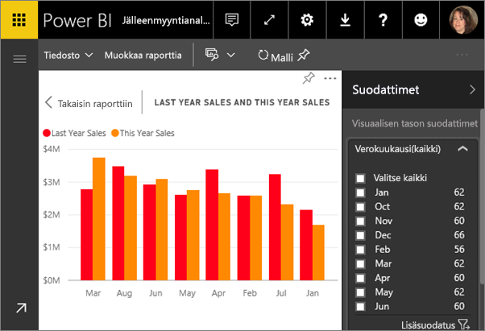

<!-- once the sample apps are live, change this so consumers can follow along -->
# Pikaopas: Tutustu ***kuluttajille suunnattuihin*** Power BI -ominaisuuksiin
Tässä pikaoppaassa opit käyttämään Power BI:tä löytääksesi tietopohjaisia merkityksellisiä liiketoimintatietoja. Tämä artikkeli ei ole tarkoitettu syvälliseksi ohjeeksi, vaan se tarjoaa lyhyen katsauksen **kuluttajille** suunnattuihin Power BI -toimintoihin.

Jos et ole rekisteröitynyt Power BI:hin, [rekisteröidy ilmaiseen kokeiluversioon](https://app.powerbi.com/signupredirect?pbi_source=web) ennen aloittamista.

## Edellytykset
- Power BI -palvelu (app.powerbi.com)
<!-- app from AppSource -->

## Lukunäkymä
Lukunäkymä on saatavilla Power BI:ssä raportin *kuluttajille*. Kun työtoverisi jakaa raportin kanssasi, voit tutkia ja käsitellä raporttia lukunäkymässä. 

Power BI -palvelun toinen raporttitila on [muokkausnäkymä](../service-interact-with-a-report-in-editing-view.md), joka on raportin *suunnittelijoiden* käytettävissä.  

Lukunäkymä on tehokas ja turvallinen tapa tutkia koontinäyttöjä ja raportteja. Kun katselet ja suodatat sinulle jaettuja koontinäyttöjä ja raportteja, niiden taustalla olevat tietojoukot pysyvät muuttumattomina. 

Lukunäkymässä voit esimerkiksi ristiinkorostaa ja ristiinsuodattaa sivun visualisointeja.  Korosta tai valitse arvo yhdessä visualisoinnissa,niin näet välittömästi sen vaikutuksen muissa visualisoinneissa. Suodatinruudussa voit lisätä ja muokata suodattimia raportin sivulla sekä muuttaa arvojen lajittelutapaa visualisoinnissa. Nämä ovat vain muutamia *kuluttajalle* suunnattuja Power BI:n ominaisuuksia.  Perehdymme näihin ja muihin ominaisuuksiin myöhemmin.

 
### Sovelluksen tarkasteleminen
Power BI:ssä *sovellukset* kokoavat toisiinsa liittyvät koontinäytöt ja raportit yhteen paikkaan.

1. Valitse **Sovellukset**  > **Hanki sovelluksia**. 
   
     
2. AppSourcen **Oma organisaatio** -osiossa voit tehdä hakuja rajataksesi tuloksia ja löytääksesi haluamasi sovelluksen.
   
     
3. Lisää sovellus Sovellukset-säilöösi valitsemalla **Hanki se nyt**. 

### Tarkastele koontinäyttöä
Tämä sovellus avautuu koontinäyttöön. Power BI ***-koontinäyttö*** on yksi sivu, jota kutsutaan usein pohjaksi, jossa käytetään visualisointeja tarinan kertomiseksi. Koska se on rajoitettu vain yhteen sivuun, hyvin suunniteltu koontinäyttö sisältää vain tarinan tärkeimmät elementit.

Koontinäytössä näkyviä visualisointeja kutsutaan *ruuduiksi* ja ne *kiinnitetään* koontinäyttöön raporteista.

### Koontinäytön (tai raportin) tilaaminen
Sinun ei tarvitse avata Power BI:tä koontinäytön seuraamiseksi.  Voit sen sijaan tehdä tilauksen, niin Power BI lähettää sinulle sähköpostilla koontinäytön tilannevedoksen haluamanasi ajankohtana. 

.

1. Valitse yläreunan valikkoriviltä **Tilaa** tai valitse kirjekuvake .
   
   

3. Voit ottaa tilauksen käyttöön tai poistaa sen käytöstä keltaisella liukusäätimellä.  Voit myös täyttää sähköpostiviestin tiedot. 

    Huomaa alla olevissa näyttökuvissa, että kun tilaat raportin, tilaat itse asiassa raportin *sivun*.  Voit tilata useamman kuin yhden raportin sivun valitsemalla **Lisää toinen tilaus** ja valitsemalla toisen sivun. 
      
   
   
    Raporttisivun päivittäminen ei päivitä tietojoukkoa. Vain tietojoukon omistaja voi manuaalisesti päivittää tietojoukon. Etsi pohjana olevan tietojoukon nimi valitsemalla **Näytä aiheeseen liittyvät** yläreunan valikkoriviltä.

### Tarkastele aiheeseen liittyvää sisältöä
**Aiheeseen liittyvä sisältö** -ruutu näyttää, miten Power BI -palvelun sisältösi -- koontinäytöt, raportit ja tietojoukot --on yhdistetty toisiinsa. Aiheeseen liittyvän sisällön esittelemisen lisäksi ruutu mahdollistaa sinulle myös toiminnot sisällön kanssa sekä helpon siirtymisen aiheeseen liittyvien sisältöjen välillä.

Valitse koontinäytössä tai raportissa **Näytä aiheeseen liittyvät** yläreunan valikkoriviltä.

### Käytä Q&A-toimintoa esittääksesi kysymyksiä luonnollisella kielellä
Joskus nopein tapa saada vastauksia tiedoista on esittää kysymyksiä luonnollisella kielellä. Q&A-kysymysruutu on käytettävissä koontinäytön yläreunassa. Esimerkiksi ”näytä suuri mahdollisuuksien määrä myyntivaiheen mukaan suppilona”. 

### Koontinäytön lisääminen suosikkeihin
Kun lisäät sisällön *suosikkeihin*, voit käyttää sitä vasemmasta siirtymispalkista. Vasen siirtymispalkki on näkyvissä lähes kaikissa Power BI:n alueissa. Suosikkeja ovat yleensä koontinäytöt, raporttisivut ja sovellukset, joita käytät useimmin.

1. Poistu Q&A-toiminnosta ja palaa takaisin koontinäyttöön.    
2. Valitse Power BI -palvelun oikeassa yläkulmassa **Suosikki** tai tähden kuvake .
   
   

### Avaa ja tarkastele raportteja ja raporttisivuja
Raportti sisältää yhden tai useampia visualisointisivuja. Raportit luodaan Power BI:n *raporttien suunnitteluohjelmassa* ja [jaetaan *kuluttajille* suoraan](end-user-shared-with-me.md) tai [sovelluksen](end-user-apps.md) osana. 

Raportit voidaan avata koontinäytöstä. Useimmat koontinäyttöruudut on *kiinnitetty* raporteista. Ruudun valitseminen avaa raportin, jota on käytetty ruudun luomiseen. 

1. Valitse koontinäytöstä ruutu. Tässä esimerkissä olemme valinneet Tuotto-sarakkeen kaavioruudun.

    

2.  Ruutuun liittyvä raportti avautuu. Huomaa, että olemme Tuoton yleiskatsaus -sivulla. Tämä raporttisivu sisältää koontinäytöstä valitun pylväskaavion.

    

### Muuta näytön dimensioita
Raportteja tarkastellaan useissa eri laitteissa, joissa on erikokoisia näyttöjä ja erilaisia kuvasuhteita.  Oletusarvon mukainen hahmontaminen ei välttämättä toimi oikein laitteessasi.  

1. Säädä näkymää yläreunan valikkoriviltä valitsemalla **Näkymä**.

    

2.  Valitse jokin näyttöasetuksista. Tässä esimerkissä olemme valinneet **Sovita sivulle**.

        

### Raportin Suodattimet-ruudun käyttäminen
Jos raportin tekijä on lisännyt suodattimia raportin sivulle, voit käyttää niitä ja tallentaa raportin muutokset.

1. Valitse **Suodattimet**-kuvake oikeasta yläkulmasta.
   
     

2. Valitse visualisointi, jotta siitä tulee aktiivinen. Näet kaikki suodattimet, jotka on otettu käyttöön kyseisessä visualisoinnissa (visuaalisen tason suodattimet), koko raporttisivulla (sivutason suodattimet) ja koko raportissa (raporttitason suodattimet).
   
   

3. Osoita suodatinta ja laajenna se painamalla alaspäin osoittavaa nuolta.
   
   

4. Muuta suodatinta ja katso, miten visualisoinnit ovat muuttuneet.  
   
     
     

### Katso, miten sivun kaikki visualisoinnit ovat yhteydessä toisiinsa
Ristiinsuodata ja ristiinkorosta sivun toisiinsa liittyviä visualisointeja. Yhden raporttisivun visualisoinnit ovat kaikki yhdistetty toisiinsa.  Tämä tarkoittaa sitä, että jos valitset yhden tai useamman arvon yhdessä visualisoinnissa, muut samaa arvoa käyttävät visualisoinnit muuttuvat valintasi perusteella.

> 
### Näytä tietoja visualisoinnissa
Pidä hiiren osoitin osien päällä nähdäksesi niiden tiedot

### Visualisoinnin lajitteleminen
Raporttisivun visualisoinnit voidaan lajitella ja muutokset tallentaa. 

1. Osoita visualisointia, jotta siitä tulee aktiivinen.    
2. Valitse kolme pistettä (...) avataksesi lajitteluasetukset.

     

###  Avaa **Valinta**-ruutu
Siirry helposti raporttisivun visualisointien välillä. 

1. Avaa Valinta-ruutu valitsemalla **Näytä > Valinta-ruutu**. Ota **Valinta-ruutu** käyttöön.

    

2. Valinta-ruutu avautuu raportin pohjalle. Valitse luettelosta visualisointi, jotta siitä tulee aktiivinen.

    

### Lähennä yksittäisissä visualisoinneissa
Osoita visualisointia ja napsauta **Tarkastelutila**-kuvaketta. Kun tarkastelet visualisointia tarkastelutilassa, se laajentaa koko raportin pohjan täyttämiseksi alla kuvatulla tavalla.

Voit näyttää saman visualisoinnin ilman häiritseviä valikkopalkkeja, suodatinruutua ja muita ylimääräisiä osia valitsemalla **koko näytön** kuvakkeen yläreunan valikkoriviltä .

### Näytä visualisoinnin lähdetiedot
Power BI:n visualisointi rakentuu pohjana olevien tietojoukkojen tiedoista. Jos olet kiinnostunut taustatoiminnoista, Power BI:n avulla voit *tarkastella* visualisoinnin luomiseen käytettyjä tietoja. Kun valitset **Näytä tiedot**, Power BI näyttää tiedot visualisoinnin alla (tai vieressä).

1. Avaa raportti Power BI -palvelussa ja valitse visualisointi.  
2. Jos haluat tuoda visualisoinnin taustalla olevat tiedot näkyviin, valitse kolme pistettä (...) ja valitse **Näytä tiedot**.
   
   

Tämä on vain lyhyt yleiskuvaus siitä, mitä **kuluttajat** voivat tehdä Power BI -palvelussa.  

## Resurssien tyhjentäminen
- Jos olet yhdistänyt sovelluksen, avaa Sovellukset-sisällysluettelo valitsemalla vasemmasta siirtymispalkista **Sovellukset**. Pidä osoitinta poistettavan sovelluksen päällä ja valitse roskakorikuvake.

- Jos toit tai yhdistit Power BI -näyteraportin, avaa vasemmasta siirtymispalkista **Oma työtila**. Käytä ylhäällä olevia välilehtiä ja etsi koontinäyttö, raportti ja tietojoukko, ja valitse sitten roskakorikuvake kunkin kohdalla.

## Seuraavat vaiheet

