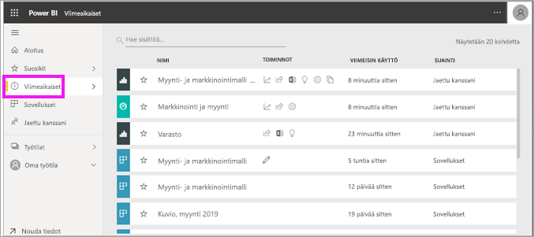
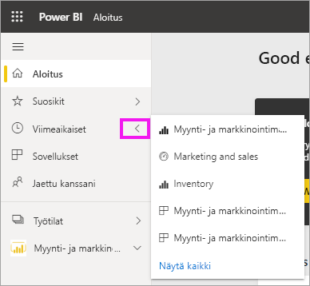
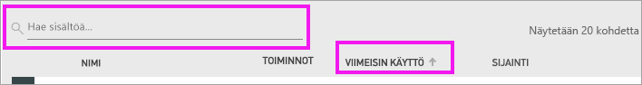

# **Viimeisimmät**-sisältö Power BI -palvelussa

[!INCLUDE[consumer-appliesto-yyny](../includes/consumer-appliesto-yyny.md)]

Viimeisin sisältö on tietoyksiköt, joissa olet viimeksi käynyt Power BI -palvelussa, enintään 20 kpl.  Näitä ovat esimerkiksi koontinäytöt, raportit, sovellukset ja työkirjat.

Katso kun Amanda näyttää, miten Power BI -palvelun **Viimeisin** sisältö -luettelot täytetään, ja kokeile sitten itse noudattamalla videon alapuolella olevia vaiheittaisia ohjeita.

<iframe width="560" height="315" src="https://www.youtube.com/embed/G26dr2PsEpk" frameborder="0" allowfullscreen></iframe>

> [!NOTE]
> Tässä videossa käytetään Power BI -palvelun vanhempaa versiota.

## Näytä viimeisin sisältö
Katso viisi viimeksi käytettyä yksikköä siirtymisruudusta ja valitse oikealla nuolella **Viimeisimmät**.  Täältä voit valita viimeaikaisen sisällön sen avaamiseksi. Vain viisi viimeisintä kohdetta näkyy luettelossa.

Jos sinulla on vähintään kuusi hiljattain käytettyä kohdetta, voit avata Viimeisimmät-näytön valitsemalla **Näytä kaikki**. Voit myös valita **Viimeisimmät**-vaihtoehdon tai Viimeisimmät-kuvakkeen siirtymisruudusta.

## **Viimeisimmät**-sisältöluettelossa käytettävissä olevat toiminnot
Käytettävissä olevat toiminnot määräytyvät sisällön *suunnittelijan* määrittämien asetusten mukaan. Vaihtoehtojasi voivat olla seuraavat:
* Valitsemalla tähtikuvakkeen voit [lisätä koontinäytön, raportin tai sovelluksen suosikkeihin](end-user-favorite.md) .
* Voit jakaa joitakin koontinäyttöjä ja raportteja edelleen muille  .
* [Avaa raportti Excelissä](end-user-export.md)  
* [Näytä merkitykselliset tiedot](end-user-insights.md), jotka Power BI löytää tiedoista .
* Lisäksi, jos luetteloista tulee pitkiä, voit [etsiä tarvitsemasi käyttämällä hakukenttää ja lajittelua](end-user-search-sort.md). Voit selvittää, voiko sarakkeen lajitella, pitämällä hiiren osoitinta sen kohdalla, kunnes näkyviin tulee nuoli. Tässä esimerkissä hiiren osoittimen pitäminen **Viimeisin käyttö** -sarakkeen päällä tuo näkyviin nuolen – viimeisin sisältösi voidaan lajitella käyttöpäivän mukaan. 

    

## Seuraavat vaiheet
[Power BI -palvelun sovellukset](end-user-apps.md)

Onko sinulla kysyttävää? [Kokeile Power BI -yhteisöä](https://community.powerbi.com/)

