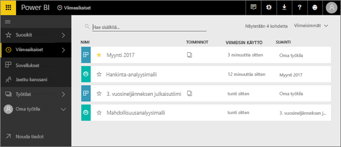
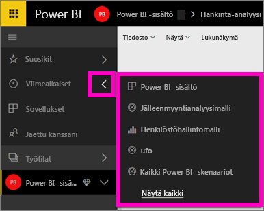

# **Viimeisimmät**-sisältö Power BI -palvelussa
Viimeisin sisältö on tietoyksiköt, joissa olet viimeksi käynyt Power BI -palvelussa, enintään 20 kpl.  Näitä ovat esimerkiksi koontinäytöt, raportit, sovellukset ja työkirjat kaikissa työtiloissasi.

Katso kun Amanda näyttää, miten Power BI -palvelun **Viimeisin** sisältö -luettelot täytetään, ja kokeile sitten itse noudattamalla videon alapuolella olevia vaiheittaisia ohjeita.

<iframe width="560" height="315" src="https://www.youtube.com/embed/G26dr2PsEpk" frameborder="0" allowfullscreen></iframe>

## Näytä viimeisin sisältö
Katso viisi viimeksi käytyä yksikköä vasemmasta siirtymisruudusta ja valitse oikealla nuolella **Viimeisimmät**.  Täältä voit valita viimeaikaisen sisällön sen avaamiseksi. Vain viisi viimeisintä kohdetta näkyy luettelossa.

Jos sinulla on enemmän kuin viisi hiljattain käytyä kohdetta, valitse **Näytä kaikki** avataksesi viimeksi käytetyn näytön (katso alta). Voit myös valita **Viimeisimmät**, tai  vasemmanpuoleisesta siirtymisruudusta.

Täältä voit käsitellä sisältöä samalla tavalla kuin yksittäisillä [**koontinäytöillä**](end-user-dashboards.md), [**raporteissa**](end-user-reports.md) ja **Työkirjat**-välilehdillä ja Sovellukset<!--[**Apps**](end-user-apps.md)-->-näytöllä.

## Seuraavat vaiheet
<!--[Power BI service Apps](end-user-apps.md)-->

Onko sinulla muuta kysyttävää? [Kokeile Power BI -yhteisöä](http://community.powerbi.com/)

