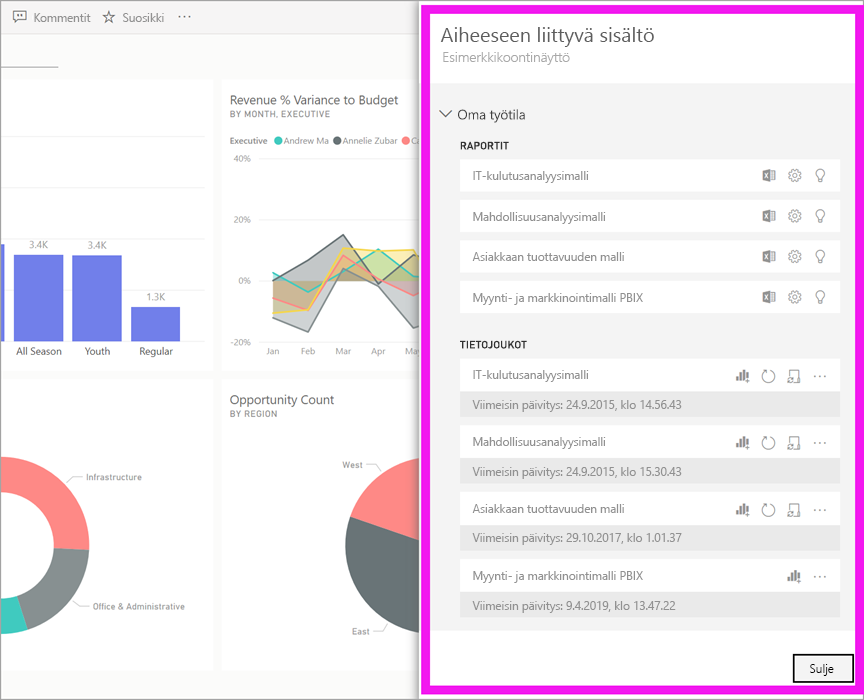

# Tarkastele aiheeseen liittyvää sisältöä Power BI -palvelussa

[!INCLUDE [power-bi-service-new-look-include](../includes/power-bi-service-new-look-include.md)]

**Aiheeseen liittyvä sisältö** -ruutu näyttää, miten Power BI -palvelun sisältösi -- koontinäytöt, raportit ja tietojoukot --on yhdistetty toisiinsa. **Aiheeseen liittyvä sisältö** -ruutu on myös paikka, jossa voi käynnistää toiminnon. Täällä voit esimerkiksi avata raporttinäkymän, avata raportin, luoda merkityksellisiä tietoja, analysoida tietoja Excelissä ja paljon muuta.  

Power BI:ssä raporttien perustana ovat tietojoukot; raporttien visualisoinnit on sitten kiinnitetty raporttinäkymään ja raporttinäkymän visualisoinnit linkittyvät takaisin raportteihin. Mutta mistä tiedät mitkä raporttinäkymät isännöivät markkinointiraporttisi visualisointeja? Ja miten löydät ne raporttinäkymät? Onko hankinnan raporttinäkymässäsi käytössä visualisointeja useammasta kuin yhdestä tietojoukosta? Jos näin on, miten ne ovat nimetty ja miten voit avata ja muokata niitä? Käytetäänkö henkilöstöhallinnon tietojoukkoa raporteissa tai raporttinäkymissä ollenkaan? Vai voidaanko sitä siirtää aiheuttamatta rikkinäisiä linkkejä? Näihin kysymyksiin voidaan vastata **Aiheeseen liittyvä sisältö** -ruudussa.  Aiheeseen liittyvän sisällön esittelemisen lisäksi ruutu mahdollistaa sinulle myös toiminnot sisällön kanssa sekä helpon siirtymisen aiheeseen liittyvien sisältöjen välillä.

> [!NOTE]
> Aiheeseen liittyvä sisältö -ominaisuutta ei voi käyttää tietojoukkojen suoratoistossa.
> 
> 

## Tarkastele raporttinäkymään tai raporttiin liittyvää sisältöä
Katso kun Will tarkastelee raporttinäkymään liittyvää sisältöä. Kokeile sitten itse samaa hankinta-analyysimallin tietojoukon kanssa noudattamalla videon alapuolella olevia vaiheittaisia ohjeita.

<iframe width="560" height="315" src="https://www.youtube.com/embed/B2vd4MQrz4M#t=3m05s" frameborder="0" allowfullscreen></iframe>

Kun raporttinäkymä tai raportti on avoinna, valitse **Enemmän vaihtoehtoja** (...) valikkopalkissa ja valitse avattavasta luettelosta **Näytä aiheeseen liittyvät**.

**Aiheeseen liittyvä sisältö** -ruutu avautuu. Raporttinäkymän kohdalla se näyttää kaikki raportit, joissa visualisoinnit ovat kiinnitettyinä raporttinäkymiin ja niihin liittyviin tietojoukkoihin. Tässä raporttinäkymässä visualisointeja on kiinnitetty vain yhdestä raportista, ja kyseinen raportti perustuu vain yhteen tietojoukkoon. 

Täältä voit tehdä suoria toimintoja aiheeseen liittyvään sisältöön.  Valitse esimerkiksi raporttinäkymän tai raportin nimi avataksesi sen.  Listatun raportin kanssa voit suorittaa toimintoja valitsemalla kuvakkeen: [Analysoi Excelissä](../service-analyze-in-excel.md) tai [Hae merkityksellistä tietoa](end-user-insights.md). Tietojoukon kohdalla voit tarkastella viimeisintä päivityksen päivämäärää ja aikaa, [analysoida Excelissä](../service-analyze-in-excel.md) ja [hakea merkityksellisiä tietoja](end-user-insights.md).  

## Tarkastele tietojoukkoon liittyvää sisältöä
Avataksesi **Aiheeseen liittyvä sisältö** -ruudun sinun pitää käydä läpi tietojoukkoon liittyvät oikeudet kohdasta *Lue*. Tässä esimerkkinä toimii [Hankinta-analyysimalli](../sample-procurement.md).

Etsi siirtymispalkista **Työtilat**-otsikko ja valitse työtila luettelosta. Jos sinulla on sisältöä työtilassa, se näkyy piirtoalustassa oikealla. 

Valitse ensin **Tietojoukot**-välilehti työtilassa ja etsi sitten  kuvakkeesta **Näytä aiheeseen liittyvät**.

Valitse kuvake avataksesi **Aiheeseen liittyvä sisältö** -ruudun.

Täältä voit tehdä suoria toimintoja aiheeseen liittyvään sisältöön. Valitse esimerkiksi raporttinäkymän tai raportin nimi avataksesi sen.  Voit jakaa listassa olevan raporttinäkymän valitsemalla kuvakkeen [Raporttinäkymän jakaminen muille](../service-share-dashboards.md) tai avaamalla raporttinäkymän **Asetukset**-ikkunan. Raportin kanssa voit suorittaa toimintoja valitsemalla kuvakkeen [Analysoi Excelissä](../service-analyze-in-excel.md), [Nimeä uudelleen](../service-rename.md), tai [Hae merkityksellistä tietoa](end-user-insights.md).  

## Rajoitukset ja vianmääritys
* Jos et näe Näytä aiheeseen liittyvät -kohtaa, etsi sen sijaan kuvaketta . Valitse kuvake avataksesi **Aiheeseen liittyvä sisältö** -ruudun.
* Jos haluat avata raporttiin liittyvää sisältöä pitää sinulla olla käytössä [Lukunäkymä](end-user-reading-view.md).
* Aiheeseen liittyvä sisältö -ominaisuus ei toimi suoratoistettuihin tietojoukkoihin.

## Seuraavat vaiheet
* [Power BI -palvelun käytön aloittaminen](../service-get-started.md)
* Onko sinulla muuta kysyttävää? [Kokeile Power BI -yhteisöä](http://community.powerbi.com/)

