# Aloita raportin Suodattimet-ruudun esittely
Tässä artikkelissa tutustutaan tarkemmin raportin Suodattimet-ruutuun. Ruutu näkyy [Power BI -palvelun muokkausnäkymässä ja lukunäkymässä](end-user-reading-view.md) ja [Power BI Desktopin raporttinäkymässä](../desktop-report-view.md).

Tietojen suodattaminen Power BI:ssä voidaan tehdä monella eri tavalla, ja suosittelemme lukemaan ensin kohdan [Tietoja suodattimista ja korostuksista](../power-bi-reports-filters-and-highlighting.md).

## Raportin Suodattimet-ruudun käyttäminen
Power BI Desktopissa raportit avataan raporttinäkymässä. Power BI -palvelussa raportit voidaan avata [muokkausnäkymässä tai lukunäkymässä](end-user-reading-view.md). Muokkausnäkymässä ja työpöydän raporttinäkymässä raportin omistajat voivat [lisätä suodattimia raporttiin](../power-bi-report-add-filter.md), ja kyseiset suodattimet tallennetaan raportin kanssa. Lukunäkymässä raporttia tarkastelevat henkilöt voivat käsitellä suodattimia ja tallentaa muutokset, mutta he eivät voi lisätä uusia suodattimia raporttiin.

Power BI -palvelussa raportit säilyttävät Suodattimet-ruudussa tekemäsi muutokset, ja muutokset siirtyvät myös raportin mobiiliversioon. Voit palauttaa suodatinruudun luojan oletusarvoihin valitsemalla **Palauta oletukset** yläreunan valikkoriviltä.     

## Avaa Suodattimet-ruutu
Kun raportti on avoinna, Suodattimet-ruutu näkyy raportin piirtoalustan oikeassa reunassa. Jos et näe ruutua, laajenna se valitsemalla nuoli oikeassa yläkulmassa. Jos olet Power BI -palvelun lukutilassa, ainoa oikealla puolella käytettävissä oleva ruutu on Suodattimet-ruutu.

Tässä esimerkissä olemme valinneet visualisoinnin, jossa on 6 suodatinta. Raporttisivulla on myös suodattimia, jotka on luetteloitu **Sivutason suodattimet** -otsikon alla. Käytössä on yksi [porautumissuodatin](../power-bi-report-add-filter.md), ja koko raportissa on myös suodatin: **FiscalYear** is 2013 or 2014.

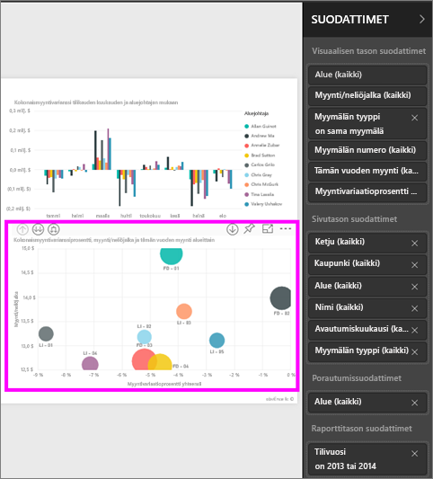

Joidenkin suodattimien vieressä on sana **All**, ja tämä tarkoittaa, että kaikki arvot sisältyvät suodattimeen.  Esimerkiksi **Chain(All)** alla olevassa näyttökuvassa ilmaisee, että tämä raporttisivu sisältää tietoja kaikista säilön ketjuista.  Toisaalta, raporttitason **FiscalYear is 2013 or 2014** -suodatin ilmaisee, että raportti sisältää tietoja vain tilikaudelle 2013 ja 2014.

Kaikki tätä raporttia tarkastelevat voivat käsitellä näitä suodattimia.

* Voit tarkastella suodattimen tietoja viemällä hiiren osoittimen sen päälle ja valitsemalla suodattimen vieressä olevan nuolen.
  
   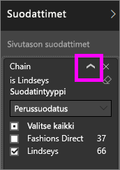
* Muuta suodatinta, esimerkiksi muuta **Lindseys**-suodatin **Fashions Direct** -suodattimeksi.
  
     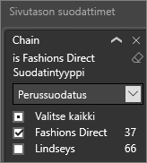

* Palauta suodattimet niiden alkuperäiseen tilaan valitsemalla **Palauta oletukset** yläreunan valikkoriviltä.    
    
    
* Poista suodatin valitsemalla **x**:n suodattimen nimen vieressä.
  
  Suodattimen poistaminen poistaa sen luettelosta, mutta ei poista tietoja raportista.  Esimerkiksi jos poistat **FiscalYear is 2013 or 2014** -suodattimen, tilikauden tiedot säilyvät edelleen raportissa, mutta sitä ei enää suodateta näyttämään vain tilikausia 2013 ja 2014, vaan siinä näkyvät kaikki tilikaudet, jotka ovat tiedoissa.  Kuitenkin kun poistat suodattimen, et voi muokata sitä uudelleen, koska se poistetaan luettelosta. Parempi vaihtoehto on tyhjentää suodatin valitsemalla Pyyhin-kuvakkeen .
  
  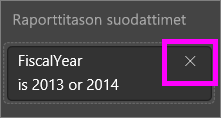

## Suodattimet muokkausnäkymässä
Kun raportti on avoinna työpöydällä tai Power BI -palvelun muokkausnäkymässä, Suodattimet-ruutu näkyy raportin piirtoalustan oikeassa reunassa **Visualisointi-ruudun** alaosassa. Jos et näe ruutua, laajenna se valitsemalla nuoli oikeassa yläkulmassa.

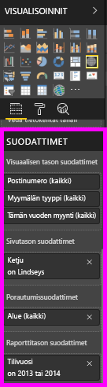.  

Jos visualisointia ei ole valittuna piirtoalustalla, niin Suodattimet-ruudussa näkyvät vain ne suodattimet, jotka koskevat koko raporttisivua tai koko raporttia, sekä mahdolliset porautussuodattimet. Alla olevassa esimerkissä visualisointia ei ole valittu eikä sivun tason tai porautumissuodattimia ole, mutta käytössä on raporttitason suodatin.  

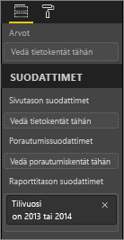  

Jos visualisointi on valittuna piirtoalustalla, näkyvissä ovat myös suodattimet, jotka koskevat vain kyseistä visualisointia:   

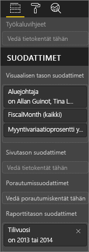

Jos haluat näyttää tietyn suodattimen asetukset, valitse suodattimen nimen vieressä oleva alanuoli.  Seuraavassa esimerkissä raporttitason suodattimena on 2013 ja 2014. Tämä on esimerkki **perussuodatuksesta**.  Voit näyttää lisäasetukset valitsemalla **Lisäsuodatus**.

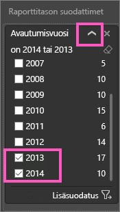

## Suodattimen tyhjentäminen
 Voit tyhjentää suodattimen sekä lisäsuodatus- että perussuodatustilassa valitsemalla Pyyhin-kuvakkeen . 

## Suodattimen lisääminen
* Desktopissa ja Power BI -palvelun muokkausnäkymässä lisää suodatin visualisointiin, sivulle, porautumiseen tai raporttiin valitsemalla kentän Kentät-ruudusta ja vetämällä sen sopivaan suodattimeen, jossa näet sanat **Vedä kentät tähän**. Kun kenttä on lisätty suodattimena, voit hienosäätää sitä perussuodatuksen ja lisäsuodatuksen ohjausobjekteilla (kuvattu alla).

* **Uuden kentän vetäminen visuaalisen tason suodatinalueelle ei lisää kenttää visualisointiin**, mutta sen avulla voit suodattaa visualisoinnin tällä uudella kentällä. Alla olevassa esimerkissä **Ketju** lisätään uutena suodattimena visualisointiin. Huomaa, että pelkkä **Ketju**-suodattimen lisääminen ei muuta visualisointia, ennen kuin käytät perus- tai lisäsuodatuksen ohjausobjekteja.

    

* Kaikki visualisoinnin luomisessa käytettävät kentät ovat myös käytettävissä suodattimina. Aktivoi ensin visualisointi valitsemalla se. Kentät, jotka ovat käytössä visualisoinnissa, on lueteltu Visualisoinnit-ruudussa ja Suodattimet-ruudussa **Visuaalisen tason suodattimet** -otsikon alla.
  
   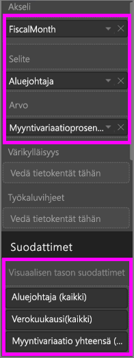  
  
   Voit hienosäätää kenttiä perussuodatuksen ja lisäsuodatuksen ohjausobjekteilla (kuvattu alla).

## Suodatintyyppejä: tekstikentän suodattimet
### Luettelotila
Valintaruudun valinta joko valitsee tai poistaa arvon valinnan. **Kaikki**-valintaruutua käyttämällä kaikkien valintaruutujen tila voidaan ottaa käyttöön tai poistaa käytöstä. Valintaruudut edustavat kaikkia käytettävissä olevia arvoja kyseiselle kentälle.  Kun säädät suodatinta, oikaisu päivittyy tekemiesi valintojen mukaiseksi. 

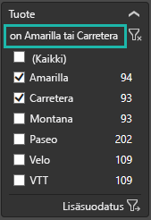

Huomaa, miten oikaisussa lukee nyt ”is Amarilla or Carretera”.

### Mukautettu tila
Valitse **Lisäsuodatus** vaihtaaksesi mukautettuun tilaan. Avattavan valikon ohjausobjektien ja tekstiruutujen avulla voit määrittää sisällytettävät kentät. Valitsemalla välillä **Ja** ja **Tai**, voit luoda monimutkaisia suodatinlausekkeita. Valitse **Käytä suodatinta** -painike, kun olet määrittänyt haluamasi arvot.  

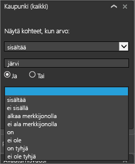

## Suodatintyyppejä: numeerisen kentän suodattimet
### Luettelotila
Jos arvot ovat rajattuja, kentän nimen valitseminen tuo näkyviin luettelon.  Katso yläpuolella olevasta kohdasta **Tekstikentän suodattimet** &gt; **Luettelotila** ohjeita valintaruutujen käyttämiseen.   

### Mukautettu tila
Jos arvot ovat loputtomia tai edustavat aluetta, kentän nimen valitseminen avaa lisäsuodatuksen tilan. Avattavan valikon ja tekstiruutujen avulla voit määrittää arvoalueen, jonka haluat nähdä. 

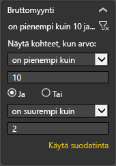

Valitsemalla välillä **Ja** ja **Tai**, voit luoda monimutkaisia suodatinlausekkeita. Valitse **Käytä suodatinta** -painike, kun olet määrittänyt haluamasi arvot.

## Suodatintyyppejä: päivämäärä ja aika
### Luettelotila
Jos arvot ovat rajattuja, kentän nimen valitseminen tuo näkyviin luettelon.  Katso yläpuolella olevasta kohdasta **Tekstikentän suodattimet** &gt; **Luettelotila** ohjeita valintaruutujen käyttämiseen.   

### Mukautettu tila
Jos kenttäarvot ilmaisevat päivämäärää tai kellonaikaa, voit määrittää aloitus- tai lopetusajan käyttämällä Päivämäärä ja aika -suodattimia.  

## Seuraavat vaiheet
[Suodattimet ja korostaminen raporteissa](../power-bi-reports-filters-and-highlighting.md)  
[Suodattimien ja korostamisen käsitteleminen raportin lukunäkymässä](end-user-reading-view.md)  
[Suodattimien luominen raportin muokkausnäkymässä](../power-bi-report-add-filter.md)  
[Muuta raportin visualisointien ristiinsuodatusta ja ristiinkorostusta suhteessa toisiinsa](end-user-interactions.md)

Lue lisää [Power BI -raporteista](end-user-reports.md)  
[Power BI:n peruskäsitteet](end-user-basic-concepts.md)

Onko sinulla muuta kysyttävää? [Kokeile Power BI -yhteisöä](http://community.powerbi.com/)

