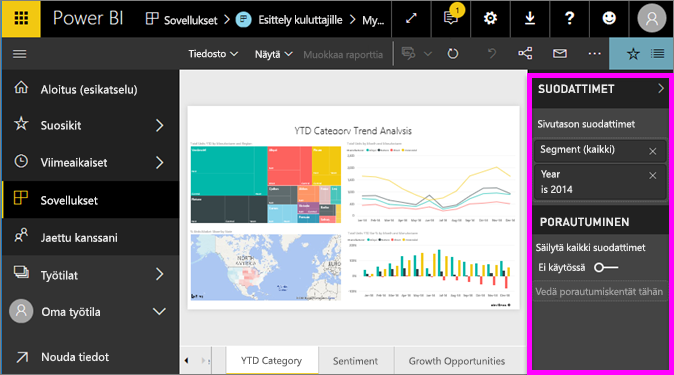

# Aloita raportin Suodattimet-ruudun esittely
Tässä artikkelissa tutustutaan raportin Suodattimet-ruutuun Power BI -palvelussa.

Tietojen suodattaminen Power BI:ssä voidaan tehdä monella eri tavalla, ja suosittelemme lukemaan ensin kohdan [Tietoja suodattimista ja korostuksista](../power-bi-reports-filters-and-highlighting.md).

## Raportin Suodattimet-ruudun käyttäminen
Kun työtoverisi jakaa raportin kanssasi, etsi **Suodattimet**-ruutu. Joskus se on kutistettuna raportin oikeassa reunassa. Laajenna se valitsemalla se.   

Suodattimet-ruutu sisältää suodattimia, jotka raportin *suunnittelija* on lisännyt raporttiin. Kaltaisesi *kuluttajat* voivat käsitellä suodattimia ja tallentaa muutokset, mutta he eivät voi lisätä uusia suodattimia raporttiin.

Power BI -palvelussa raportit säilyttävät Suodattimet-ruudussa tekemäsi muutokset, ja muutokset siirtyvät myös raportin mobiiliversioon. Voit palauttaa suodatinruudun suunnittelijan oletusarvoihin valitsemalla **Palauta oletukset** yläreunan valikkoriviltä.     

## Avaa Suodattimet-ruutu
Kun raportti on avoinna, Suodattimet-ruutu näkyy raportin piirtoalustan oikeassa reunassa. Jos et näe ruutua, laajenna se valitsemalla nuoli oikeassa yläkulmassa.  

Tässä esimerkissä olemme valinneet visualisoinnin, jossa on 6 suodatinta. Raporttisivulla on myös suodattimia, jotka on luetteloitu **Sivutason suodattimet** -otsikon alla. Käytössä on yksi [porautumissuodatin](../power-bi-report-add-filter.md), ja koko raportissa on myös suodatin: **FiscalYear** is 2013 or 2014.

Joidenkin suodattimien vieressä on sana **All**, ja tämä tarkoittaa, että kaikki arvot sisältyvät suodattimeen.  Esimerkiksi **Chain(All)** alla olevassa näyttökuvassa ilmaisee, että tämä raporttisivu sisältää tietoja kaikista säilön ketjuista.  Toisaalta, raporttitason **FiscalYear is 2013 or 2014** -suodatin ilmaisee, että raportti sisältää tietoja vain tilikaudelle 2013 ja 2014.

Kaikki tätä raporttia tarkastelevat voivat käsitellä näitä suodattimia.

* Voit tarkastella suodattimen tietoja viemällä hiiren osoittimen sen päälle ja valitsemalla suodattimen vieressä olevan nuolen.
  
   
* Muuta suodatinta, esimerkiksi muuta **Lindseys**-suodatin **Fashions Direct** -suodattimeksi.
  
     

* Palauta suodattimet niiden alkuperäiseen tilaan valitsemalla **Palauta oletukset** yläreunan valikkoriviltä.    
    
    
* Poista suodatin valitsemalla **x**:n suodattimen nimen vieressä.
  
  Suodattimen poistaminen poistaa sen luettelosta, mutta ei poista tietoja raportista.  Esimerkiksi jos poistat **FiscalYear is 2013 or 2014** -suodattimen, tilikauden tiedot säilyvät edelleen raportissa, mutta sitä ei enää suodateta näyttämään vain tilikausia 2013 ja 2014, vaan siinä näkyvät kaikki tilikaudet, jotka ovat tiedoissa.  Kuitenkin kun poistat suodattimen, et voi muokata sitä uudelleen, koska se poistetaan luettelosta. Parempi vaihtoehto on tyhjentää suodatin valitsemalla Pyyhin-kuvake.
  
  

## Suodattimen tyhjentäminen
 Valitse joko lisäsuodatus- tai perussuodatustilassa Pyyhin-kuvake   tyhjentääksesi suodattimen. 

## Suodatintyyppejä: tekstikentän suodattimet
### Luettelotila
Valintaruudun valinta joko valitsee tai poistaa arvon valinnan. **Kaikki**-valintaruutua käyttämällä kaikkien valintaruutujen tila voidaan ottaa käyttöön tai poistaa käytöstä. Valintaruudut edustavat kaikkia käytettävissä olevia arvoja kyseiselle kentälle.  Kun säädät suodatinta, oikaisu päivittyy tekemiesi valintojen mukaiseksi. 

Huomaa, miten oikaisussa lukee nyt ”is Amarilla or Carretera”.

### Mukautettu tila
Valitse **Lisäsuodatus** vaihtaaksesi mukautettuun tilaan. Avattavan valikon ohjausobjektien ja tekstiruutujen avulla voit määrittää sisällytettävät kentät. Valitsemalla välillä **Ja** ja **Tai**, voit luoda monimutkaisia suodatinlausekkeita. Valitse **Käytä suodatinta** -painike, kun olet määrittänyt haluamasi arvot.  

## Suodatintyyppejä: numeerisen kentän suodattimet
### Luettelotila
Jos arvot ovat rajattuja, kentän nimen valitseminen tuo näkyviin luettelon.  Katso yläpuolella olevasta kohdasta **Tekstikentän suodattimet** &gt; **Luettelotila** ohjeita valintaruutujen käyttämiseen.   

### Mukautettu tila
Jos arvot ovat loputtomia tai edustavat aluetta, kentän nimen valitseminen avaa lisäsuodatuksen tilan. Avattavan valikon ja tekstiruutujen avulla voit määrittää arvoalueen, jonka haluat nähdä. 

Valitsemalla välillä **Ja** ja **Tai**, voit luoda monimutkaisia suodatinlausekkeita. Valitse **Käytä suodatinta** -painike, kun olet määrittänyt haluamasi arvot.

## Suodatintyyppejä: päivämäärä ja aika
### Luettelotila
Jos arvot ovat rajattuja, kentän nimen valitseminen tuo näkyviin luettelon.  Katso yläpuolella olevasta kohdasta **Tekstikentän suodattimet** &gt; **Luettelotila** ohjeita valintaruutujen käyttämiseen.   

### Mukautettu tila
Jos kenttäarvot ilmaisevat päivämäärää tai kellonaikaa, voit määrittää aloitus- tai lopetusajan käyttämällä Päivämäärä ja aika -suodattimia.  

## Seuraavat vaiheet
[Lue, miksi ja miten visualisoinneilla on ristiinsuodatus ja ristiinkorostus suhteessa toisiinsa raportin sivulla](end-user-interactions.md)