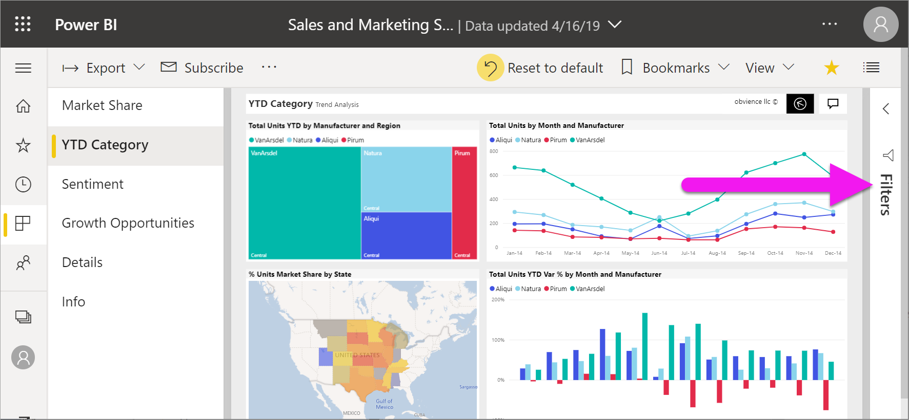

# Aloita raportin Suodattimet-ruudun esittely

[!INCLUDE [power-bi-service-new-look-include](../includes/power-bi-service-new-look-include.md)]

Tässä artikkelissa tutustutaan raportin **Suodattimet**-ruutuun Power BI -palvelussa. Suodattimilla saat tiedoistasi näkyviin uusia merkityksiä.

Tietoja voi suodattaa Power BI:ssä monin eri tavoin. Saat lisätietoja suodattimista ohjeartikkelista [Suodattimet ja korostaminen Power BI -raporteissa](../power-bi-reports-filters-and-highlighting.md).

## Raportin Suodattimet-ruudun käyttäminen

Kun työtoverisi jakaa raportin kanssasi, etsi **Suodattimet**-ruutu. Joskus se on kutistettuna raportin oikeassa reunassa. Laajenna se valitsemalla se.

**Suodattimet**-ruutu sisältää suodattimia, jotka raportin *suunnittelija* on lisännyt raporttiin. Kaltaisesi *kuluttajat* voivat käyttää olemassa olevia suodattimia ja tallentaa muutokset, mutta ette voi lisätä uusia suodattimia raporttiin. Esimerkiksi yllä olevassa näyttökuvassa suunnittelija on lisännyt kolme sivutason suodatinta: **Segmentti on Kaikki**, **Vuosi on 2014** ja **Alue on Keski**. Voit käyttää ja muuttaa näitä suodattimia, mutta et voi lisätä neljättä sivutason suodatinta.

Power BI-palvelussa raportit säilyttävät muutokset, jotka teet **Suodattimet**-ruudussa. Palvelu siirtää nämä muutokset myös raportin mobiiliversioon. 

Voit palauttaa **Suodattimet**-ruudun suunnittelijan oletusarvoihin valitsemalla **Palauta oletukset** yläreunan valikkoriviltä.

 

> [!NOTE]
> Jos et näe **Palauta oletukset** -valintaa, raportin *suunnittelija* on saattanut poistaa sen käytöstä. *Suunnittelija* voi myös lukita tietyt suodattimet niin, että niitä ei voi muuttaa.

## Raporttisivun kaikkien suodattimien näyttäminen

**Suodattimet**-ruudussa näkyvät kaikki suodattimet, jotka raportin tekijä on lisännyt raporttiin. **Suodattimet**-ruudussa on myös alue, jossa voit tarkastella tietoja suodattimista ja käyttää niitä. Tallenna tekemäsi muutokset tai palauta suodattimen alkuperäiset asetukset **Palauta oletukset** -toiminnolla.

Jos haluat tallentaa muutoksia, voit myös luoda oman kirjanmerkin. Lisätietoja on artikkelissa [Mitä kirjanmerkit ovat?](end-user-bookmarks.md).

**Suodattimet**-ruudusta näet erilaiset raporttisuodattimet ja voit hallita niitä: raportti, raporttisivu ja visualisointi.

Tässä esimerkissä olemme valinneet visualisoinnin, jossa on kolme suodatinta. Raporttisivulla on myös suodattimia, jotka on lueteltu **Tämän sivun suodattimet** -otsikon alla. Lisäksi koko raportilla on **päivämääräsuodatin**.

Joidenkin suodattimien vieressä lukee **(Kaikki)** . **(Kaikki)** tarkoittaa sitä, että kaikki arvot sisältyvät suodattimeen. Yllä olevassa näyttökuvassa **Segmentti(Kaikki)** kertoo meille, että tämä raporttisivu sisältää tiedot kaikista tuotesegmenteistä. 

Kaikki tätä raporttia tarkastelevat voivat käsitellä näitä suodattimia.

### Vain visualisoinnissa käytettyjen suodattimien näyttäminen

Jos haluat tarkastella tarkemmin tietyssä visualisoinnissa käytettyjä suodattimia, siirrä hiiren osoitin visualisoinnin kohdalle ja tuo näkyviin suodatinkuvake . Valitsemalla suodatinkuvakkeen näet ponnahdusikkunan, joka sisältää kaikki visualisointiin vaikuttavat suodattimet, osittajat ja niin edelleen. Ponnahdusikkunan suodattimet sisältävät **Suodattimet**-ruudussa näkyvät suodattimet sekä valittuun visualisointiin vaikuttavia lisäsuodattimia.

Tässä näkymässä voidaan näyttää seuraavia suodattimia:

- Perussuodattimet
- Osittajat
- Ristiinkorostus
- Ristiinsuodatus
- Lisäsuodattimet
- Ylimmät N-suodattimet
- Suhteelliset päivämääräsuodattimet
- Synkronoinnin osittajat
- Sisällytä / Jätä pois -suodattimet
- Suodattimet, jotka välitetään URL-osoitteen kautta

Tässä esimerkissä:
1. **Sisältyy** ilmaisee, että visualisointi on ristiinsuodatettu. Tämä tarkoittaa sitä, että Utahin, Coloradon ja Texasin osavaltiot on valittu jossakin muussa tämän raporttisivun visualisoinnissa. Tässä tapauksessa kyseessä on kartta. Näiden kolmen osavaltion valinta estää kaikkien muiden osavaltioiden tietojen näyttämisen valitussa palkkikaaviossa.  

1. **Päivämäärä** on suodatin, jota käytetään kaikkiin tämän raportin sivuihin, ja

1. **Alue on Keski** ja **Vuosi on 2014** ovat suodattimia, joita käytetään tässä raporttisivussa, ja

4. **Valmistaja on VanArsdel, Natura, Aliqui tai Pirum** on suodatin, jota käytetään tässä visualisoinnissa.

### Hae suodattimessa

Joskus suodattimella voi olla pitkä luettelo arvoja. Etsi ja valitse haluamasi arvo hakuruudun avulla.

### Suodattimen tietojen näyttäminen

Saat paremman kuvan suodattimesta tutustumalla käytettävissä oleviin arvoihin ja määriin.  Näet suodattimen tiedot viemällä hiiren osoittimen sen päälle ja valitsemalla suodattimen nimen vieressä olevan nuolen.
  

### Suodatinvalintojen muokkaaminen

Voit etsiä tiedoista merkityksiä suodattimien avulla. Voit muokata suodatinvalintoja kentän nimen vieressä olevalla avattavan valikon nuolella.  Vaihtoehdot vaihtelevat yksinkertaisista valinnoista päivämäärä- ja lukualueisiin. Tämä riippuu Power BI:n suodattamasta tietotyypistä ja suodattimesta. Alla olevassa kehittyneessä suodattimessa vaihdoimme puukartan **yksiköiden kokonaismäärän vuoden alusta** suodattimen arvoksi 2 000–3 000. Huomaa, että tämä muutos poistaa Prirumin puukartasta.
  

> [!TIP]
> Jos haluat valita samanaikaisesti useita suodatinarvoja, paina CTRL-näppäintä valitessasi arvoja. Useimmat suodattimet tukevat monivalintaa.

### Suodattimen palauttaminen oletuksiin

Jos haluat peruuttaa kaikki suodattimiin tekemäsi muutokset, valitse **Palauta oletukset** yläosan valikosta.  Tämä palauttaa suodattimet raportin suunnittelijan määrittämiin oletuksiin.

### Suodattimen tyhjentäminen

Jos haluat nollata suodattimen tilan (Kaikki), tyhjennä se valitsemalla suodattimen nimen vieressä oleva pyyhinkuvake.

  
<!--  too much detail for consumers

## Types of filters: text field filters
### List mode
Ticking a checkbox either selects or deselects the value. The **All** checkbox can be used to toggle the state of all checkboxes on or off. The checkboxes represent all the available values for that field.  As you adjust the filter, the restatement updates to reflect your choices. 

Note how the restatement now says "is Mar, Apr or May".

### Advanced mode
Select **Advanced Filtering** to switch to advanced mode. Use the dropdown controls and text boxes to identify which fields to include. By choosing between **And** and **Or**, you can build complex filter expressions. Select the **Apply Filter** button when you've set the values you want.  

## Types of filters: numeric field filters
### List mode
If the values are finite, selecting the field name displays a list.  See **Text field filters** &gt; **List mode** above for help using checkboxes.   

### Advanced mode
If the values are infinite or represent a range, selecting the field name opens the advanced filter mode. Use the dropdown and text boxes to specify a range of values that you want to see. 

By choosing between **And** and **Or**, you can build complex filter expressions. Select the **Apply Filter** button when you've set the values you want.

## Types of filters: date and time
### List mode
If the values are finite, selecting the field name displays a list.  See **Text field filters** &gt; **List mode** above for help using checkboxes.   

### Advanced mode
If the field values represent date or time, you can specify a start/end time when using Date/Time filters.  

-->

## Seuraavat vaiheet

Lue, miksi ja miten [visualisoinneilla on ristiinsuodatus ja ristiinkorostus suhteessa toisiinsa raportin sivulla](end-user-interactions.md)