# Raportin näyttäminen Power BI -palvelussa *kuluttajille*

[!INCLUDE[consumer-appliesto-yyny](../includes/consumer-appliesto-yyny.md)]

[!INCLUDE [power-bi-service-new-look-include](../includes/power-bi-service-new-look-include.md)]

Raportti sisältää yhden tai useampia visualisointisivuja. Power BI:n *suunnittelijat* luovat raportit ja [jakavat *ne kuluttajille* suoraan](end-user-shared-with-me.md) tai [sovelluksen](end-user-apps.md) osana. 

Raportin voi avata monella eri tavalla ja näytämme nyt niistä kaksi, avaamisen aloitussivulta ja avaamisen koontinäytöstä. 

<!-- add art-->

## Raportin avaaminen Power BI -aloitussivulta
Avataan raportti, joka on jaettu suoraan sinulle, ja avataan sen jälkeen raportti, joka on jaettu sovelluksen osana.

   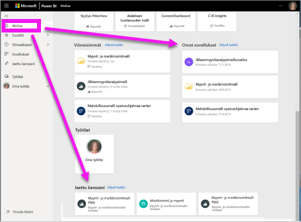

### Sinulle jaetun raportin avaaminen
Power BI -*suunnittelijat* voivat jakaa yksittäisen raportin suoraan sinulle sähköpostiviestissä olevan linkin kautta tai lisäämällä sen automaattisesti Power BI -sisältöön. Näin jaetut raportit näkyvät **Jaettu kanssani** -säilössä siirtymisruudussa ja aloitussivun **Jaettu kanssani** -osassa.

1. Avaa Power BI -palvelu (app.powerbi.com).

2. Siirry aloitussivulle valitsemalla siirtymisruudusta **Aloitussivu**.  

   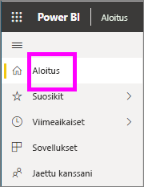
   
3. Vieritä alaspäin, kunnes näet **Jaettu kanssani** -kohdan. Etsi raporttikuvake . Tässä näyttökuvassa on yksi koontinäyttö ja yksi raportti. Raportin nimi on *Myynti- ja markkinointimalli*. 
   
   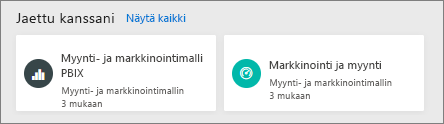

4. Avaa raportti valitsemalla *raporttikortti*.

   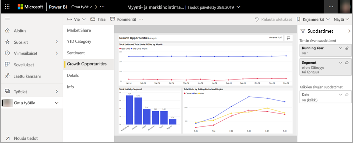

5. Huomioi vasemmalla puolella olevat välilehdet.  Kukin välilehti edustaa yhtä raportti*sivua*. *Kasvumahdollisuus*-sivu on nyt avoinna. Avaa sen sijaan raporttisivu valitsemalla *Luokka vuoden alusta* -välilehti. 

   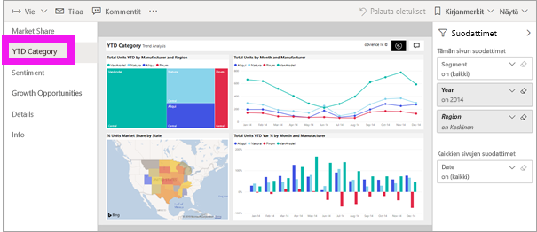

6. Huomaa oikeassa reunassa oleva **Suodattimet**-ruutu. Siinä näytetään tällä raporttisivulla tai koko raportissa käytetyt suodattimet.

7. Kun viet osoittimen raportin visualisoinnin päälle, näkyviin tulee useita kuvakkeita ja **Enemmän vaihtoehtoja** (...). Jos haluat tarkastella tiettyyn visualisointiin käytettyä suodatinta, valitse suodatinkuvake. Tässä esimerkissä olemme valinneet viivakaavion *Yksiköiden kokonaismäärä jatkuvan jakson ja alueen mukaan* suodatinkuvakkeen.

   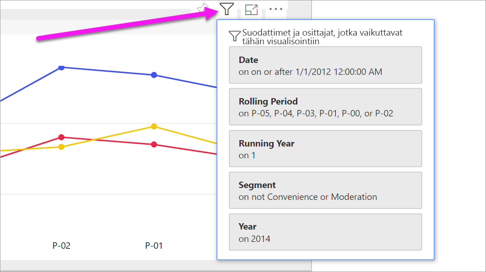

6. Nyt näet koko raporttisivun. Jos haluat muuttaa sivun näyttöä (zoomausta), valitse avattava Näytä-valikko oikeasta yläkulmasta ja valitse **Todellinen koko**.

   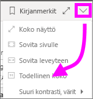

   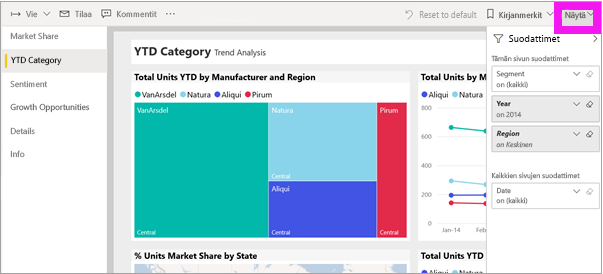

Voit käsitellä raporttia monella tavalla, jotta voit löytää merkityksellisiä tietoja ja tehdä liiketoimintaa koskevia päätöksiä.  Vasemmalla olevan sisällysluettelon avulla voit lukea muita artikkeleja, jotka koskevat Power BI -raportteja. 

### Sovelluksen osana jaetun raportin avaaminen
Jos olet saanut sovelluksia työtovereilta tai AppSourcesta, kyseiset sovellukset ovat käytettävissä aloitussivulla ja **Sovellukset**-säilössä siirtymisruudussa. [Sovellus](end-user-apps.md) on kokoelma koontinäyttöjä ja raportteja, jotka Power BI -*suunnittelija* on niputtanut yhteen puolestasi.

### Edellytykset
Lataa Myynti ja markkinointi ‑sovellus, jotta voit seurata ohjeita.
1. Siirry selaimessa osoitteeseen appsource.microsoft.com.
1. Hae "Myynti ja markkinointi" ja valitse **Microsoft-näyte - Myynti ja markkinointi**.
1. Asenna sovellus sovellussäilöön valitsemalla **Hanki se nyt** > **Jatka** > **Asenna**. 

Voit avata sovelluksen sovellussäilöstä tai etusivulta.
1. Palaa takaisin aloitussivulle valitsemalla **Aloitussivu** siirtymisruudusta.

7. Vieritä alaspäin, kunnes näet **Omat sovellukset** -kohdan.

   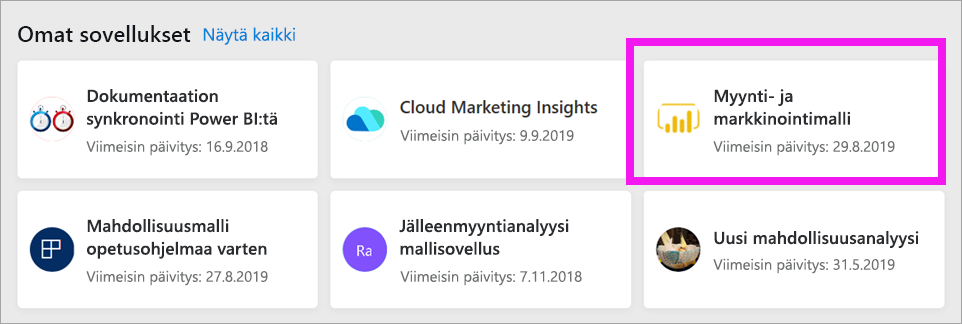

8. Avaa uusi *Myynti ja markkinointi* -sovelluksesi valitsemalla se. Sovelluksen *suunnitteluohjelman* asetusten mukaan sovellus avaa joko koontinäytön tai raportin. Tämä sovellus avautuu koontinäyttöön.  

## Raportin avaaminen koontinäytöstä
Raportit voidaan avata koontinäytöstä. Useimmat koontinäyttö[ruudut](end-user-tiles.md) on *kiinnitetty* raporteista. Ruudun valitseminen avaa raportin, jota on käytetty ruudun luomiseen. 

1. Valitse raporttinäkymästä ruutu. Tässä esimerkissä olemme valinneet *Yksiköitä yhteensä vuoden alusta* -pylväskaavioruudun.

    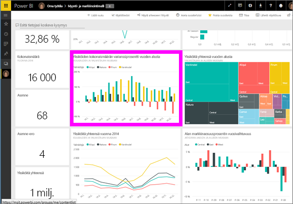

2.  Ruutuun liittyvä raportti avautuu. Huomaa, että olemme *Vuoden alusta* -luokan sivulla. Tämä raporttisivu sisältää koontinäytöstä valitun pylväskaavion.

    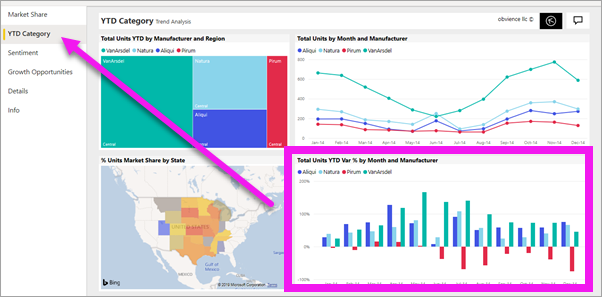

> [!NOTE]
> Kaikki ruudut eivät johda raporttiin. Jos valitset ruudun, joka oli [luotu esittämällä kysymyksiä](end-user-q-and-a.md), QA-näyttö avautuu. Jos valitset ruudun, joka oli [luotu koontinäytön **Lisää ruutu** -pienoissovelluksella](../service-dashboard-add-widget.md), monia eri asioita voi tapahtua. Esimerkiksi video voidaan toistaa tai sivusto avata.  

##  Muita tapoja avata raportti
Kun pääset sinuiksi Power BI -palvelun kanssa, löydät itsellesi sopivimmat työnkulut. Tässä on vielä muita tapoja raporttien käyttämiseen:
- Valitsemalla siirtymisruudusta [Suosikit](end-user-favorite.md) ja [Viimeisimmät](end-user-recent.md)    
- Käyttämällä [Näytä aiheeseen liittyvät](end-user-related.md) -toimintoa    
- Sähköpostiviestistä, jonka joku on [jakanut kanssasi](../service-share-reports.md), tai kun [määrität ilmoituksen](end-user-alerts.md)    
- [Ilmoituskeskuksen](end-user-notification-center.md) kautta    
- Työtilasta
- ja muilla tavoilla

## Seuraavat vaiheet
[Raporttinäkymän avaaminen ja tarkasteleminen](end-user-dashboard-open.md)    
[Raporttisuodattimet](end-user-report-filter.md)

