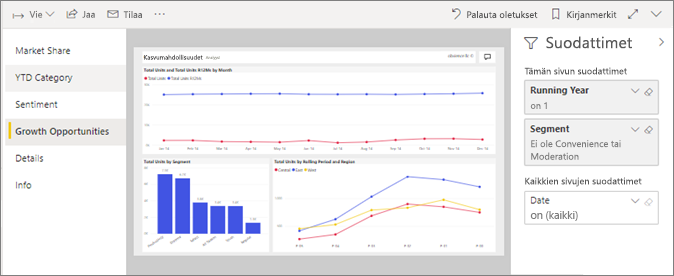
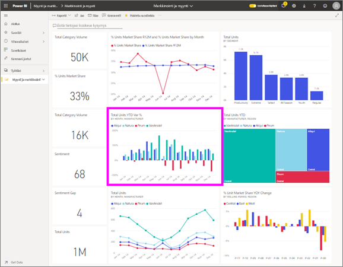

# Näytä raportti Power BI -palvelussa *kuluttajille*
Raportti sisältää yhden tai useampia visualisointisivuja. Power BI Luo raportteja *suunnittelijat* ja [kanssa *kuluttajien* suoraan](end-user-shared-with-me.md) tai osana [sovelluksen](end-user-apps.md). 

Voit avata raportin monella eri tavalla ja näytämme kaksi: Avaa kotoa ja avaaminen koontinäytöstä. 

<!-- add art-->

## Avaa raportti Power BI aloitus
Avataan raportti, joka on jaettu suoraan sinulle, ja avataan sen jälkeen raportti, joka on jaettu sovelluksen osana.

   

### Sinulle jaetun raportin avaaminen
Power BI *suunnittelijat* jakaa raportin suoraan kanssasi. Näin jaettu sisältö näkyy **jaettu kanssani** säilön,-nav palkki- ja - **jaettu kanssani** aloitus-kangas-osasta.

1. Avaa Power BI-palvelussa (app.powerbi.com).

2. Valitse navigointipalkki **aloitus** näyttämään aloitus-pohjan.  

   
   
3. Vieritä alaspäin, kunnes näet **Jaettu kanssani** -kohdan. Etsi raporttikuvake . Tässä näyttökuvassa on yksi koontinäyttö ja yksi raportti nimeltä *myynti- ja markkinointimalli*. 
   
   

4. Valitsemalla raportin *kortin* voit avata raportin.

   

5. Huomaa välilehdet vasemmassa reunassa.  Kukin välilehti edustaa yhtä raportti*sivua*. Ole tällä hetkellä *kasvu mahdollisuuden* sivu on avoinna. Valitse *alusta-luokan* välilehti raporttisivun sen sijaan. 

   

6. Juuri nyt voimme antamisen koko raporttisivun. Jos haluat muuttaa sivun näyttö (Zoomaus), valitse avattavasta luettelosta oikeassa yläkulmassa ( **>** ) ja valitse **todellinen koko**.

   

   

### Sovelluksen osana jaetun raportin avaaminen
Jos olet saanut sovellukset työtovereiden tai appsourcesta, kyseiset sovellukset ovat käytettävissä, aloitus ja - **sovelluksia** säilön nav-palkissa. [Sovellus](end-user-apps.md) on koontinäyttöjen ja raporttien nippu.

1. Siirry takaisin valitsemalla Aloitus **aloitus** nav-palkista.

7. Vieritä alaspäin, kunnes näet **Omat sovellukset** -kohdan.

   

8. Avaa sovellus valitsemalla se. Sovelluksen *suunnitteluohjelman* asetusten mukaan sovellus avaa joko koontinäytön, raportin tai sovelluksen sisältöluettelon. Jos sovellus:
    - avaa raportin, olet valmis.
    - avaa koontinäytön, katso alla oleva kohta ***Raportin avaaminen koontinäytöstä***.
    - avaa sovelluksen sisältöluettelon kohtaan **Raportit**, avaa raportti valitsemalla se.

## Raportin avaaminen koontinäytöstä
Raportit voidaan avata koontinäytöstä. Useimmat koontinäyttöruudut on *kiinnitetty* raporteista. Ruudun valitseminen avaa raportin, jota on käytetty ruudun luomiseen. 

1. Valitse koontinäytöstä ruutu. Tässä esimerkissä olemme valinneet Yksiköitä yhteensä vuoden alusta -pylväskaavioruudun.

    

2.  Ruutuun liittyvä raportti avautuu. Huomaa, että olemme Vuoden alusta -luokan sivulla. Tämä raporttisivu sisältää koontinäytöstä valitun pylväskaavion.

    

> [!NOTE]
> Kaikki ruudut eivät johda raporttiin. Jos valitset ruudun, joka oli [luotu esittämällä kysymyksiä](end-user-q-and-a.md), QA-näyttö avautuu. Jos valitset ruudun, joka oli [luotu koontinäytön **Lisää ruutu** -pienoissovelluksella](../service-dashboard-add-widget.md), monia eri asioita voi tapahtua.  

##  Muita tapoja avata raportti
Kun saat sinuiksi Power BI-palvelussa siirtyminen, sanomia työnkulkuja, jotka parhaalla mahdollisella tavalla. Tässä on vielä muita tapoja raporttien käyttämiseen:
- Palkin käyttämällä nav- **Suosikit** ja **viimeisimmät**    
- Käyttämällä [Näytä aiheeseen liittyvät](end-user-related.md) -toimintoa    
- Sähköpostiviestistä, jonka joku on [jakanut kanssasi](../service-share-reports.md), tai kun [määrität ilmoituksen](end-user-alerts.md)    
- [Ilmoituskeskuksen](end-user-notification-center.md) kautta    
- ja muilla tavoilla

## Seuraavat vaiheet
[Raportteja voi käsitellä monella eri tavalla](end-user-reading-view.md).  Voit aloittaa tutustumisen valitsemalla jokaisen välilehden raporttipohjan reunaan.

