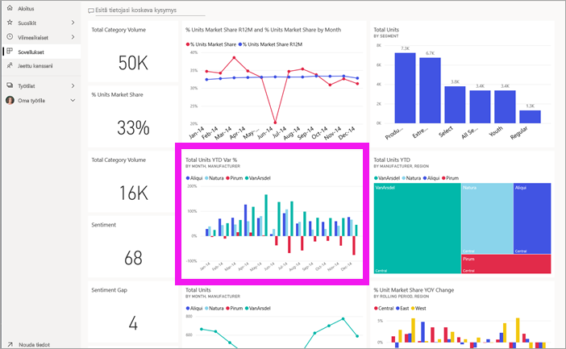

# Näytä raportti Power BI -palvelussa *kuluttajille*
Raportti sisältää yhden tai useampia visualisointisivuja. Raportit luodaan Power BI:n *raporttien suunnitteluohjelmassa* ja [jaetaan *kuluttajille* suoraan](end-user-shared-with-me.md) tai [sovelluksen](end-user-apps.md) osana. 

Raportin voi avata monella eri tavalla ja näytämme nyt niistä kaksi, avaamisen aloitussivulta ja avaamisen koontinäytöstä. 

<!-- add art-->

## Raportin avaaminen aloitussivulta
Avataan raportti, joka on jaettu suoraan sinulle, ja avataan sen jälkeen raportti, joka on jaettu sovelluksen osana.

   

### Sinulle jaetun raportin avaaminen
Power BI:n *suunnitteluohjelmassa* raportin voi jakaa suoraan napsauttamalla ylävalikkopalkin **Jaa**-painiketta. Näin jaettu sisältö näkyy **Jaettu kanssani** -säilössä vasemmassa siirtymispalkissa ja aloitussivun **Jaettu kanssani** -osassa.

1. Avaa Power BI -palvelu (app.powerbi.com).

2. Avaa aloitussivu valitsemalla vasemmassa siirtymispalkissa **Aloitussivu (esikatselu)**.  

   
   
3. Vieritä alaspäin, kunnes näet **Jaettu kanssani** -kohdan. Etsi raporttikuvake . Tässä näyttökuvassa on kaksi raporttia: *Rahoitus* ja *Northwind*. 
   
   

4. Avaa raportti valitsemalla jokin *raporttikorteista*.

   

5. Huomioi alareunan välilehdet. Kukin välilehti edustaa yhtä raportti*sivua*. Meillä on nyt *IT-kulutrendi*-sivu avoinna. Avaa jokin toinen raporttisivu valitsemalla eri välilehti. 

   

6. Tällä hetkellä näemme vain osan raporttisivusta. Jos haluat muuttaa sivun näyttöä (zoomausta), valitse **Näytä** > **Sovita sivulle**.

   

   

### Sovelluksen osana jaetun raportin avaaminen
Jos olet saanut sovelluksia työtovereilta tai AppSourcesta, kyseiset sovellukset ovat käytettävissä aloitussivulla ja **Sovellukset**-säilössä vasemmassa siirtymispalkissa. [Sovellus](end-user-apps.md) on koontinäyttöjen ja raporttien nippu.

1. Palaa aloitussivulle valitsemalla vasemmassa siirtymispalkissa **Aloitussivu (esikatselu)**.

7. Vieritä alaspäin, kunnes näet **Omat sovellukset** -kohdan.

   

8. Avaa sovellus valitsemalla se. Sovelluksen *suunnitteluohjelman* asetusten mukaan sovellus avaa joko koontinäytön, raportin tai sovelluksen sisältöluettelon. Jos sovellus:
    - avaa raportin, olet valmis.
    - avaa koontinäytön, katso alla oleva kohta [Raportin avaaminen koontinäytöstä](#Open-a-report-from-a-dashboard).
    - avaa sovelluksen sisältöluettelon kohtaan **Raportit**, avaa raportti valitsemalla se.

## Raportin avaaminen koontinäytöstä
Raportit voidaan avata koontinäytöstä. Useimmat koontinäyttöruudut on *kiinnitetty* raporteista. Ruudun valitseminen avaa raportin, jota on käytetty ruudun luomiseen. 

1. Valitse koontinäytöstä ruutu. Tässä esimerkissä olemme valinneet Yksiköitä yhteensä vuoden alusta -pylväskaavioruudun.

    

2.  Ruutuun liittyvä raportti avautuu. Huomaa, että olemme Vuoden alusta -luokan sivulla. Tämä raporttisivu sisältää koontinäytöstä valitun pylväskaavion.

    

> [!NOTE]
> Kaikki ruudut eivät johda raporttiin. Jos valitset ruudun, joka oli [luotu esittämällä kysymyksiä](end-user-q-and-a.md), QA-näyttö avautuu. Jos valitset ruudun, joka oli [luotu koontinäytön **Lisää ruutu** -pienoissovelluksella](../service-dashboard-add-widget.md), monia eri asioita voi tapahtua.  

##  Muita tapoja avata raportti
Kun pääset sinuiksi Power BI -palvelun kanssa, löydät itsellesi sopivimmat työnkulut. Tässä on vielä muita tapoja raporttien käyttämiseen:
- Valitsemalla vasemmasta siirtymisruudusta **Suosikit** ja **Viimeisimmät**    
- Käyttämällä [Näytä aiheeseen liittyvät](end-user-related.md) -toimintoa    
- Sähköpostiviestistä, jonka joku on [jakanut kanssasi](../service-share-reports.md), tai kun [määrität ilmoituksen](end-user-alerts.md)    
- [Ilmoituskeskuksen](end-user-notification-center.md) kautta    
- ja muilla tavoilla

## Seuraavat vaiheet
[Raportteja voi käsitellä monella eri tavalla](end-user-reading-view.md).  Aloita tutustuminen valitsemalla jokainen välilehti raporttipohjan alaosasta.

