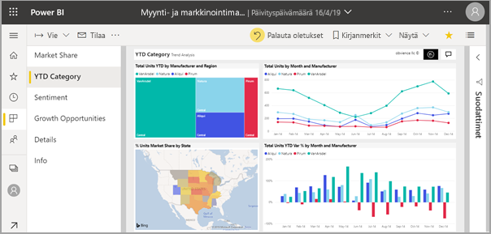
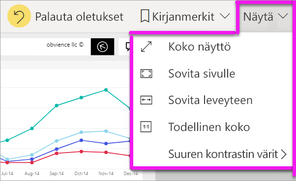
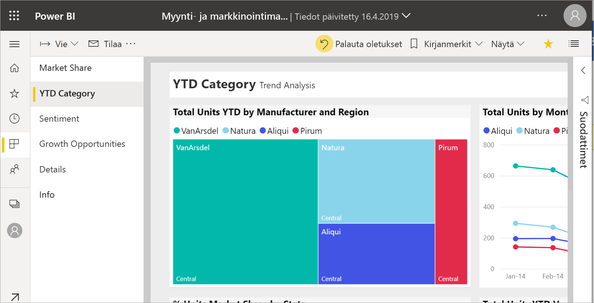
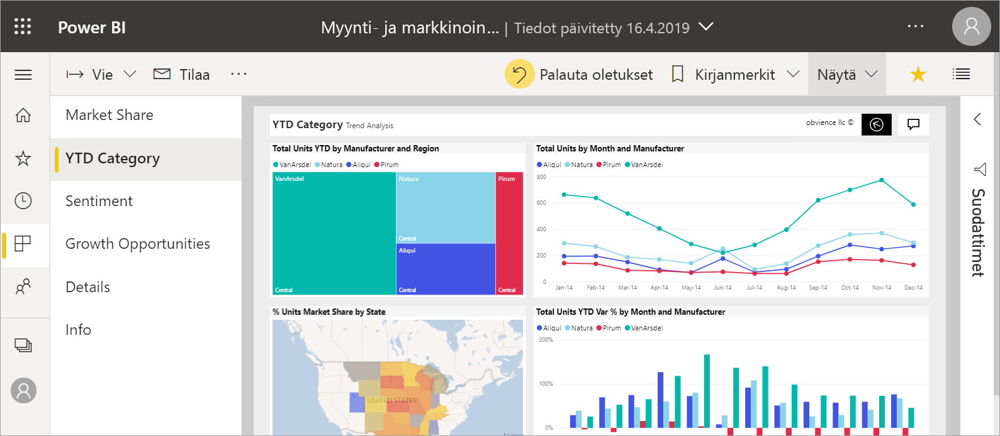
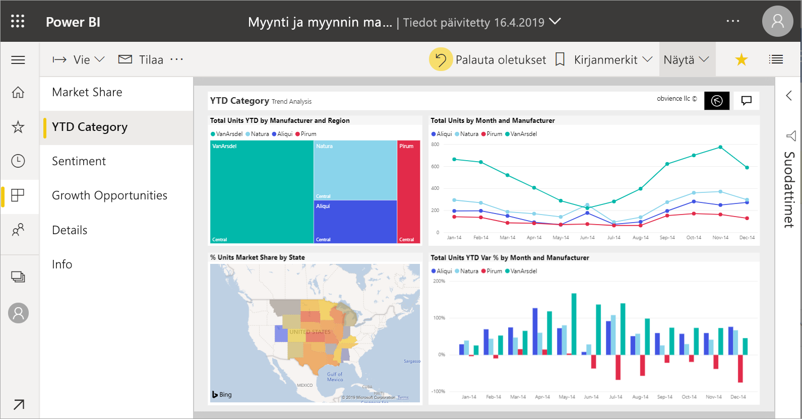
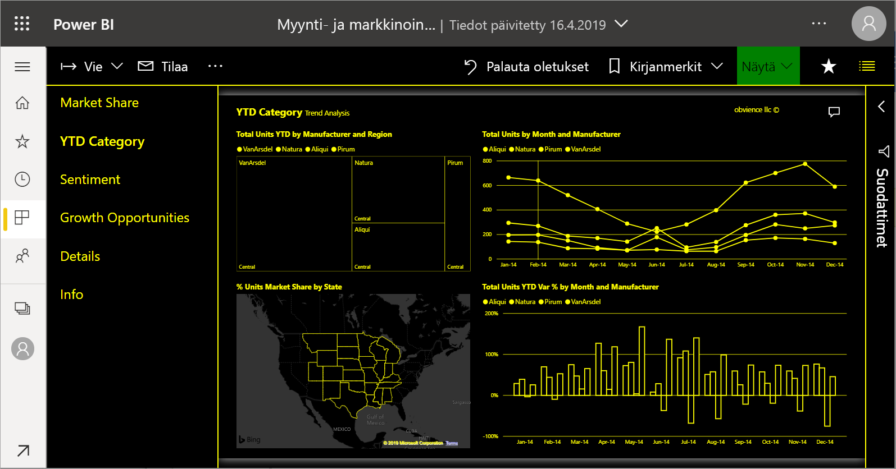
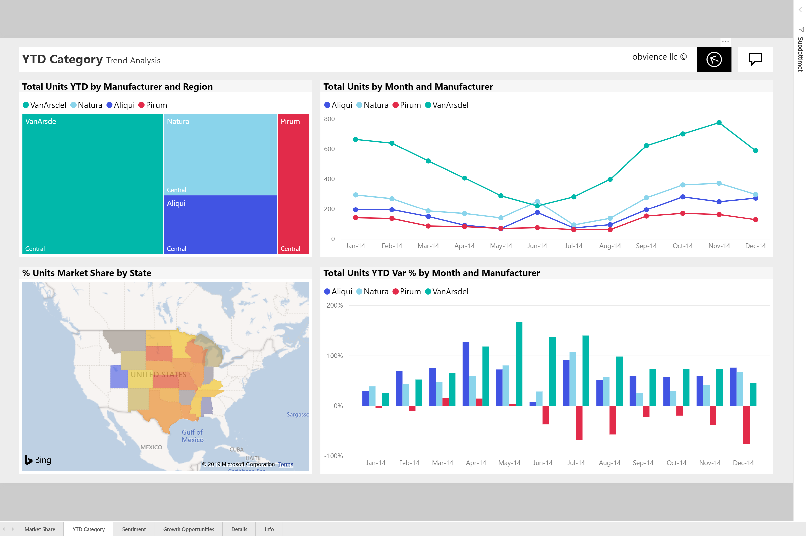

# Raportin sivun näyttökoon muuttaminen

[!INCLUDE[consumer-appliesto-yyny](../includes/consumer-appliesto-yyny.md)]

[!INCLUDE [power-bi-service-new-look-include](../includes/power-bi-service-new-look-include.md)]

Ihmiset lukevat raportteja useilla eri laitteilla, joissa on erikokoisia näyttöjä ja erilaisia kuvasuhteita. Voit muokata raporttisivun näyttötapaa tarpeisiisi sopivaksi.

## Näytä-valikon esittely

**Näytä**-valikon toiminnoilla voit näyttää raporttisivuja joustavasti haluamallasi leveydellä ja koolla:

- Oletetaan, että käytät raporttia pienellä laitteella ja sinulla on vaikeuksia nähdä otsikoita ja selitteitä.  Voit suurentaa raporttisivun kokoa valitsemalla **Näytä** > **Todellinen koko**. Voit siirtyä raportissa vierityspalkkien avulla.

    

- Voit myös sovittaa raportin näytön leveyteen valitsemalla **Sovita leveyteen**. Koska tämä säätää vain leveyttä, ei korkeutta, sinun täytyy ehkä silti käyttää edelleen pystysuuntaista vierityspalkkia.

  

- Jos et halua nähdä vierityspalkkeja ja haluat käyttää näytön koon tehokkaasti, valitse **Sovita sivulle**.

   

- Valittavissa on myös neljä **suuren kontrastin väriä**: Suuri kontrasti 1, Suuri kontrasti 2, Suuri kontrasti, musta ja Suuri kontrasti, valkoinen. Tämä on helppokäyttötoiminto, jonka avulla heikosti näkevät käyttäjät näkevät raportin paremmin. Alla olevassa esimerkissä on suuri kontrasti 1. 

    

- Viimeinen vaihtoehto **Koko näyttö** näyttää raporttisivun ilman valikkorivejä ja otsikoita. Koko näyttö voi olla hyvä vaihtoehto pienille näytöille, joissa yksityiskohtien näkeminen on vaikeaa.  Koko näyttö voi olla hyvä vaihtoehto myös silloin, kun heijastat raporttisivuja suurille näytöille ihmisten tarkasteltavaksi (ei käsiteltäväksi).  

    

Kun poistut raportista, **näkymäasetuksia** ei tallenneta, vaan ne palautetaan oletuksiin. Jos haluat tallentaa näitä asetuksia, käytä [kirjanmerkkejä](end-user-bookmarks.md).

## Vaihda sivunäyttöä selaimesi avulla

Selaimen zoomaussäätimet lisäävät ja vähentävät käytettävissä olevaa sivualuetta. Zoomauksen pienentäminen laajentaa käytettävissä olevaa sivualuetta ja päinvastoin. 

Koko selaimen koon muuttaminen on toinen tapa muuttaa raportin näyttökokoa. 

## Lähennä visualisointia
Joskus visualisoinnin yksityiskohtia on vaikea nähdä. Voit suurentaa visualisoinnin näyttöä. Lisätietoja on kohdassa [Tarkastelutila ja koko näytön tila](end-user-focus.md)

### Visualisointi *tarkastelutilassa*

### Visualisointi *koko näytön tilassa*

## Seuraavat vaiheet

* [Aloita raportin Suodattimet-ruudun esittely](end-user-report-filter.md)