# Raportin sivun koon muuttaminen
Opit [edellisessä artikkelissa ja videossa](../power-bi-report-display-settings.md) kaksi tapaa hallita Power BI -raporttien sivun näyttöä: **Näkymä** ja **Sivun koko**. Sivun Näkymä ja Sivun koko ovat käytettävissä sekä Power BI -palvelussa että Power BI Desktopissa. Niiden ulkonäkö ja toiminnot ovat lähes samat, mutta tässä opetusohjelmassa käytämme Power BI -palvelua.

### Edellytykset
- Power BI -palvelu   
- [Jälleenmyyntianalyysimallin raportti](../sample-retail-analysis.md)

## Muutetaanpa ensiksi sivun Näkymä-asetusta.

1. Avaa raportti lukunäkymässä tai muokkausnäkymässä, ja valitse Raportti-välilehdessä **Uudet myymälät**. Tämä raportin sivu näytetään oletusarvoisesti käyttämällä **Sovita sivulle** -asetusta.  Tässä tapauksessa Sovita sivulle -asetus näyttää raportin sivun ilman vierityspalkkeja, mutta jotkin tiedot ja otsikot ovat liian pieniä luettaviksi.

   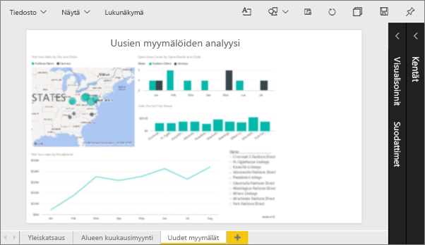
2. Varmista, että piirtoalustalla ei ole valittu mitään visualisointia. Valitse **Näkymä** ja tarkista näyttöasetukset.

   * Näet lukunäkymässä seuraavan.

     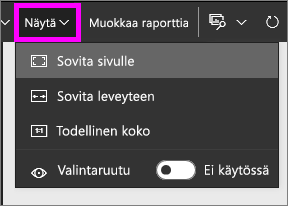
   * Näet muokkausnäkymässä seuraavan.

     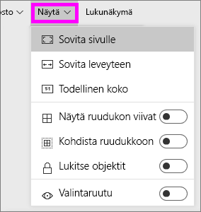

3. Katsotaanpa, miltä sivu näyttää käyttämällä **Todellinen koko** -asetusta.

   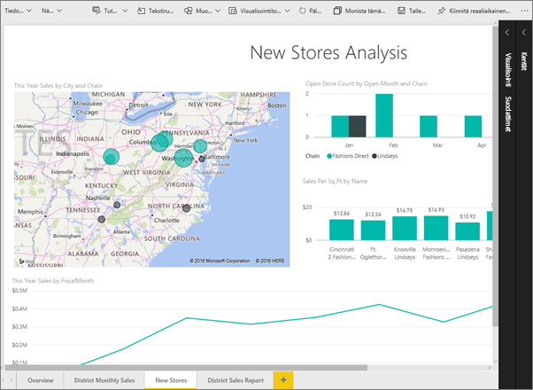

   Ei kovin hyvältä, ja koontinäytössä on nyt kaksinkertaiset vierityspalkit.
4. Vaihda asetukseksi **Sovita leveyteen**.

   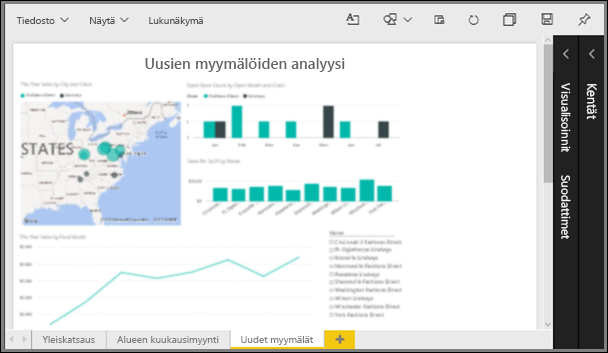

   Se näyttää paremmalta. Vierityspalkkeja on yhä yksi, mutta sitä on helpompi lukea tarkemmin.

## Raportin sivun oletusnäkymän muuttaminen
Jos olet raportin *laatija*, voit muuttaa raportin sivujen oletusnäkymää. Kun jaat raportin muiden kanssa, raportin sivut avataan käyttämällä määrittämääsi näkymää. Raportin *lukijat* voivat vaihtaa tätä näkymää, mutta he eivät voi tallentaa muutoksiaan, kun he poistuvat raportista.

1. Vaihda raportin **Uudet myymälät**-sivulla takaisin **Todellinen koko** -näkymään.

   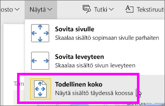

2. Määritä **Alueen kuukausimyynti** -sivulla asetukseksi **Sovita leveyteen**.

3. Säilytä **Yleiskatsaus**-raporttisivulla oletusarvoinen Näkymä-asetus.

4. Tallenna raportti nyt valitsemalla **Tiedosto > Tallenna**. Seuraavan kerran avaat tämän raportin, sivut näytetään käyttämällä uutta Näkymä-asetusta. Katsotaanpa, miten tämä tehdään.

   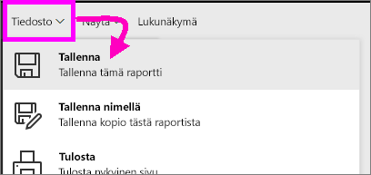
3. Valitse nykyisen työtilan nimi yläreunan siirtymispalkista, jotta voit palata tähän työtilaan.  

   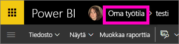
4. Valitse **Raportit**-välilehti ja valitse sama raportti (jälleenmyyjäanalyysimalli).

    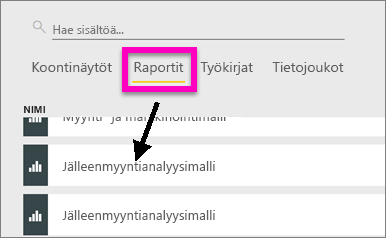
5. Avaa raportin jokainen sivu, jotta näet uudet asetukset.

   

## Tutustutaanpa nyt *Sivun koko* -asetukseen.
Sivun koon asetukset ovat käytettävissä vain [muokkausnäkymässä](../service-interact-with-a-report-in-editing-view.md), joten sinulla on oltava muokkausoikeudet (*laatija*) raporttiin sivun koon asetusten muuttamiseksi. Jos olet yhdistänyt johonkin Microsoftin [malliin](../sample-datasets.md), sinulla on *laatijan* käyttöoikeudet näihin raportteihin.

1. Avaa [jälleenmyyjäanalyysimallin](../sample-retail-analysis.md) ”Alueen kuukausimyynti” -sivu muokkausnäkymässä.
2. Varmista, että piirtoalustalla ei ole valittu mitään visualisointia.  Valitse **Visualisoinnit**-ruudussa maalirullakuvake.
3. Valitse **Sivun koko** &gt; **Tyyppi**, jos haluat näyttää sivun koon asetukset.

   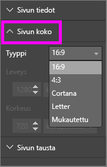
4. Valitse **Letter**.  Piirtoalustalla vain sisältö, joka mahtuu 816 x 1 056 kuvapisteeseen (Letter-koko), näkyy piirtoalustan valkoisella osalla.

   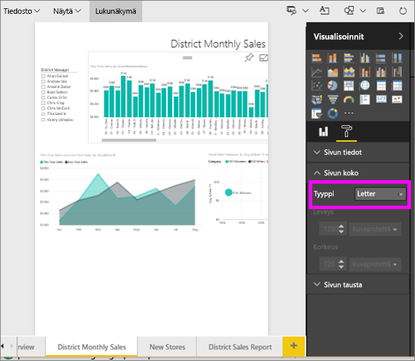
5. Valitse **Sivun koko** **16:9**-suhde.

   

   Raportin sivulla käytetään kuvasuhdetta, jonka leveys on 16 ja korkeus 9. Voit nähdä käytetyn todelliset kuvapistekoon katsomalla harmaana näkyviä leveys- ja korkeuskenttiä (1 280 x 720). Raportin piirtoalustan ympärillä on paljon tyhjää tilaa, koska määritimme aiemmin **Näkymä**-asetukseksi ”Sovita leveyteen”.
7. Jatka tutustumalla **Sivun koko** -asetuksiin.

## Sivun Näkymä- ja Sivun koko -asetusten käyttö yhdessä
Käyttämällä sivun Näkymä- ja Sivun koko -asetuksia yhdessä voit luoda upean raportin, jonka voit jakaa ystävien kanssa tai upottaa toiseen sovellukseen.

Tässä harjoituksessa luot raportin sivun. Se näytetään sovelluksessa, jonka tilan leveys on 500 kuvapistettä ja korkeus 750 kuvapistettä.

Edellisessä vaiheessa näimme, että raportin sivun leveys on tällä hetkellä 1 280 kuvapistettä ja korkeus 720 kuvapistettä. Tiedämme siis, että meidän on muokattava kokoa reippaasti, jotta kaikki visualisoinnit mahtuvat mukaan.

1. Muuta visualisointien kokoa ja siirrä niitä siten, että ne mahtuvat alle puoleen tilaan nykyisestä piirtoalueesta.

    
2. Valitse **Sivun koko** &gt; **Mukauta**.
3. Määritä leveydeksi 500 ja korkeudeksi 750.

    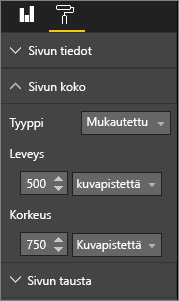
4. Parantele raportin sivua siten, että se näyttää mahdollisimman hyvältä. Tee mukautukset vaihtamalla asetusten **Näkymä > Todellinen koko** ja **Näkymä > Sovita sivulle** välillä.

    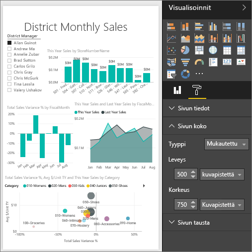

## Seuraavat vaiheet
[Raporttien luominen Cortanaa varten](../service-cortana-answer-cards.md)

Palaa artikkeliin [Power BI- raportin sivun näyttöasetukset](../power-bi-report-display-settings.md)

Onko sinulla muuta kysyttävää? [Kokeile Power BI -yhteisöä](http://community.powerbi.com/)
