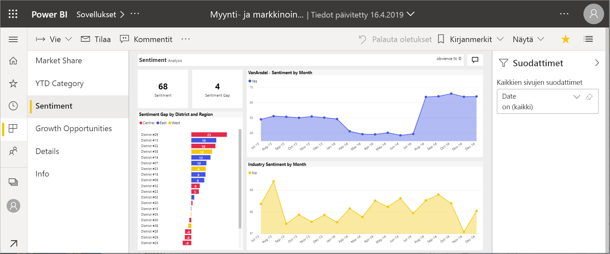
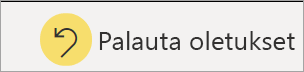

# Raportit Power BI:ssä

Power BI -raportti on usean perspektiivin tietojoukkonäkymä, jonka visualisoinnit edustavat eri havaintoja ja merkityksellisiä tietoja tietojoukosta.  Raportilla voi olla yksittäinen visualisointi tai sivuja, jotka ovat täynnä visualisointeja. Saatat olla raporttien *suunnittelija*, mutta tämä riippuu työroolistasi. Saatat myös olla raporttien *kuluttaja* eli käyttäjä.

Tässä raportissa on kuusi sivua (tai välilehteä). Tarkastelet tällä hetkellä **Asenne**-sivua. Tällä sivulla on viisi erilaista visualisointia ja sivun otsikko. *Suodattimet*-ruudussa näkyy yksi suodatin, jota käytetään kaikkiin raporttisivuihin. Jos haluat kutistaa Suodattimet-ruudun, valitse nuoli ( **>** ).

Jos olet uusi Power BI:n käyttäjä, saat hyvän pohjan sen käyttöön lukemalla [Peruskäsitteet Power BI -palvelun kuluttajille](end-user-basic-concepts.md) -ohjeartikkelin. Raportteja voi lukea, jakaa ja merkitä mobiililaitteilla. Saat lisätietoja ohjeartikkelista [Raporttien tutkiminen Power BI -mobiilisovelluksissa](mobile/mobile-reports-in-the-mobile-apps.md).

## Raporttien edut

Power BI -raportti perustuu yhteen tietojoukkoon. Raporttien *suunnittelijat* luovat raportin visualisointeja, jotka edustavat tiettyjä tietoja. Visualisoinnit eivät ole muuttumattomia.  Ne päivittyvät, kun niiden perustana olevat tiedot muuttuvat. Voit käyttää visualisointeja ja suodattimia, kun pureudut tietoihin löytääksesi merkityksellisiä tietoja ja vastauksia. Kuten koontinäyttö, raportti on erittäin vuorovaikutteinen ja mukautettava.

### Sisällön turvallinen käyttö

Kun käytät sisältöä suodattamalla, osittamalla, tilaamalla ja viemällä, et voi rikkoa raportteja. Työsi ei vaikuta taustalla olevaan tietojoukkoon tai alkuperäiseen jaettuun sisältöön. Tämä koskee koontinäyttöjä, raportteja ja sovelluksia.

> [!NOTE]
> Muista, että et voi vahingoittaa tietojasi. Power BI on hyvä paikka tutkia ja kokeilla ilman pelkoa minkään rikkomisesta.

### Muutosten tallentaminen tai oletusasetusten palauttaminen

Tämä ei kuitenkaan tarkoita sitä, ettetkö voi tallentaa muutoksiasi. Se on tietysti mahdollista, mutta nämä muutokset kuitenkin koskevat vain sinun näkymääsi sisällöstä. Jos haluat palata raportin alkuperäiseen oletusnäkymään, valitse **Palauta oletukset**.

## Koontinäytöt vs. raportit

[Koontinäytöt](end-user-dashboards.md) sekoitetaan usein raportteihin, koska nekin ovat pohjia, jotka ovat täynnä visualisointeja. Niiden välillä on kuitenkin merkittäviä eroja.  

| **Ominaisuus** | **Koontinäytöt** | **Raportit** |
| --- | --- | --- |
| Sivut |Yksi sivu |Yksi tai useampi sivu |
| Tietolähteet |Yksi tai useampi raportti ja yksi tai useampi tietojoukko koontinäyttöä kohden |Yksi tietojoukko raporttia kohden |
| Suodatus |Ei voi suodattaa tai jakaa sektoreihin |Monta eri tapaa suodattaa, korostaa ja jakaa sektoreihin |
| Hälytysten asettaminen |Voit luoda hälytyksiä lähetettäväksi sähköpostina, kun koontinäyttö täyttää tietyt ehdot |Ei |
| Ominaisuus |Voit määrittää jonkin koontinäytön esittelyssä olevaksi koontinäytöksi |Esittelyssä olevaa raporttia ei voida luoda |
| Pohjana olevat tietojoukkojen taulukot ja kentät ovat näkyvissä |Ei. Voit viedä tietoja, mutta et näe tietojoukon taulukoita ja kenttiä itse koontinäytössä |Kyllä. Näet ne tietojoukon taulukot, kentät ja arvot, joihin sinulla on oikeudet |
| Mukauttaminen |Ei  |Voit suodattaa, viedä, tarkastella liittyvää sisältöä, lisätä kirjanmerkkejä, luoda QR-koodeja, analysoida Excelissä ja niin edelleen |

<!--| Available in Power BI Desktop |No |Yes, can create and view reports in Desktop |
| Pinning |Can pin existing visuals (tiles) only from current dashboard to your other dashboards |Can pin visuals (as tiles) to any of your dashboards. Can pin entire report pages to any of your dashboards. | -->

## Raportin suunnittelijat ja kuluttajat

Roolistasi riippuen saatat olla *suunnittelija*, joka luo raportteja omaan käyttöönsä tai jakaa niitä työtovereidensa kanssa. Haluat oppia, miten raportteja luodaan ja jaetaan.

Tai voit olla *kuluttaja*, joka saa raportteja muilta. Haluat oppia ymmärtämään ja käyttämään raportteja. Jos olet raporttien *kuluttaja*, nämä linkit ovat sinulle:

* Aloita [Power BI -palvelun esittelyllä](end-user-basic-concepts.md) niin tiedät, mistä raportit ja raporttityökalut löytyvät.
* Opi [avaamaan raportti](end-user-report-open.md) ja tutustu kaikkeen [lukunäkymässä](end-user-reading-view.md) käytettävissä olevaan vuorovaikutukseen.
* Tutustu raportteihin paremmin tutustumalla johonkin [malleistamme](../sample-tutorial-connect-to-the-samples.md).  
* Katso, mitä tietojoukkoa raportissa käytetään ja missä koontinäytöissä on raportista kiinnitettyjä ruutuja, [tarkastelemalla asiaan liittyvää sisältöä Power BI -palvelussa](end-user-related.md).

> [!TIP]
> Jos et löytänyt etsimääsi täältä, selaa kaikkia *raportteihin* liittyviä ohjeartikkeleita vasemmalla olevan sisällysluettelon avulla.

## Seuraavat vaiheet

[Raportin avaaminen ja tarkasteleminen](end-user-report-open.md)    
[Raporttinäkymät Power BI -palvelussa](end-user-dashboards.md)