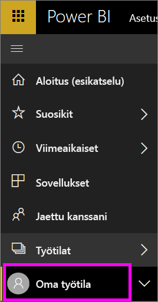
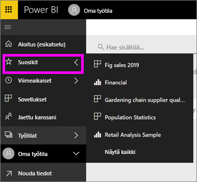

# Siirtyminen: sisällön hakeminen, löytäminen ja lajitteleminen Power BI -palvelussa
Sisältöön voi siirtyä monella tavalla Power BI -palvelussa. Sisältö on jaettu työtiloissa tyypin mukaan koontinäyttöihin, raportteihin, työkirjoihin ja tietojoukkoihin.  Lisäksi sisältö on järjestetty käytön mukaan suosikkeihin, viimeksi avattuihin, sovelluksiin, kanssani jaettuihin ja esiteltyihin. Kaikki sisältö näkyy aloitussivulla, jotta siirtyminen olisi helpompaa. Näiden eri kulkureittien kautta löydät tarvitsemasi sisällön nopeasti Power BI -palvelussa.  

## Siirtyminen työtiloissa

Power BI:n *kuluttajilla* on yleensä vain yksi työtila: **Oma työtila**. **Omassa työtilassa** on sisältöä vain, jos olet ladannut Microsoftin malleja tai luonut tai ladannut omaa sisältöä.  

Power BI -palvelu jakaa **Omassa työtilassa** sisällön tyypin mukaan koontinäyttöihin, raportteihin, työkirjoihin ja tietojoukkoihin. Näet tämän jaon, kun valitset työtilan. Tässä esimerkissä **Oma työtila** sisältää yhden koontinäytön, kaksi raporttia, ei yhtään työkirjaa ja kaksi tietojoukkoa.

________________________________________

## Siirtyminen käyttämällä vasenta siirtymisruutua
Vasen siirtymispalkki luokittelee sisällön tavoilla, jotka helpottavat ja nopeuttavat entisestään tarvittavan sisällön löytämistä.  

- Kanssasi jaettu sisältö on käytettävissä **Jaettu kanssani** -kohdassa.
- Viimeksi tarkasteltu sisältö on käytettävissä **Viimeisimmät**-kohdassa. 
- Löydät sovelluksesi valitsemalla **Sovellukset**.
- **Aloitus**-näkymässä tärkein sisältösi, suositeltu sisältö ja oppimislähteet näkyvät yhdellä sivulla.

Voit lisäksi lisätä sisällön [suosikiksi](end-user-favorite.md) ja [esittelyyn](end-user-featured.md). Valitse koontinäyttö, jota uskot tarkastelevasi useimmin, ja määritä se *esittelyssä* olevaksi koontinäytöksi. Aina kun avaat Power BI -palvelun, esittelyssä oleva koontinäyttö näkyy ensimmäisenä. Käytkö usein useissa koontinäytöissä ja sovelluksissa? Kun lisäät ne suosikeiksi, ne ovat aina käytettävissä vasemmassa siirtymisruudussa.

.

## Huomioon otettavat seikat ja vianmääritys
* Tietojoukoissa omistaja ei ole käytettävissä **lajitteluperusteena**.

## Seuraavat vaiheet
[Power BI:n peruskäsitteet](end-user-basic-concepts.md)

Onko sinulla muuta kysyttävää? [Kokeile Power BI -yhteisöä](http://community.powerbi.com/)