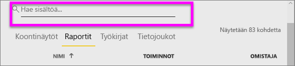

# Siirtyminen: sisällön hakeminen, löytäminen ja lajitteleminen Power BI -palvelussa

[!INCLUDE [power-bi-service-new-look-include](../includes/power-bi-service-new-look-include.md)]

Sisältöön voi siirtyä monella tavalla Power BI -palvelussa. Sisältö on jaettu työtilassasi tyypin mukaan koontinäyttöihin ja raportteihin.  Lisäksi sisältö on järjestetty käytön mukaan suosikkeihin, viimeksi avattuihin, sovelluksiin, kanssani jaettuihin ja esiteltyihin. Kaikki sisältö näkyy Power BI:n *aloitussivulla*, jotta siirtyminen olisi helpompaa. Näiden eri kulkureittien kautta löydät tarvitsemasi sisällön nopeasti Power BI -palvelussa.  

## Siirtyminen työtiloissa

Power BI:n *kuluttajilla* on yleensä vain yksi työtila: **Oma työtila**. **Omassa työtilassa** on sisältöä vain, jos olet ladannut Microsoftin malleja tai luonut tai ladannut omia koontinäyttöjä, raportteja tai sovelluksia.  

Power BI -palvelu jakaa sisältösi **Omassa työtilassa** tyypin mukaan koontinäyttöihin, raportteihin, työkirjoihin ja tietojoukkoihin. Näet tämän jaon, kun valitset työtilan. Tässä esimerkissä **Oma työtila** sisältää yhden koontinäytön, yhden raportin, ei yhtään työkirjaa ja yhden tietojoukon.

________________________________________
## Siirtyminen hakukentän avulla
Käytä **Oma työtila** -sisältönäkymää sisällön hakuun, suodattamiseen ja lajittelemiseen. Kirjoita hakukenttään koontinäytön, raportin, työkirjan tai omistajan nimi tai osa siitä.  

Jos sinulla on vain muutamia sisältöjä, hakemista ja lajittelemista ei tarvita.  Jos sinulla on pitkiä luetteloita, jotka koostuvat koontinäytöistä ja raporteista, hakemisesta ja lajittelemisesta on paljon hyötyä. Esimerkiksi alla olevassa raporttiluettelossa on 83 kohdetta. 

Voit lajitella sisällön myös nimen tai omistajan mukaan. Huomaa ylöspäin osoittava nuoli **Nimi**-kohdan oikealle puolella. Olemme tällä hetkellä lajittelemassa 83 kohdetta aakkosjärjestyksessä nimen mukaan nousevasti. Jos haluat muuttaa lajittelujärjestyksen laskevaksi, valitse **Nimi**. Ylänuoli muuttuu alaspäin osoittavaksi nuoleksi.

Kaikki sarakkeet eivät ole lajiteltavissa. Jos haluat tietää, voidaanko jokin sarake lajitella, pidä hiiren osoitinta kyseisen sarakeotsikon päällä.

___________________________________________________________________
## Siirtyminen siirtymisruudun avulla
Siirtymispalkki luokittelee sisällön tavoilla, jotka helpottavat ja nopeuttavat tarvittavan sisällön löytämistä.  

- Kanssasi jaettu sisältö on käytettävissä **Jaettu kanssani** -kohdassa.
- Viimeksi tarkasteltu sisältö on käytettävissä **Viimeisimmät**-kohdassa. 
- Löydät sovelluksesi valitsemalla **Sovellukset**.
- **Aloitus**-näkymässä tärkein sisältösi, suositeltu sisältö ja oppimislähteet näkyvät yhdellä sivulla.

Voit lisäksi lisätä sisällön [suosikiksi](end-user-favorite.md) ja [esittelyyn](end-user-featured.md). Valitse koontinäyttö tai raportti, jota uskot tarkastelevasi useimmin, ja määritä se *esittelyssä* olevaksi sisällöksi. Aina kun avaat Power BI -palvelun, esittelyssä oleva koontinäyttö näkyy ensimmäisenä. Käytkö usein useissa koontinäytöissä ja sovelluksissa? Kun lisäät ne suosikeiksi, ne ovat aina käytettävissä vasemmassa siirtymispalkissa.

.

## Huomioon otettavat seikat ja vianmääritys
* Tietojoukoissa omistaja ei ole käytettävissä **lajitteluperusteena**.

## Seuraavat vaiheet
[Lajittele visualisoinnit raporteissa](end-user-change-sort.md)

Onko sinulla kysyttävää? [Kokeile Power BI -yhteisöä](http://community.powerbi.com/)
