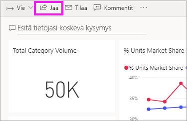
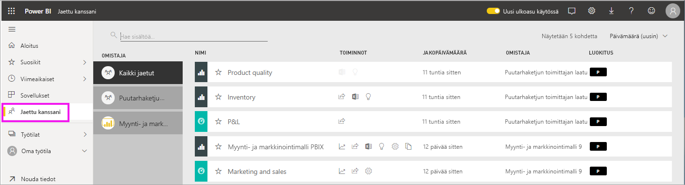
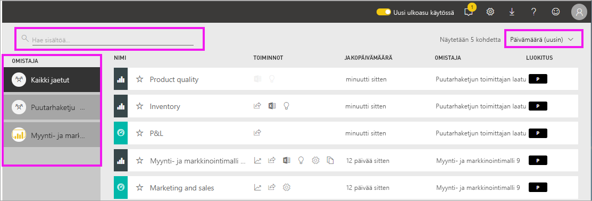

# Minulle jaettujen koontinäyttöjen ja raporttien tarkastelu

[!INCLUDE[consumer-appliesto-ynny](../includes/consumer-appliesto-ynny.md)]

[!INCLUDE [power-bi-service-new-look-include](../includes/power-bi-service-new-look-include.md)]

Kun työtoveri jakaa sinulle sisältöä **Jaa**-painiketta käyttämällä, se näkyy **Jaettu kanssani** -säilössä. Koontinäyttö tai raportti on käytettävissä vain **Jaettu kanssani** -luettelosta, ei **Sovellukset**-näkymän kautta.

Katso videolta, kun Amanda kertoo lisää **Jaettu kanssani** ‑sisältöluettelosta ja näyttää, miten luettelosta siirrytään sisältöihin toiseen ja miten luetteloa voi suodattaa. Kokeile sitten itse noudattamalla videon alapuolella olevia vaiheittaisia ohjeita. Tarvitset Power BI Pro ‑käyttöoikeuden voidaksesi tarkastella sinulle jaettuja koontinäyttöjä. Saat lisätietoja ohjeartikkelista [Mikä käyttöoikeus minulla on?](end-user-license.md)
    

> [!NOTE]
> Tässä videossa käytetään Power BI -palvelun vanhempaa versiota.
    

<iframe width="560" height="315" src="https://www.youtube.com/embed/G26dr2PsEpk" frameborder="0" allowfullscreen></iframe>

## Jaetun sisällön käsitteleminen

Jaettujen koontinäyttöjen ja raporttien kanssa voi toimia eri tavoilla sen mukaan, millaiset käyttöoikeudet niiden *suunnittelija* on myöntänyt sinulle. Tällaisia toimintoja ovat esimerkiksi kopioiden tekeminen koontinäytöstä, raportin avaaminen [lukunäkymässä](end-user-reading-view.md) ja sisältöjen jakaminen edelleen muille työtovereille.

### **Jaettu kanssani** -säilön käytettävissä olevat toiminnot
Käytettävissä olevat toiminnot määräytyvät sisällön *suunnittelijan* määrittämien asetusten mukaan. Vaihtoehtojasi voivat olla seuraavat:
* Valitsemalla tähtikuvakkeen voit [lisätä koontinäytön tai raportin suosikkeihin](end-user-favorite.md) .
* Koontinäytön tai raportin poistaminen  .
* Voit jakaa joitakin koontinäyttöjä ja raportteja edelleen muille  .
* [Avaa raportti Excelissä](end-user-export.md)  
* [Näytä merkitykselliset tiedot](end-user-insights.md), jotka Power BI löytää tiedoista .
  
  > [!NOTE]
  > Jos haluat tietoa EGRC-luokituksista, valitse **Luokitus**-painike tai lue artikkeli [Koontinäytön tietojen luokittelu](../service-data-classification.md).
  > 

## Jaettujen koontinäyttöjen hakeminen ja lajitteleminen
Jos sisältöluettelosi on pitkä, sinulla on useita vaihtoehtoja tarvitsemasi kohteen hakemiseen. Voit käyttää hakukenttää, lajitella päivämäärän mukaan tai valita vaihtoehdon **Omistaja**-sarakkeesta.    

