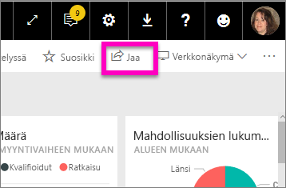
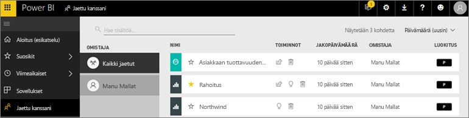
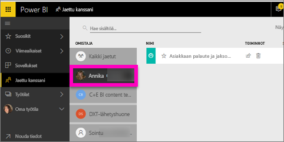

# Minulle jaettujen koontinäyttöjen ja raporttien tarkastelu
## Jaettu kanssani

Kun työtoveri jakaa sinulle sisältöä **Jaa**-painiketta käyttämällä, se näkyy **Jaettu kanssani** -säilössä. Koontinäyttö tai raportti on käytettävissä vain **Jaettu kanssani** -luettelosta, ei **Sovellukset**-näkymän kautta.

Katso videolta, kun Amanda kertoo lisää **Jaettu kanssani** ‑sisältöluettelosta ja näyttää, miten luettelosta siirrytään sisältöihin toiseen ja miten luetteloa voi suodattaa. Kokeile sitten itse noudattamalla videon alapuolella olevia vaiheittaisia ohjeita. Tarvitset Power BI Pro ‑käyttöoikeuden voidaksesi tarkastella sinulle jaettuja koontinäyttöjä. Lisätietoja on artikkelissa [Mikä on Power BI Premium?](../service-premium.md)

<iframe width="560" height="315" src="https://www.youtube.com/embed/G26dr2PsEpk" frameborder="0" allowfullscreen></iframe>

Koontinäyttöjen ja raporttien kanssa voi toimia eri tavoilla sen mukaan, millaiset käyttöoikeudet niiden suunnittelija on myöntänyt sinulle. Tällaisia toimintoja ovat esimerkiksi kopioiden tekeminen koontinäytöstä, raportin avaaminen [lukunäkymässä](end-user-reading-view.md) ja sisältöjen jakaminen edelleen muille työtovereille.

## **Jaettu kanssani** -säilön käytettävissä olevat toiminnot
* Voit [lisätä koontinäytön tai raportin suosikkeihin](end-user-favorite.md) tähtikuvakkeella.
* Koontinäytön tai raportin poistaminen  
* Voit jakaa joitakin koontinäyttöjä ja raportteja edelleen muille  
* Lisäksi, jos luetteloista tulee pitkiä, voit [etsiä tarvitsemasi käyttämällä hakukenttää ja lajittelua](end-user-search-sort.md).
  
  > [!NOTE]
  > Jos haluat tietoa EGRC-luokituksista, valitse luokituspainike tai katso artikkeli [Koontinäytön tietojen luokittelu](../service-data-classification.md).
  > 
  > 
* Voit avata koontinäytön ja tutkia sitä valitsemalla koontinäytön nimen. Kun olet avannut jaetun koontinäytön, voit esittää Q&A-toiminnon avulla kysymyksiä koontinäytön perustana olevista tiedoista, tai jos haluat avata raportin ja tehdä sille toimintoja lukunäkymässä, valitse haluamasi ruutu.

## Jaettujen koontinäyttöjen suodattaminen omistajan mukaan
**Jaettu kanssani** ‑näkymän sisällön voi suodattaa sisällön omistajan mukaan. Jos valitsen esimerkiksi omistajaksi **Amandan**, näkyville jää vain koontinäyttö, jonka Amanda on jakanut minulle.

