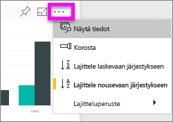
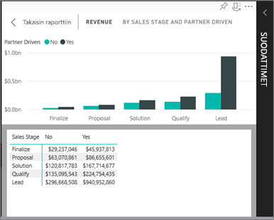
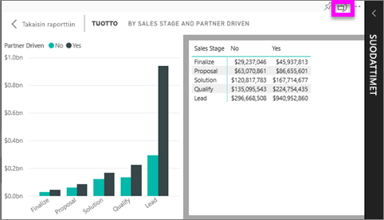

# Visualisoinnin luomiseen käytettyjen tietojen näyttäminen
## Näytä tiedot
Power BI:n visualisointi rakentuu pohjana olevien tietojoukkojen tiedoista. Jos olet kiinnostunut taustatoiminnoista, Power BI:n avulla voit *tarkastella* visualisoinnin luomiseen käytettyjä tietoja. Kun valitset **Näytä tiedot**, Power BI näyttää tiedot visualisoinnin alla (tai vieressä).

## *Näytä tiedot* -ominaisuuden käyttäminen Power BI -palvelussa
1. Avaa raportti Power BI -palvelussa ja valitse visualisointi.  
2. Jos haluat tuoda visualisoinnin taustalla olevat tiedot näkyviin, valitse kolme pistettä (...) ja valitse **Näytä tiedot**.
   
   
3. Tiedot näkyvät oletusarvoisesti visualisoinnin alla.
   
   

4. Jos haluat vaihtaa suuntaa, valitse pystysuuntainen asettelu  visualisoinnin oikeasta yläkulmasta.
   
   

### Seuraavat vaiheet
[Visualisoinnit Power BI -raporteissa](../visuals/power-bi-report-visualizations.md)    
[Power BI -raportit](end-user-reports.md)    
