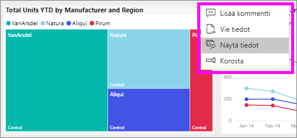
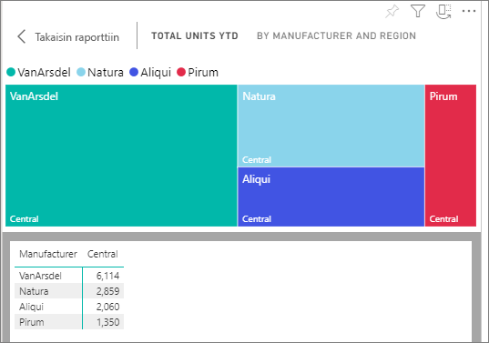
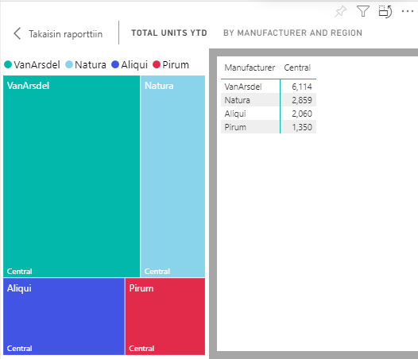

# Tietojen näyttäminen Power BI -raporteissa

[!INCLUDE[consumer-appliesto-yyny](../includes/consumer-appliesto-yyny.md)]

[!INCLUDE [power-bi-service-new-look-include](../includes/power-bi-service-new-look-include.md)]

Power BI -visualisointi rakentuu pohjana olevien tietojoukkojen tiedoista. Jos olet kiinnostunut taustatoiminnoista, Power BI -palvelun avulla voit *tarkastella* raportin visualisoinnin luomiseen käytettyjä tietoja. Kun valitset **Näytä tiedot**, Power BI näyttää tiedot visualisoinnin alla (tai vieressä).

Jos haluat tarkastella pohjana olevia tietoja koontinäytössä, käytä [Vie Exceliin](end-user-export.md) -toimintoa

## Raportin visualisoinnin luonnissa käytettävien tietojen näyttäminen
1. [Avaa raportti](end-user-report-open.md) Power BI -palvelussa ja valitse visualisointi.  
2. Jos haluat tuoda visualisoinnin taustalla olevat tiedot näkyviin, valitse **Enemmän vaihtoehtoja** (...) ja valitse **Näytä tiedot**.
   
   
3. Tiedot näkyvät oletusarvoisesti visualisoinnin alla.
   
   

4. Jos haluat vaihtaa suuntaa, valitse pystysuuntainen asettelu  visualisoinnin oikeasta yläkulmasta.
   
   

## Seuraavat vaiheet
[Visualisoinnit Power BI -raporteissa](../visuals/power-bi-report-visualizations.md)    
[Power BI -raportit](end-user-reports.md)    
