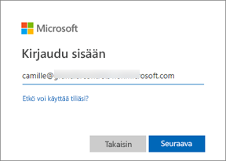
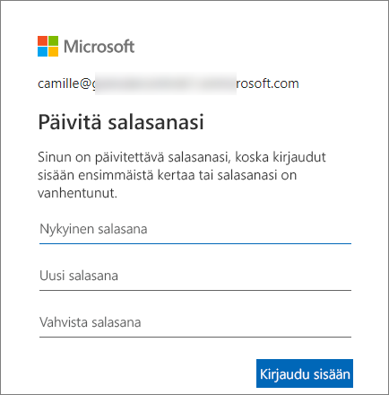
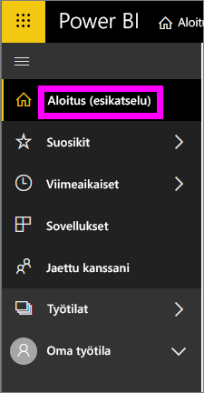
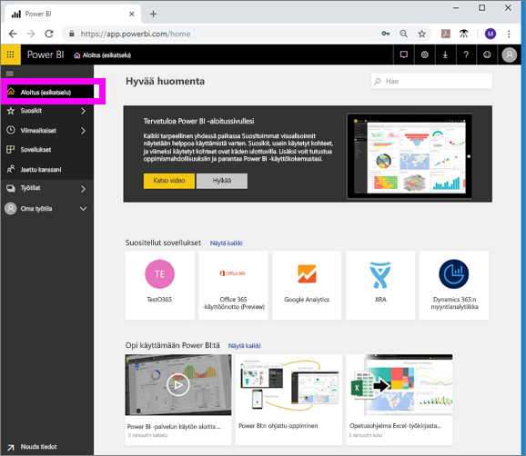

# Power BI -palveluun kirjautuminen

## Power BI -tilit
Tarvitset tilin, jotta voit kirjautua Power BI -palveluun. Voit hankkia Power BI -tilin kahdella eri tavalla. Yrityksesi voi ostaa Power BI -käyttöoikeuksia työntekijöilleen. Yksittäiset käyttäjät voivat rekisteröityä maksuttoman kokeiluversion käyttäjiksi tai ostaa henkilökohtaisen käyttöoikeuden. Tässä artikkelissa käsitellään ensimmäistä vaihtoehtoa.

## Ensimmäinen kirjautumiskerta

### 1. vaihe: avaa selain
Power BI -palvelua käytetään selaimella.  Avaa siis suosikkiselaimesi ja anna osoitteeksi **app.powerbi.com**.

### 2. vaihe: kirjoita sähköpostiosoitteesi
Kun kirjaudut ensimmäistä kertaa, sinulta kysytään sähköpostiosoitettasi.  Voit käyttää työpaikan tai oppilaitoksen sähköpostiosoitetta, jolla Power BI:hin on rekisteröidytty.  

Tarkista postilaatikostasi Power BI -järjestelmänvalvojalta saamasi viesti. Useimmat järjestelmänvalvojat lähettävät tervetulosähköpostin, joka sisältää tilapäisen salasanasi. Kirjaudu sisään tällä sähköpostitilillä. 

 
### 3. vaihe: luo uusi salasana
Jos Power BI -järjestelmänvalvoja on lähettänyt sinulla tilapäisen salasanan, kirjoita se **Nykyinen salasana** -kenttään. Jos et ole saanut tätä salasanaa sähköpostitse, ota yhteyttä Power BI -järjestelmänvalvojaasi

Power BI muistaa tunnistetietosi, joten sinun ei tarvitse antaa käyttäjänimeäsi ja salasanaasi enää seuraavalla kirjautumiskerralla. 

### 4. vaihe: tarkista aloitussivu
Ensimmäisellä käyttökerralla Power BI avautuu **aloitussivullesi**. Jos **aloitussivusi** ei avaudu, valitse se vasemmasta siirtymisruudusta. 

Aloitussivulla näet kaiken sen sisällön, jonka käyttöön sinulla on oikeus. Alussa aloitussivullasi ei välttämättä ole paljonkaan sisältöä, mutta älä huoli: tämä muuttuu, kun aloitat Power BI:n käytön työtovereidesi kanssa. 

Jos et halua Power BI:n avautuvan aloitussivullesi, voit [määrittää **esitellyn** koontinäytön tai raportin,](end-user-featured.md) joka avataan kirjauduttuasi. 

## Sisällön turvallinen käyttö
Koska olet ***kuluttaja***, muut jakavat sisältöä kanssasi ja tutkit tämän sisällön avulla tietoja sekä teet liiketoimintapäätöksiä.  Kun suodatat, ositat, tilaat, viet ja muutat kokoa, työsi ei vaikuta taustalla olevaan tietojoukkoon tai alkuperäiseen jaettuun sisältöön (koontinäyttöihin ja raportteihin). Power BI on turvallinen tila, jossa voit tutkia ja kokeilla. Tämä ei kuitenkaan tarkoita sitä, ettetkö voi tallentaa muutoksiasi: se on tietysti mahdollista. Nämä muutokset kuitenkin koskevat vain **sinun** näkymääsi sisällöstä. Voit palata alkuperäiseen oletusnäkymään helposti napsauttamalla.

## Kirjautuminen ulos Power BI -palvelusta
Kun suljet Power BI:n tai kirjaudut siitä ulos, muutoksesi tallennetaan. Tämän ansiosta voit jatkaa siitä, mihin jäit.

Voit sulkea Power BI:n sulkemalla selainvälilehden, jota käytät 

 

Jos jaat tietokoneen muiden käyttäjien kanssa, suosittelemme, että kirjaudut ulos aina, kun suljet Power BI:n.  Voit kirjautua ulos valitsemalla oikeasta yläkulmasta profiilikuvasi ja valitsemalla sitten **Kirjaudu ulos**. Muussa tapauksessa voit vain sulkea selainvälilehden, kun olet valmis.

 

## Vianmääritys ja huomioon otettavat seikat
- Jos olet rekisteröitynyt Power BI:hin yksityishenkilönä, kirjaudu sisään sillä sähköpostiosoitteella, jolla rekisteröidyit.

- Jos käytät Power BI:tä usealla tilillä, sinua pyydetään valitsemaan tili luettelosta ja antamaan valitsemasi tilin salasana, kun kirjaudut sisään. 

## Seuraavat vaiheet
[Power BI -sovelluksen tarkasteleminen](end-user-app-view.md)
