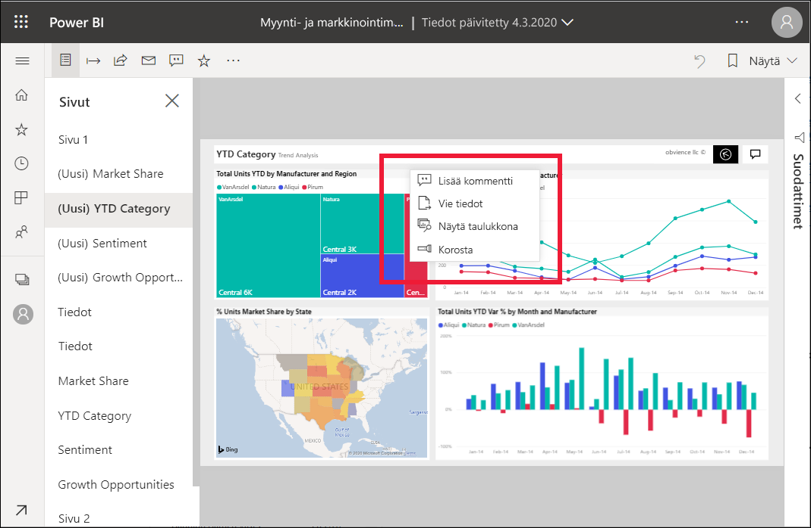
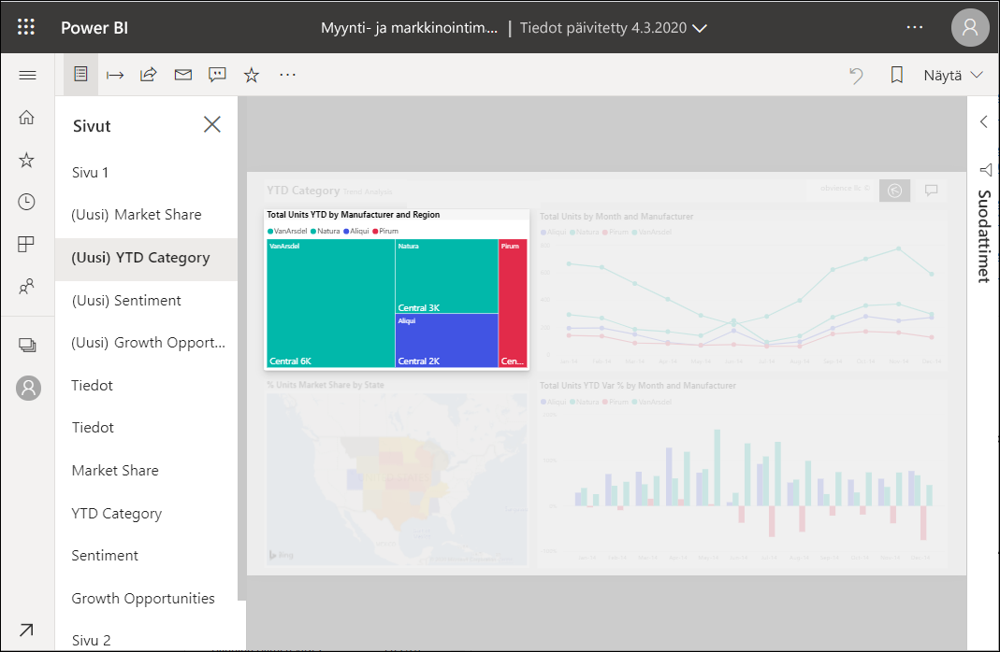

# Korostusten lisääminen Power BI -raportteihin

[!INCLUDE[consumer-appliesto-yyny](../includes/consumer-appliesto-yyny.md)]

Korostuksella voit kiinnittää huomiota tiettyyn visualisointiin raporttisivulla.  Jos korostustila on valittuna, kun kirjanmerkki lisätään, kyseinen tila säilytetään kirjanmerkissä.

## Korostuksen lisääminen

1. [Avaa raportti](end-user-report-open.md) Power BI -palvelussa.

2. Valitse, mitä visualisointia haluat korostaa raporttisivulla. Valitse avattava **Lisää toimintoja (...)** -valikko.  

    

3. Valitse **Korosta**. Valittu visualisointi korostetaan, jolloin kaikki muut sivun visualisoinnit haalentuvat miltei läpinäkyviksi. 

    

## Seuraavat vaiheet

* [Koontinäytön ruudun tai raporttivisualisoinnin näyttäminen tarkastelutilassa](end-user-focus.md)

