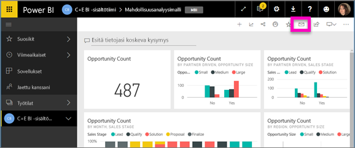
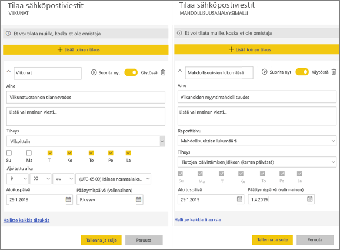
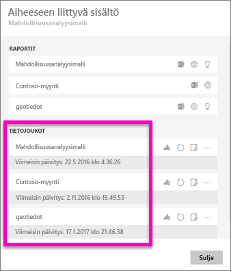

# Raportin tai koontinäytön tilaaminen Power BI -palvelussa 
Ei ole koskaan ollut näin helppoa pysyä ajan tasalla tärkeimmistä koontinäytöistä ja raporteista. Kun tilaat itsellesi tärkeimmät raporttisivut ja koontinäytöt, Power BI lähettää sinulle sähköpostitse niistä tilannevedoksen. Voit määrittää, miten usein haluat Power BI:n lähettävän sähköpostia: päivittäin, viikoittain tai tietojen päivittyessä. Voit myös määrittää tietyn ajankohdan sille, milloin Power BI lähettää sähköpostit, tai voit suorittaa tämän nyt.  

Sähköpostissa ja tilannevedoksessa käytetään samaa kieliasetusta kuin Power BI:ssä (katso [Power BI:ssä tuetut kielet ja maat/alueet](../supported-languages-countries-regions.md)). Jos mitään kieltä ei ole määritetty, Power BI käyttää senhetkisen selaimesi paikka-asetuksen mukaista kieltä. Jos haluat nähdä kieliasetuksesi tai muuttaa sitä, valitse hammasrataskuvake  > **Asetukset > Yleiset > Kieli**. 

Kun saat sähköpostiviestin, siinä on mukana linkki, jonka kautta voit siirtyä raporttiin tai koontinäyttöön. Mobiililaitteissa, joihin on asennettu Power BI ‑sovelluksia, linkin valitseminen käynnistää sovelluksen (eikä oletusarvoista raportin tai koontinäytön avaamista Power BI ‑sivustolla).

## Vaatimukset
Tilauksen **luominen** on Power BI Pro -ominaisuus.   

## Koontinäytön tai raporttisivun tilaaminen
Koontinäytön ja raportin tilausprosessit ovat samankaltaiset. Samaa painiketta painamalla voit tilata Power BI -palvelun koontinäyttöjä ja raportteja.
 
.

1. Avaa koontinäyttö tai raportti.
2. Valitse yläreunan valikkoriviltä **Tilaa** tai valitse kirjekuvake .
   
   

   
    
    Vasemmalla olevassa näytössä näet, milloin olet koontinäytössä. Valitse siinä **Tilaa**. Oikealla olevassa näytössä näet, milloin olet raporttisivulla. Valitse siinä **Tilaa**. Voit tilata useamman kuin yhden raportin sivun valitsemalla **Lisää toinen tilaus** ja valitsemalla toisen sivun. 

4. Voit ottaa tilauksen käyttöön tai poistaa sen käytöstä keltaisella liukusäätimellä.  Liukusäätimen asettaminen Poissa käytöstä -asentoon ei poista itse tilausta. Jos haluat poistaa tilauksen, valitse roskakorikuvake.

4. Voit myös täyttää sähköpostiviestin tiedot. 

5. Valitse tilauksesi **tiheys**.  Voit valita Päivittäin, Viikoittain tai Tietojen päivittämisen jälkeen (päivittäin).  Jos haluat saada tilauksen sähköpostit vain tiettyinä päivinä, valitse **Viikoittain** ja valitse sitten, minä päivinä haluat saada sähköposteja.  Jos haluat saada tilauksen sähköpostit esimerkiksi vain arkipäivinä, valitse tiheydeksi **Viikoittain** ja poista sitten lauantain ja sunnuntain valintaruutujen valinnat.   

6. Voit valita sähköpostien lähetyskellonajan valitsemalla tiheydeksi Päivittäin tai Viikoittain ja määrittämällä sitten tilaukselle **ajoitetun** **ajan**.   

7. Määritä alkamis- ja päättymispäivät päivämääräkenttiin. Tilauksesi alkamisaika on oletusarvoisesti tilauksen luomispäivä ja päättymispäivä on oletusarvoisesti vuoden päässä. Tilaus lopetetaan päättymispäivänä, jos et ota sitä uudelleen käyttöön.  Saat ennen tilauksen päättymistä ilmoituksia, jossa kysytään, haluatko jatkaa tilausta.     

8. Jos haluat tarkistaa tilauksesi ja testata sitä, valitse **Suorita nyt**.  Tämä lähettää sähköpostin sinulle heti. 

8. Jos kaikki näyttää olevan kunnossa, tallenna tilaus valitsemalla **Tallenna ja sulje**. Saat sähköpostin ja tilannevedoksen koontinäytöstä tai raportista määrittämäsi aikataulun mukaisesti. Kaikissa tilauksissa, joiden tiheydeksi määritetään **Tietojen päivittämisen jälkeen**, lähetetään sähköpostia vain kyseisen päivän ensimmäisen ajoitetun päivityksen jälkeen.
   
   
   
    Raporttisivun päivittäminen ei päivitä tietojoukkoa. Vain tietojoukon omistaja voi manuaalisesti päivittää tietojoukon. Etsi pohjana olevan tietojoukon nimi valitsemalla **Näytä aiheeseen liittyvät** yläreunan valikkoriviltä.
   
    

## Tilausten hallinta
Vain sinä voit hallita tilauksiasi. Valitse uudelleen **Tilaa** ja valitse vasemmasta alakulmasta **Kaikkien tilausten hallinta** (katso yllä olevat näyttökuvat). 

Tilaus päättyy, jos Pro-käyttöoikeus umpeutuu, omistaja poistaa koontinäytön tai tilauksen luomiseen käytetty käyttäjätili poistetaan.

## Huomioon otettavat seikat ja vianmääritys
* Jos koontinäytön sähköpostitilausten joillakin ruuduilla on käytössä rivitason suojaus (RLS), näitä ruutuja ei näytetä.  Jos raportin sähköpostitilausten tietojoukko käyttää rivitason suojausta (RSL), et pysty luomaan tilausta.
* Raporttisivujen tilaukset on sidottu raporttisivun nimeen. Jos tilaat raporttisivun ja nimeät sen uudelleen, sinun on luotava myös tilaus uudelleen.
* Jos et voi käyttää tilaustoimintoa, ota yhteyttä järjestelmänvalvojaasi. Organisaatiosi on ehkä poistanut tämän toiminnon käytöstä todennussyistä tai muista syistä.  
* Sähköpostitilaukset eivät tue suurinta osaa [mukautetuista visualisoinneista](../power-bi-custom-visuals.md).  Poikkeuksena ovat mukautetut visualisoinnit, jotka on [sertifioitu](../power-bi-custom-visuals-certified.md).  
* Sähköpostitilaukset eivät tue R:ää hyödyntäviä mukautettuja visualisointeja tällä hetkellä.  
* Erityisesti koontinäyttötilausten osalta tiettyjä ruututyyppejä ei vielä tueta.  Sellaisia ovat esimerkiksi suoratoisto-, video- ja mukautetut verkkosisältöruudut.     
* Tilaukset voi epäonnistua sähköpostiviestien kokorajoitusten vuoksi, jos koontinäytöissä tai raporteissa on erittäin suuria kuvia.    
* Power BI keskeyttää automaattisesti sellaisten tietojoukkojen päivittämisen, joihin liittyvissä koontinäytöissä tai raporteissa ei ole käyty yli kahteen kuukauteen.  Kuitenkin jos lisäät koontinäytön tai raportin tilauksen, päivitystä ei lopeteta, vaikka kohteessa ei vierailtaisikaan.    

## Seuraavat vaiheet

[Hae ja lajittele sisältöä](end-user-search-sort.md)