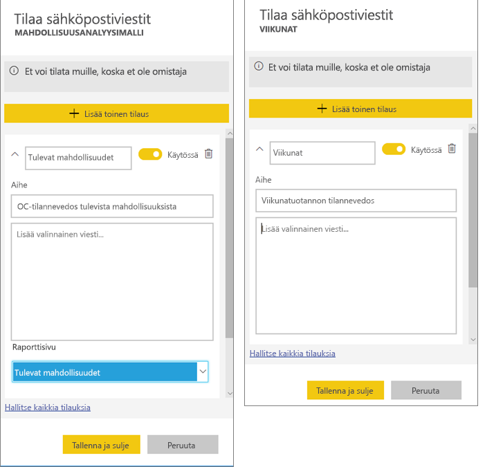
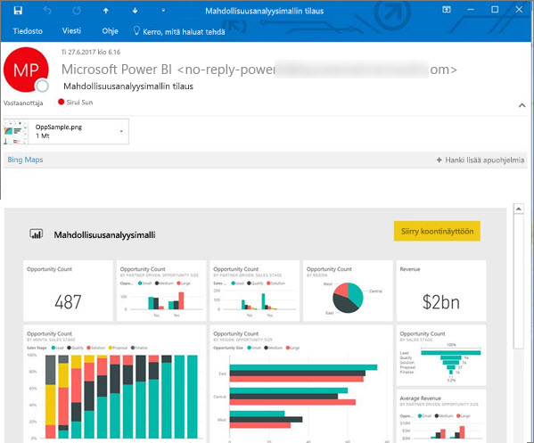
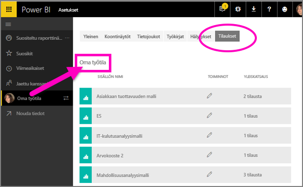

# Raportin tai koontinäytön tilaaminen Power BI -palvelussa 
Ei ole koskaan ollut näin helppoa pysyä ajan tasalla tärkeimmistä koontinäytöistä ja raporteista. Kun tilaat itsellesi tärkeimmät raporttisivut ja koontinäytöt, Power BI lähettää sinulle sähköpostitse niistä tilannevedoksen. Voit määrittää, miten usein haluat Power BI:n lähettävän viestejä – vaihtoehtoja on päivittäisestä viikoittaiseen. 

Sähköpostissa ja tilannevedoksessa käytetään samaa kieliasetusta kuin Power BI:ssä (katso [Power BI:ssä tuetut kielet ja maat/alueet](../supported-languages-countries-regions.md)). Jos mitään kieltä ei ole määritetty, Power BI käyttää senhetkisen selaimesi paikka-asetuksen mukaista kieltä. Jos haluat nähdä kieliasetuksesi tai muuttaa sitä, valitse hammasrataskuvake  > **Asetukset > Yleiset > Kieli**. 

Kun saat sähköpostiviestin, siinä on mukana linkki, jonka kautta voi siirtyä raporttiin tai koontinäyttöön. Mobiililaitteissa, joihin on asennettu Power BI ‑sovelluksia, linkin valitseminen käynnistää sovelluksen (eikä oletusarvoista raportin tai koontinäytön avaamista Power BI ‑sivustolla).

## Vaatimukset
- Tilauksen **luominen** on Power BI Pro -ominaisuus. 
- Koska tilauksen sähköpostiviestejä lähetetään vain, kun pohjana oleva tietojoukko on päivitetty, tilaukset eivät toimi tietojoukoissa, joita ei päivitetä.

## Koontinäytön tai raporttisivun tilaaminen
Koontinäytön ja raportin tilausprosessit ovat lähes samanlaiset. Samaa painiketta painamalla voit tilata Power BI -palvelun koontinäyttöjä ja raportteja.
 
.

1. Avaa koontinäyttö tai raportti.
2. Valitse yläreunan valikkoriviltä **Tilaa** tai valitse kirjekuvake .
   
   

3. Voit ottaa tilauksen käyttöön tai poistaa sen käytöstä keltaisella liukusäätimellä.  Liukusäätimen asettaminen Pois-vaihtoehtoon ei poista itse tilausta. Jos haluat poistaa tilauksen, valitse roskakorikuvake.

4. Voit myös täyttää sähköpostiviestin tiedot. 

    Huomaa alla olevissa näyttökuvissa, että kun tilaat raportin, tilaat itse asiassa raportin *sivun*.  Voit tilata useamman kuin yhden raportin sivun valitsemalla **Lisää toinen tilaus** ja valitsemalla toisen sivun. 
      
   

5. Tallenna tilaus valitsemalla **Tallenna ja sulje**. Saat koontinäytöstä tai raporttisivusta tilannevedoksen sähköpostitse aina, kun jokin sen pohjana olevista tietojoukoista muuttuu. Jos koontinäyttö tai raportti päivittyy useammin kuin kerran päivässä, saat sähköpostitse tilannevedoksen vain ensimmäisestä päivityksestä.  
   
   
   
Raporttisivun päivittäminen ei päivitä tietojoukkoa. Vain tietojoukon omistaja voi manuaalisesti päivittää tietojoukon. Etsi pohjana olevan tietojoukon nimi valitsemalla **Näytä aiheeseen liittyvät** yläreunan valikkoriviltä.
   

## Miten sähköpostittamisen aikataulu määräytyy?
Seuraava taulukko esittää, miten usein sähköpostiviesti lähetetään. Kaikki riippuu tietojoukon yhteystavasta, jolle koontinäyttö tai raportti perustuu (DirectQuery, reaaliaikainen yhteys, tuonti Power BI:hin tai Excel-tiedosto OneDrivessa tai SharePoint Onlinessa) sekä käytettävissä ja valittuna olevista tilausasetuksista (päivittäin, viikoittain tai ei mitään).

|  | **DirectQuery** | **Reaaliaikainen yhteys** | **Ajoitettu päivitys (tuonti)** | **Excel-tiedosto OneDrivessa tai SharePoint Onlinessa** |
| --- | --- | --- | --- | --- |
| **Miten usein raportti/koontinäyttö päivittyy?** |15 min välein |Power BI tarkistaa 15 minuutin välein, onko tietojoukko muuttunut ja jos on, päivittää raportin. |Käyttäjä valitsee joko ei mitään, päivittäin tai viikoittain. Päivittäin voi olla enintään 8 kertaa päivässä. Viikoittain tarkoittaa viikoittaista aikataulua, jonka käyttäjä luo ja määrittää mielensä mukaan päivittämään raportin vähintään kerran viikossa ja enintään kerran päivässä. |Tunnin välein |
| **Miten paljon käyttäjä voi vaikuttaa tilatun sähköpostiviestin aikatauluun?** |Asetusvaihtoehdot: päivittäin tai viikoittain |Ei asetusvaihtoehtoja: käyttäjälle lähetetään sähköpostiviesti, jos raportti päivittyy, mutta tiheimmillään kerran päivässä. |Jos päivittämisen asetukseksi on valittu päivittäin, vaihtoehdot ovat päivittäin ja viikoittain.  Jos päivittämisen asetukseksi on valittu viikoittain, ainoa vaihtoehto on viikoittain. |Ei asetusvaihtoehtoja: käyttäjälle lähetetään sähköpostiviesti aina, kun tietojoukko päivittyy, mutta tiheimmillään kerran päivässä. |

## Tilausten hallinta
Vain sinä voit hallita tilauksiasi. Valitse uudelleen **Tilaa** ja valitse **Kaikkien tilausten hallinta** (katso alla olevat näyttökuvat vaiheesta 4 alkaen). 

Tilaus päättyy, jos Pro-käyttöoikeus umpeutuu, omistaja poistaa koontinäytön tai tilauksen luomiseen käytetty käyttäjätili poistetaan.

## Huomioon otettavat seikat ja vianmääritys
* Jos koontinäytön sähköpostitilausten joillakin ruuduilla on käytössä rivitason suojaus (RLS), näitä ruutuja ei näytetä.  Jos raportin sähköpostitilausten tietojoukko käyttää rivitason suojausta (RSL), et pysty luomaan tilausta.
* Raporttisivujen tilaukset on sidottu raporttisivun nimeen. Jos tilaat raporttisivun ja nimeät sen uudelleen, sinun on luotava myös tilaus uudelleen.
* Tietyt organisaatiosi Azure Active Directoryyn määrittämät asetukset voivat rajoittaa sähköpostitilausten käyttämistä Power BI:ssä.  Tällaisia voivat olla esimerkiksi monimenetelmäinen todentaminen tai IP-aluerajoitukset resursseja käytettäessä.
* Jos teet sähköpostitilauksen tietojoukkoihin, jotka käyttävät reaaliaikaista yhteyttä, saat sähköpostiviestejä vain tietojen muuttuessa. Eli jos tiedot päivittyvät, mutta niihin ei tule muutoksia, Power BI ei lähetä sinulle sähköpostiviestiä.
* Sähköpostitilaukset eivät tue suurinta osaa [mukautetuista visualisoinneista](../power-bi-custom-visuals.md).  Poikkeuksena ovat mukautetut visualisoinnit, jotka on [sertifioitu](../power-bi-custom-visuals-certified.md).  
* Sähköpostitilaukset eivät tue R:ää hyödyntäviä mukautettuja visualisointeja tällä hetkellä.  
* Jos koontinäytön joillakin ruuduilla on käytössä rivitason suojaus (RLS), näitä ruutuja ei näytetä.
* Sähköpostitilaukset lähetetään käyttäen raportin oletusarvoista suodatin- ja osittajatilaa. Oletusarvoihin tilauksen jälkeen tehdyt muutokset eivät näy sähköpostiviestissä.    
* Erityisesti koontinäyttötilausten osalta tiettyjä ruututyyppejä ei vielä tueta.  Sellaisia ovat esimerkiksi suoratoisto-, video- ja mukautetut verkkosisältöruudut.     
* Tilaukset voi epäonnistua sähköpostiviestien kokorajoitusten vuoksi, jos koontinäytöissä tai raporteissa on erittäin suuria kuvia.    
* Power BI keskeyttää automaattisesti sellaisten tietojoukkojen päivittämisen, joihin liittyvissä koontinäytöissä tai raporteissa ei ole vierailtu yli kahteen kuukauteen.  Kuitenkin jos lisäät koontinäytön tai raportin tilauksen, päivitystä ei lopeteta, vaikka kohteessa ei vierailtaisikaan.    

## Seuraavat vaiheet
* Onko sinulla kysyttävää? [Voit esittää kysymyksiä Power BI -yhteisössä](http://community.powerbi.com/)    
* [Lue blogimerkintä](https://powerbi.microsoft.com/blog/introducing-dashboard-email-subscriptions-a-360-degree-view-of-your-business-in-your-inbox-every-day/)

