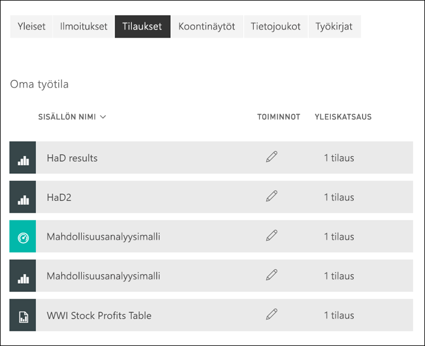

# Raportin tai koontinäytön tilaaminen Power BI -palvelussa 

[!INCLUDE[consumer-appliesto-ynny](../includes/consumer-appliesto-ynny.md)]

[!INCLUDE [power-bi-service-new-look-include](../includes/power-bi-service-new-look-include.md)]

Ei ole koskaan ollut näin helppoa pysyä ajan tasalla tärkeimmistä koontinäytöistä ja raporteista. Kun tilaat itsellesi tärkeimmät raporttisivut ja koontinäytöt, Power BI lähettää sinulle sähköpostitse niistä tilannevedoksen. Voit määrittää, miten usein haluat Power BI:n lähettävän sähköpostia: päivittäin, viikoittain tai tietojen päivittyessä. Voit myös määrittää tietyn ajankohdan sille, milloin Power BI lähettää sähköpostit, tai voit suorittaa tämän nyt.  Voit määrittää enintään 24 eri tilausta kullekin raportille tai koontinäytölle.

Sähköpostissa ja tilannevedoksessa käytetään samaa kieliasetusta kuin Power BI:ssä (katso [Power BI:n tuetut kielet ja maat tai alueet](../supported-languages-countries-regions.md)). Jos mitään kieltä ei ole määritetty, Power BI käyttää senhetkisen selaimesi paikka-asetuksen mukaista kieltä. Jos haluat nähdä kieliasetuksesi tai muuttaa sitä, valitse hammasrataskuvake  > **Asetukset > Yleiset > Kieli**. 

Kun saat sähköpostiviestin, siinä on mukana linkki, jonka kautta voit siirtyä raporttiin tai koontinäyttöön. Mobiililaitteissa, joihin on asennettu Power BI ‑sovelluksia, linkin valitseminen käynnistää sovelluksen (eikä oletusarvoista raportin tai koontinäytön avaamista Power BI ‑sivustolla).

## Vaatimukset
Tilauksen **luominen** itselle edellyttää tietyn tyyppistä [käyttöoikeutta](end-user-license.md). Jos et pysty luomaan tilausta, ota yhteyttä Power BI -järjestelmänvalvojaan. **Muille tilaamista** voi käyttää vain koontinäytön tai raportin omistaja. Sivutettujen raporttien tilaaminen on hieman erilaista. Saat lisätietoja ohjeartikkelista [Power BI -palvelun sivutettujen raporttien tai koontinäyttöjen tilaaminen itsellesi ja muille](paginated-reports-subscriptions.md). 

## Koontinäytön tai raporttisivun tilaaminen
Koontinäytön ja raportin tilausprosessit ovat samankaltaiset. Samaa painiketta painamalla voit tilata Power BI -palvelun koontinäyttöjä ja raportteja.
 
.

1. Avaa koontinäyttö tai raportti.
2. Valitse yläreunan valikkoriviltä **Tilaa** tai valitse kirjekuvake .
   

   
    
    Vasemmalla olevassa näytössä näet, milloin olet koontinäytössä. Valitse siinä **Tilaa**. Oikealla olevassa näytössä näet, milloin olet raporttisivulla. Valitse siinä **Tilaa**. 
    
    a. Voit tilata useamman kuin yhden raportin sivun valitsemalla **Lisää toinen tilaus** ja valitsemalla toisen sivun avattavasta valikosta yläreunan läheltä.

    b. Voit ottaa tilauksen käyttöön tai poistaa sen käytöstä keltaisella liukusäätimellä.  Liukusäätimen asettaminen Poissa käytöstä -asentoon ei poista itse tilausta. Jos haluat poistaa tilauksen, valitse roskakorikuvake.

    c. Halutessasi voit lisätä aiheen ja sähköpostiviestin tiedot. 

    d. Valitse tilauksesi **tiheys**.  Voit valita Päivittäin, Viikoittain tai Tietojen päivittämisen jälkeen (päivittäin).  Jos haluat saada tilauksen sähköpostit vain tiettyinä päivinä, valitse **Viikoittain** ja valitse sitten, minä päivinä haluat saada sähköposteja.  Jos haluat saada tilauksen sähköpostit esimerkiksi vain arkipäivinä, valitse tiheydeksi **Viikoittain** ja poista lauantain ja sunnuntain valintaruutujen valinnat. Jos valitset **Kuukausittain**, kirjoita ne kuukauden päivät, jolloin haluat saada tilauksen sähköpostit.   

    e. Jos valitset Päivittäin, Tunneittain, Kuukausittain tai Viikoittain, voit määrittää tilaukselle myös ajoitetun ajan. Viestit voidaan lähettää tasatunnein tai 15, 30 tai 45 minuuttia yli tasatunnin. Valitse AM tai PM (12 tunnin kellon mukaisesti). Voit määrittää myös aikavyöhykkeen. Jos valitset Tunneittain, valitse ajoitettu aika, jolloin haluat tilauksen alkavan, ja se suoritetaan tunnin välein sen jälkeen.  

    f. Määritä alkamis- ja päättymispäivät päivämääräkenttiin. Tilauksesi alkamisaika on oletusarvoisesti tilauksen luomispäivä ja päättymispäivä on oletusarvoisesti vuoden päässä. Voit vaihtaa päivämääräksi minkä tahansa tulevaisuudessa olevan päivämäärän (aina vuoteen 9999 saakka) milloin tahansa ennen tilauksen päättymistä. Tilaus lopetetaan päättymispäivänä, jos et ota sitä uudelleen käyttöön.  Saat ennen tilauksen päättymistä ilmoituksia, jossa kysytään, haluatko jatkaa tilausta.     

    (esim. Jos haluat tarkistaa tilauksesi ja testata sitä, valitse **Suorita nyt**.  Tämä lähettää sähköpostin sinulle heti. 

3. Jos kaikki näyttää olevan kunnossa, tallenna tilaus valitsemalla **Tallenna ja sulje**. Saat sähköpostin ja tilannevedoksen koontinäytöstä tai raportista määrittämäsi aikataulun mukaisesti. Kaikissa tilauksissa, joiden tiheydeksi määritetään **Tietojen päivittämisen jälkeen**, lähetetään sähköpostia vain kyseisen päivän ensimmäisen ajoitetun päivityksen jälkeen.
   
   
   
    Raporttisivun päivittäminen ei päivitä tietojoukkoa. Vain tietojoukon omistaja voi manuaalisesti päivittää tietojoukon. Etsi pohjana olevan tietojoukon omistajan nimi valitsemalla avattavan valikon yläreunan valikkorivi tai etsi alkuperäinen tilaussähköposti.
   
    

## Tilausten hallinta
Vain sinä itse voit hallita luomiasi tilauksia. Valitse uudelleen **Tilaa** ja valitse vasemmasta alakulmasta **Kaikkien tilausten hallinta** (katso yllä olevat näyttökuvat). Näytettävät tilaukset riippuvat siitä, mikä työtila on sillä hetkellä aktiivisena. Jos haluat nähdä kaikkien työtilojen kaikki tilaukset kerralla, varmista, että aktiivisena on **Oma työtila**. Työtilojen toiminnasta saat lisätietoa artikkelista [Työtilat Power BI:ssä](end-user-workspaces.md). 

Tilaus päättyy, jos Pro-käyttöoikeus umpeutuu, omistaja poistaa koontinäytön tai tilauksen luomiseen käytetty käyttäjätili poistetaan.

## Huomioon otettavat seikat ja vianmääritys
* Jos haluat välttää tilaussähköpostien joutumisen roskapostikansioosi, lisää Power BI:n sähköpostialias no-reply-powerbi@microsoft.com yhteystietoihisi. Jos käytät Microsoft Outlookia, napsauta aliasta hiiren kakkospainikkeella ja valitse **Lisää Outlook-yhteystietoihin**. 
* Jos koontinäytössä on yli 25 kiinnitettyä ruutua tai neljä kiinnitettyä reaaliaikaisista raporttisivua, koontinäyttö ei ehkä hahmonnu täysin käyttäjille lähetetyissä tilauksen sähköpostiviesteissä. Suosittelemme, että otat yhteyttä koontinäytön tekijään ja pyydät häntä vähentämään kiinnitettyjen ruutujen määrän alle 25:een ja kiinnitettyjen reaaliaikaisten raporttien määrän alle neljään, jotta sähköpostiviesti näytetään oikein.  
* Jos koontinäytön sähköpostitilausten joillakin ruuduilla on käytössä rivitason suojaus (RLS), näitä ruutuja ei näytetä.  
* Jos sähköpostissa olevat linkit (sisältöön) lakkaavat toimimasta, sisältö on ehkä poistettu. Näyttökuvan alla olevassa sähköpostiviestissä näet, oletko tilannut viestin itse vai onko joku muu tehnyt tilauksen puolestasi. Jos joku muu on tehnyt tilauksen, pyydä työtoveria joko peruuttamaan sähköpostiviestit tai tekemään tilaus uudelleen.
* Koontinäyttötilausten osalta tiettyjä ruututyyppejä ei vielä tueta. Sellaisia ovat esimerkiksi suoratoisto-, video- ja mukautetut verkkosisältöruudut. 
* Raporttisivujen tilaukset on sidottu raporttisivun nimeen. Jos tilaat raporttisivun ja nimeät sen uudelleen, sinun on luotava myös tilaus uudelleen.
* Jos et voi käyttää tilaustoimintoa, ota yhteyttä järjestelmänvalvojaasi. Organisaatiosi on saattanut poistaa tämän ominaisuuden käytöstä.  
* Sähköpostitilaukset eivät tue suurinta osaa [mukautetuista visualisoinneista](../developer/visuals/power-bi-custom-visuals.md).  Poikkeuksena ovat mukautetut Power BI -visualisoinnit, jotka on [sertifioitu](../developer/visuals/power-bi-custom-visuals-certified.md).    
* Sähköpostitilaukset lähetetään käyttäen raportin oletusarvoista suodatin- ja osittajatilaa. Oletusarvoihin tilauksen jälkeen tehdyt muutokset eivät näy sähköpostiviestissä. Sivutetut raportit tukevat tätä ominaisuutta, ja niiden avulla voit valita kullekin tilaukselle määritetyt parametriarvot.  
* Sähköpostitilaukset eivät tue R:ää hyödyntäviä Power BI -visualisointeja tällä hetkellä.  
* Erityisesti koontinäyttötilausten osalta tiettyjä ruututyyppejä ei vielä tueta.  Sellaisia ovat esimerkiksi suoratoisto-, video- ja mukautetut verkkosisältöruudut.     
* Tilaukset voi epäonnistua sähköpostiviestien kokorajoitusten vuoksi, jos koontinäytöissä tai raporteissa on erittäin suuria kuvia.    
* Power BI keskeyttää automaattisesti sellaisten tietojoukkojen päivittämisen, joihin liittyvissä koontinäytöissä tai raporteissa ei ole käyty yli kahteen kuukauteen.  Jos lisäät koontinäytön tai raportin tilauksen, päivitystä kuitenkaan ei lopeteta, vaikka kohteessa ei käytäisikään.
* Joissain harvoissa tapauksissa sähköpostitilausten toimittaminen vastaanottajille saattaa kestää yli 15 minuuttia.  Jos näin käy, suosittelemme, että suoritat tietojen päivittämisen ja sähköpostien tilaamisen eri aikoihin toimitusten varmistamiseksi.  Jos ongelma jatkuu, ota yhteyttä Power BI -tukeen.

## Seuraavat vaiheet

[Hae ja lajittele sisältöä](end-user-search-sort.md)
