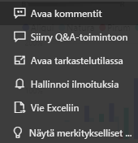
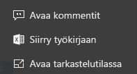
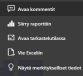

# Koontinäyttöruudut Power BI:ssä

[!INCLUDE [power-bi-service-new-look-include](../includes/power-bi-service-new-look-include.md)]

Ruutu on tietojen tilannevedos, jonka *suunnittelija* on kiinnittänyt koontinäyttöön. *Suunnittelijat* voivat luoda ruutuja raportista, tietojoukosta, koontinäytöstä, Q&A-kyselyruudusta, Excelistä, SQL Server Reporting Servicesistä (SSRS) ja niin edelleen.  Tämä näyttökuva esittää useita eri ruutuja, jotka on kiinnitetty koontinäyttöön.

Raporteista kiinnitettyjen ruutujen lisäksi *suunnittelijat* voivat lisätä yksittäisiä ruutuja suoraan koontinäyttöön käyttämällä **Lisää ruutu** -komentoa. Yksittäisiä ruutuja ovat tekstiruudut, kuvat, videot, suoratoistotiedot ja verkkosisältö.

Tarvitsetko apua Power BI:n rakenneosien kanssa?  Katso [Power BI - peruskäsitteet](end-user-basic-concepts.md).

## Koontinäytön ruutujen käsitteleminen

1. Tuo kolme pistettä näyttöön pitämällä osoitinta ruudun päällä.
   
    
2. Avaa ruudun toimintovalikko valitsemalla kolme pistettä. Käytettävissä olevat vaihtoehdot vaihtelevat visualisointityypin ja ruudun luontimenetelmän mukaan. Tässä on muutama esimerkki siitä, mitä saatat nähdä.

    - Q&A:n avulla luotu ruutu
   
        

    - työkirjasta luotu ruutu
   
        

    - raportista luotu ruutu
   
        
   
    Täältä voit:
   
   * [avata raportin, jolla tämä ruutu on luotu ](end-user-reports.md)   
   
   * [avata Q&A-kysymyksen, jolla tämä ruutu on luotu](end-user-reports.md)   
   

   * [avata työkirjan, jolla tämä ruutu on luotu ](end-user-reports.md)   
   * [tarkastella ruutua tarkastelutilassa ](end-user-focus.md)  
   * [tarkastella merkityksellisiä tietoja ](end-user-insights.md) 
   * [lisätä kommentin ja aloittaa keskustelun](end-user-comment.md)  
   * [hallita koontinäytön ruudun ilmoituksia](end-user-alerts.md)  
   * [avata tiedot Excelissä](end-user-export.md)  

3. Jos haluat sulkea toimintovalikon, valitse kankaan tyhjä alue.

### Ruudun valitseminen (napsauttaminen)
Kun valitset ruudun, seuraavaksi tapahtuva asia riippuu siitä, miten ruutu on luotu ja onko sillä [mukautettu linkki](../service-dashboard-edit-tile.md). Jos sillä on mukautettu linkki, ruudun valitseminen ohjaa sinut kyseiseen linkkiin. Muussa tapauksessa ruudun valitseminen avaa raportin, Excel Online -työkirjan, SSRS-raportin, joka on paikallinen, tai kysymysten ja vastausten kysymyksen, jolla ruutu on luotu.

> [!NOTE]
> Poikkeuksena tähän ovat videoruudut, jotka on luotu suoraan koontinäyttöön **Lisää ruutu** -toiminnolla. (Tällä tavalla luodun) videoruudun valitseminen toistaa videon suoraan koontinäytössä.   
> 
> 

## Huomioon otettavat seikat ja vianmääritys
* Jos raporttia, jolla visualisointi on luotu, ei tallennettu, ruudun valitseminen ei tuota mitään toimia.
* Jos ruudun luotiin Excel Onlinen työkirjasta eikä sinulla ole vähintään lukuoikeuksia kyseiseen työkirjaan, ruudun valitseminen ei avaa työkirjaa Excel Onlinessa.
* Jos suoraan koontinäyttöön **Lisää ruutu** -toiminnolla luoduissa ruuduissa on määritetty mukautettu hyperlinkki, otsikon, alaotsikon tai ruudun valitseminen avaa kyseisen URL-osoitteen.  Muussa tapauksessa jonkin näiden suoraan koontinäytössä luotujen kuvan, verkkokoodin tai muokkausruudun ruudun valitseminen ei oletusarvoisesti tuota mitään toimia.
* Jos sinulla ei ole raportin käyttöoikeutta SSRS:ssä, SSRS:ssä luodun ruudun valitseminen avaa sivun, jossa ilmoitetaan, ettei sinulla ole käyttöoikeutta (rsAccessDenied).
* Jos sinulla ei ole käyttöoikeutta SSRS-palvelimen sisältävään verkkoon, SSRS:ssä luodun ruudun valitseminen avaa sivun, joka osoittaa, ettei palvelinta ei löytynyt (HTTP 404). Laitteellasi on oltava verkkoyhteys raporttipalvelimeen raportin tarkastelemiseksi.
* Jos ruudun luomiseen käytetty alkuperäinen visualisointi muuttuu, ruutu ei muutu.  Jos esimerkiksi *suunnittelija* kiinnitti raportin viivakaavion ja muutti sitten viivakaavion palkkikaavioksi, koontinäytön ruudussa näkyy edelleen viivakaavio. Tiedot päivittyvät, mutta visualisointityyppi ei.

## Seuraavat vaiheet
[Tietojen uudelleenlataus](../refresh-data.md)

[Power BI:n peruskäsitteet](end-user-basic-concepts.md)
