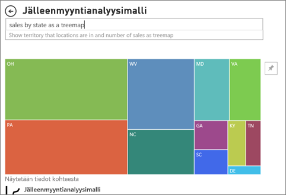

# Visualisointityypit Power BI-
Löydät visualisointeja raportteihin, koontinäyttöihin, sovelluksia ja Q & A. Jotkin näistä visualisointityyppejä on pakattu kanssa Power BI-ja osa on *mukautettujen visualisointien*. Mukautetut visualisoinnit luodaan Power BI:n ulkopuolella siten, että *raporttien suunnittelijat* voivat lisätä niitä Power BI:n raportteihin, koontinäyttöihin ja sovelluksiin. 

Tässä artikkelissa on yleiskatsaus visualisointeja, jotka on paketoitu Power BI.  Nämä ovat visualisoinnit, joita tarvitaan eniten. 

> [!NOTE]
> Jos haluat lisätietoja mukautetuista visualisoinneista, hae niitä [Microsoft AppSourcen](https://appsource.microsoft.com/marketplace/apps?product=power-bi-visuals) **Power BI -visualisointien osiossa**. Näet kustakin visualisoinnista kuvauksen, sen tekijän tiedot ja joko näyttökuvia tai videon. 

## Luettelo visualisoinneista, jotka ovat käytettävissä Power BI
Kaikki nämä visualisoinnit löytyvät Power BI-sovelluksia, koontinäyttöjä ja raportteja, ja [määritetty Q & A](end-user-q-and-a.md). Lue, miten voit käyttää visualisointeja, on artikkelissa [visualisoinnit raporttien, koontinäyttöjen ja sovellusten käsittely](end-user-visualizations.md)

### Aluekaaviot: Perus (kerrostettu) ja pinottu

Perusaluekaavio perustuu viivakaavioon, jonka alue on akselin ja täytetyn viivan välillä. Aluekaaviot korostavat muutoksen suuruutta ajan kuluessa, ja niiden avulla voidaan kiinnittää huomio trendin kokonaisarvoon. Esimerkiksi tiedot, jotka edustavat tuottoa ajan kuluessa, voidaan kuvata aluekaaviossa kokonaistuoton korostamiseksi.

### Palkki- ja pylväskaaviot

 

Palkkikaaviot ovat vakiomuotoisia katseltaessa tiettyä arvoa eri luokkien välillä.

### Kortit: Yksittäinen luku

Yksittäisen luvun kortissa näytetään yksi fakta, yksi arvopiste. Joskus yksittäinen luku on tärkein seikka, jota haluat seurata Power BI-raporttinäytöllä tai raportissa, kuten kokonaismyynti, markkinaosuus vuositasolla tai kokonaismahdollisuudet.  

### Kortit: Moniriviset

Monirivisissä korteissa näytetään yksi arvopiste tai useita arvopisteitä, yksi per rivi.

### Yhdistelmäkaaviot

Yhdistelmäkaavio yhdistää pylväskaavion ja viivakaavion. Näiden kahden kaavion yhdistäminen nopeuttaa tietojen vertailua. Yhdistelmäkaavioissa voi olla yksi y-akseli tai kaksi y-akselia, joten tarkista kaavio tarkasti. 

Yhdistelmäkaavio on hyvä vaihtoehto, kun:
- sinulla on viivakaavio ja pylväskaavio, joilla on sama X-akseli
- haluat vertailla useita mittareita eri arvoalueilla
- haluat havainnollistaa kahden mitan välistä korrelaatiota yhdessä visualisoinnissa
- haluat tarkistaa, täyttääkö mittari toisen mittarin määrittämän tavoitteen
- haluat säästää tilaa piirtoalustalla.

### Rengaskaaviot

Rengaskaaviot muistuttavat ympyräkaavioita.  Ne näyttävät osien suhteen kokonaisuuteen. Ainoa ero on se, että keskellä on tyhjää tilaa otsikkoa tai kuvaketta varten.

### Suppilokaavio

Suppilokaaviot auttavat visualisoimaan prosessia, jossa on vaiheita ja tietoyksikön työnkulku peräkkäin yhdestä vaiheesta seuraavaan.  Esimerkki tällaisesta on vaikkapa myyntiprosessi, joka alkaa liideistä ja päättyy ostamiseen.

Esimerkiksi myynnistä voi tehdä suppilokaavion, jossa seurataan asiakkuuksien eri vaiheita: liidi > hyväksytty liidi > prospekti > sopimus > myynti. Suppilon muoto välittää yhdellä silmäyksellä tarkastelemasi prosessin kunnon.
Suppilon kukin vaihe edustaa prosenttiosuutta kokonaismäärästä. Siten useimmissa tapauksissa suppilokaaviosta tulee suppilon muotoinen – ensimmäinen vaihe on kaikkein suurin ja kukin seuraava vaihe on pienempi kuin sitä edeltänyt vaihe. Myös päärynänmuotoisista suppilokaavioista on hyötyä: sen avulla voi tunnistaa ongelman prosessissa. Tyypillisesti kuitenkin ensimmäinen vaihe, ”sisäänotto”, on kaikkein suurin.

Suppilokaavio on hyvä vaihtoehto:
- kun tiedot seuraavat toinen toistaan ja etenevät vähintään 4 vaiheen kautta.
- kun on odotettavissa, että ”kohteiden” määrä ensimmäisessä vaiheessa on suurempi kuin viimeisessä vaiheessa.
- kun haluat laskea (tuoton/myyntien/sopimuksien jne.) mahdollisuuksia vaihekohtaisesti.
- kun haluat laskea ja seurata konversio- ja asiakaspoistuma-astetta.
- kun haluat paljastaa lineaarisen prosessin pullonkauloja.
- kun haluat seurata ostoskorin työnkulkua.
- kun haluat seurata napsautusvaiheiden kautta etenevien mainos- tai markkinointikampanjoiden etenemistä ja onnistumista.

### Mittarikaaviot

Viisarimittarikaaviossa on pyöreä kaari, ja siinä on yksi arvo, joka mittaa edistymistä kohti tavoitetta/suorituskyvyn mittaria. Tavoite tai tavoitearvo esitetään riveittäin (neula). Tämän päämäärän edistyminen esitetään varjostuksella. Arvo, joka edustaa kyseistä edistymistä, näkyy lihavoituna kaaren sisällä. Kaikki mahdolliset arvot on jaettu tasaisesti kaarta pitkin minimistä (äärimmäisenä vasemmalla oleva arvo) maksimiin (äärimmäisenä oikealla oleva arvo).

Yllä olevassa esimerkissä olemme automyyjä, joka seuraa myyntitiimin keskimääräistä myyntiä kuukaudessa. Tavoitteemme on 140, ja sitä edustaa musta neula. Pienin mahdollinen keskimääräinen myynti on 0, ja maksimiksi on asetettu 200. Sininen varjostus näyttää, että olemme tällä hetkellä noin 120 kappaleen vauhdissa tässä kuussa. Onneksi meillä on vielä viikko aikaa tavoitteiden saavuttamiseksi.

Viisarimittarit ovat hyvä vaihtoehto, kun:
- esitetään edistyminen kohti tavoitetta
- esitetään prosenttiyksiköitä, kuten suorituskyvyn mittareita
- näyttää yhden mittarin kunnon
- näytetään tiedot, joita voidaan nopeasti tarkistaa ja ymmärtää.

 ### Tärkeimpien vaikuttajien kaavio

Tärkeimpien vaikuttajien kaaviossa näytetään valittuun tulokseen tai arvoon eniten vaikuttavat tekijät.

Tärkeimmät vaikuttajat auttaa sinua ymmärtämään tekijöitä, jotka vaikuttavat johonkin tärkeään arvoon. Tällainen vaikuttaja voi olla esimerkiksi se, *mikä saa asiakkaat tekemään toisen tilauksen *tai* miksi myynti oli hyvällä tasolla viime kesäkuussa*. 

### Suorituskyvyn mittarit

Suorituskykyilmaisin (KPI) on visuaalinen vihje, joka kertoo edistymisen määrän kohti mitattavissa olevaa tavoitetta. 

Suorituskykyilmaisin on hyvä vaihtoehto, kun halutaan
- mitata edistymistä (minkä edellä vai jäljessä olen?)
- mitata etäisyyttä tavoitteeseen (kuinka paljon edellä tai jäljessä olen?)

### Viivakaaviot

Viivakaaviot korostavat koko arvosarjan yleistä muotoa yleensä ajan kuluessa.

### Kartat: Peruskartat

Peruskarttaa käytetään sekä luokiteltuun että kvantitatiiviseen tietoon, joilla on paikkatietojen sijainnit.

### Kartat: ArcGIS-kartat

ArcGIS-kartat ja Power BI yhdessä tekevät kartoista muutakin kuin vain esitettäviä pisteitä. Valittavissasi on pohjakarttoja, sijaintityyppejä, teemoja, symbolityylit ja viittauskerroksia Luo upeita, informatiivisia informatiivisia kartan visualisointeja. Määräävien tietokerrosten (kuten laskentatietojen) sijaintikohtaista analyysiä yhdistelmän karttoihin mahdollistaa visualisoinnin tietojen.

### Kartat: Täytetyt kartat (Choropleth)

Täytetyssä kartassa käytetään sävytystä tai kuvioita esittämään, miten arvot vaihtelevat suhteellisesti maantieteellisellä alueella. Suhteelliset erot hahmottuvat nopeasti, kun sävytys vaihtelee vaaleammasta (tarkoittaen harvinaisempaa/pienempää) tummempaan (yleisempi/enemmän).

### Kartat: Muotokartat

Muotokartalla verrataan alueita kartalla värien avulla. Muotokartta ei voi näyttää arvopisteiden tarkkoja maantieteellisiä sijainteja kartalla (toisin kuin karttavisualisoinnit). Sen sijaan sen päätarkoituksena on näyttää alueiden suhteellisia vertailuja kartalla eri värien avulla.

### Matrix

Matriisivisualisointi on eräänlainen taulukkovisualisointi (sillä on oma kohtansa alla), joka tukee vaiheittaista asettelua. Raporttien suunnittelijat lisäävät usein matriiseja raportteihin ja koontinäyttöihin, jotta käyttäjät voivat valita yhden elementin tai useita elementtejä (rivejä, sarakkeita tai soluja) matriisista ristiinkorostaakseen muita visualisointeja raporttisivulla.  

### Ympyräkaaviot

Ympyräkaaviot näyttävät osien suhteen kokonaisuuteen. 

### Nauhakaavio

Nauhakaaviot näyttävät, millä tietoluokalla on paras sijoitus (suurin arvo). Nauhakaaviot esittävät luokkamuutoksen tehokkaasti, koska korkein sija (suurin arvo) näkyy aina ylimpänä kullakin ajanjaksolla.

### Piste-, kupla- ja pistetulostuskaaviot

Pistekaaviossa on aina kaksi arvoakselia, jotka näyttävät yhden numeerisen tietosarjan vaakasuuntaisella akselilla ja toisen numeerisen arvosarjan pystysuuntaisella akselilla. Kaaviossa näytetään arvopisteet numeerisen arvon X ja Y leikkauskohdassa yhdistämällä nämä kaksi arvoa yhdeksi arvopisteeksi. Nämä arvopisteet voidaan jakaa tasaisesti tai epätasaisesti vaakasuuntaiselle akselille tietojen mukaan.

Kuplakaaviossa arvopisteet korvataan kuplilla ja kuplan koko kuvastaa tietojen muuta dimensiota.

Pistetulostuskaavio muistuttaa kuplakaaviota ja hajontaa kuvaavaa pistekaaviota sillä erotuksella, että X-akselille voi tulostaa numeerisia tai luokittaisia tietoja.

### Suuren tiheyden pistekaavio

Näytteitä suuren tiheyden tiedoista otetaan näytteitä luoda visualisointeja kohtuullisen nopeasti, joiden vuorovaikutteisuus säilyy. Suuren tiheyden tiedoissa käytetään algoritmia, joka poistaa päällekkäiset pisteet ja varmistaa, että kaikki tietojoukon pisteet näytetään visualisoinnissa. Se ei näytä vain näytettä tiedoista.  

Tämä tarjoaa parhaan vasteajan ja esityksen ja taltioi selkeästi tärkeimmät pisteet koko tietojoukosta.

### Osittajat

Osittaja on erillinen kaavio, jolla voidaan suodattaa sivun muita visualisointeja. Osittajia on monia erilaisia (luokka, alue, päivämäärä jne.). Niitä voidaan muotoilla siten, että on mahdollista valita yksi arvo, monia arvoja tai kaikki saatavilla olevat arvot. 

Ohittaja on hyvä vaihtoehto, kun haluat
- helpottaa käyttöä näyttämällä usein käytettyjä tai tärkeitä suodattimia raportin piirtoalustassa
- helpottaa nykyisen suodatetun tilan tarkastelua avaamatta avattavaa luetteloa
- käyttää suodatuksessa sarakkeita, jotka ovat tarpeettomia ja piilotettuina tietotaulukoissa
- luoda tarkempia raportteja sijoittamalla osittajia tärkeiden visualisointien viereen.

### Erilliset kuvat

Erillinen kuva on graafinen elementti, joka on lisätty raporttiin tai koontinäyttöön. 

### Taulukot

Taulukko on ruudukko, joka sisältää tietoja järjestettynä loogiseen sarjaan rivejä ja sarakkeita. Se voi sisältää myös otsikkoja ja summarivin. Taulukot toimivat hyvin kvantitatiivisessa vertailussa, jossa tarkastellaan moni arvoja tietystä kategoriasta. Esimerkiksi tässä taulukossa näkyvät luokan viisi eri mittaria.

Taulukko on hyvä vaihtoehto:
- yksityiskohtaisen tiedon ja tarkkojen arvojen selaamiseen ja vertailemiseen (visuaalisten esitysmuotojen sijaan).
- tietojen esittämiseen taulukkomuodossa.
- numeeristen tietojen luokiteltuun esittämiseen.

### Puukartat

Puukartat ovat värillisiä suorakulmioita, joiden koko vastaa arvoa.  Ne voivat olla hierarkkisia, suorakulmiot sisäkkäin pääsuorakulmioissa. Kunkin suorakulmion sisällä oleva suorakulmio perustuu mitattavaan arvoon. Suorakulmiot järjestetään koon mukaan vasemmasta yläkulmasta (suurin) oikeaan alakulmaan (pienin).

Puukartat ovat hyvä vaihtoehto seuraaville:
- näyttää suuria määriä hierarkkisia tietoja
- palkkikaaviolla ei voida tehokkaasti käsitellä suuria määriä arvoja
- näyttää kunkin osan väliset ja koko kokonaisuuden mittasuhteet
- näyttää mittarin jakautuminen kuviona kussakin hierarkian luokkatasossa
- näyttää määritteet kokovertailun ja värikoodauksen avulla
- kuvioiden, poikkeavien arvojen, tärkeimpien tekijöiden ja poikkeusten erottuvan selvästi.

### Vesiputouskaaviot

Vesiputouskaavio näyttää juoksevan summan, kun arvoja lisätään tai vähennetään. On hyödyllistä ymmärtää, kuinka positiivisten ja negatiivisten muutosten sarja vaikuttaa alkuarvoon (esimerkiksi nettotuloon).

Sarakkeet ovat värillisiä, jotta näet nopeasti nousut ja laskut. Alkuarvon ja lopullisen arvon sarakkeet usein alkavat vaaka-akselilla, kun taas keskitason arvot ovat irrallisia sarakkeita. Tämän ulkoasun vuoksi vesiputouskaavioita kutsutaan myös siltakaavioiksi.

Vesiputouskaavio on hyvä vaihtoehto:
- kun olet tehnyt muutoksia mittarin aikasarjaan tai eri luokkiin
- jos haluat valvoa tärkeimpiä kokonaisarvoon vaikuttavia muutoksia
- jos haluat tehdä kaavion yrityksen vuosittaisesta tuotosta näyttämällä eri tulonlähteitä ja lopulta kokonaisvoiton (tai tappion).
- jos haluat havainnollistaa yrityksen alku- ja lopetushenkilöstömäärän vuoden aikana
- jos haluat visualisoida, kuinka paljon rahaa ansaitset ja käytät joka kuukausi sekä tilin juoksevan saldon.

## Kerro Q & A käyttää minkä visualisoinnin
Kirjoitettaessa kyselyjä luonnollisella kielellä Power BI Q & A: määrittää visualisoinnin tyyppiä kyselyssä.  Esimerkki:

”***myynti osavaltioittain puukarttana***”

## Seuraavat vaiheet
[Visualisointien raporttien, koontinäyttöjen ja sovellukset](end-user-visualizations.md)    
[Oikealla oleva visuaalinen viite osoitteesta sqlbi.com](http://www.sqlbi.com/wp-content/uploads/videotrainings/dashboarddesign/visuals-reference-may2017-A3.pdf)
