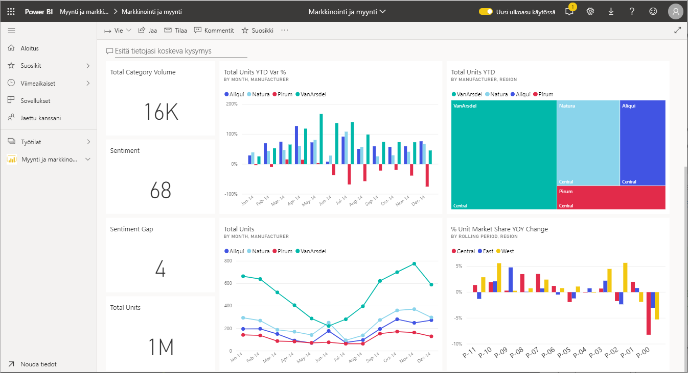
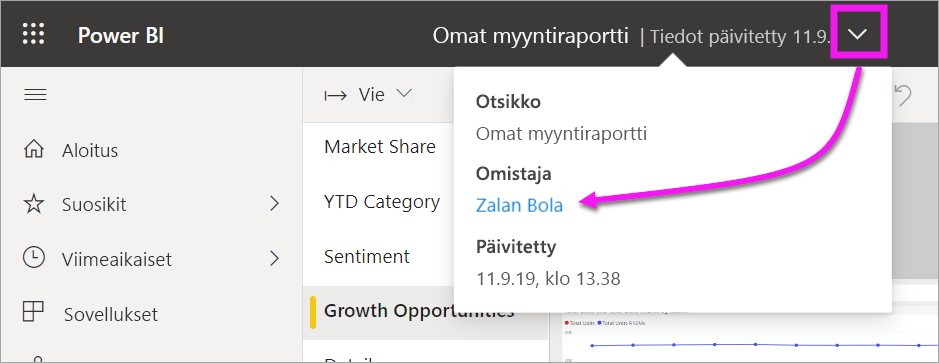

# Visualisointien käyttö raporteissa, koontinäytöissä ja sovelluksissa

[!INCLUDE[consumer-appliesto-ynny](../includes/consumer-appliesto-ynny.md)]

***Visualisointi*** (tai *visuaali*) on periaatteessa Power BI:n *suunnittelijaohjelman* luoma kaaviotyyppi, jossa on hyödynnetty raporttien ja tietojoukkojen tietoja. 

Visualisointeja on koontinäytöissä ja raporteissa. Niitä voi luoda lennosta Power BI:n Q&A:ssa. Kun suunnittelija luo visualisoinnin raportissa, hän voi *kiinnittää* kyseisen visualisoinnin koontinäyttöön. [Koontinäytössä olevaa visualisointia kutsutaan *ruuduksi*](end-user-tiles.md). Tässä koontinäytössä on kahdeksan ruutua. 

> [!TIP]
> Suosittelemme lukemaan ensin [Power BI:n peruskäsitteet *kuluttajille -yleiskuvauksen*](end-user-basic-concepts.md) ennen tämän yksityiskohtaisemman sisällön lukemista.

## Mitä voin tehdä visualisointien avulla?

Visualisoinnit luodaan raporttien ja koontinäyttöjen *suunnitteluohjelman* avulla ja jaetaan *kuluttajille*. Kuluttajilla on monia vaihtoehtoja visualisointien käsittelyyn ja merkityksellisten tietojen tunnistamiseen sekä tietopohjaisten liiketoimintapäätösten tekemiseen. Valtaosa vaihtoehdoista on lueteltu alla olevassa taulukossa, joka sisältää linkit yksityiskohtaisiin ohjeisiin.

Monissa näistä vaihtoehdoista järjestelmänvalvoja tai *suunnittelija* voi poistaa ominaisuudet näkyvistä tai käytöstä. Osa näistä ominaisuuksista toimii vain tietyissä visualisoinneissa.  Jos sinulla on kysyttävää, ota yhteyttä järjestelmänvalvojaan tai raportin tai koontinäytön omistajaan. Jos haluat löytää omistajan, valitse koontinäytön tai raportin avattava valikko. 

> [!IMPORTANT]
> Aluksi kuitenkin hieman tietoa Q&A:sta. Q&A on Power BI:n luonnollisen kielen mukainen hakutyökalu. Voit kirjoittaa kysymyksen luonnollisella kielellä ja Q&A vastaa kysymykseen visualisoinnin muodossa. Q&A:n avulla kuluttajat voivat luoda omia visualisointejaan lennosta. Q&A:n avulla luotuja visualisointeja ei voi kuitenkaan tallentaa. Q&A on kuitenkin hyvä vaihtoehto, jos haluat tietoja jostakin tietystä aiheesta, jota suunnitteluohjelma ei ottanut mukaan raporttiin tai koontinäyttöön. Lue lisää Q&A:sta kohdasta [Q&A kuluttajille](end-user-q-and-a.md).

|Tehtävä  |Koontinäytössä  |Raportissa  | Q&A:ssa
|---------|---------|---------|--------|
|[Lisää kommentteja visualisointiin tai aloita keskustelu visualisoinnista työtovereiden kanssa](end-user-comment.md).     |  kyllä       |   kyllä      |  ei  |
|[Avaa raportti, johon visualisointi luotiin, ja tutustu siihen](end-user-tiles.md).     |    kyllä     |   ei      |  ei |
|[Näytä luettelo suodattimista ja osittajista, jotka vaikuttavat visualisointiin](end-user-report-filter.md).     |    jos avaat tarkastelutilassa     |   kyllä      |  ei |
|[Avaa visualisointi ja tutustu siihen Q&A:ssa (jos *suunnittelija* on luonut visualisoinnin Q&A:n avulla)](end-user-q-and-a.md).     |   kyllä      |   ei      |  ei  |
|[Luo visualisointi Q&A:ssa (tutkimista varten, et voi tallentaa sitä)](end-user-q-and-a.md).     |   kyllä      |   jos suunnittelija on lisännyt Q&A:n raporttiin      |  kyllä  |
|[Pyydä Power BI:tä etsimään puolestasi kiinnostavia faktoja tai trendejä](end-user-insights.md) visualisoinnin tiedoista.  Näitä automaattisesti luotuja visualisointeja kutsutaan *merkityksellisiksi tiedoiksi*.     |    kyllä, ruuduille    |  ei       | ei   |
|[Näytä vain yksi visualisointi kerrallaan *kohdistus*tilaa](end-user-focus.md) käyttämällä.     | kyllä, ruuduille        |   kyllä, visualisoinneille      | ei  |
|[Katso, milloin visualisointi on viimeksi päivitetty](end-user-fresh.md).     |  kyllä       |    kyllä     | ei  |
|[Näytä vain yksi visualisointi kerrallaan ilman reunoja tai siirtymisruutuja *koko näytön* tilaa käyttämällä](end-user-focus.md).     |   kyllä      |  kyllä       | oletus  |
|[Tulosta](end-user-print.md).     |  kyllä       |   kyllä      | ei  |
|[Pureudu syvemmälle visualisointiin lisäämällä ja muokkaamalla visualisoinnin suodattimia.](end-user-report-filter.md)     |    ei     |   kyllä      | ei  |
|Näytä lisätietoja ja työkaluvihjeitä pitämällä hiiren osoitinta visualisoinnin päällä.     |    kyllä     |   kyllä      | kyllä  |
|[Ristiinsuodata ja ristiinkorosta sivun muita visualisointeja.](end-user-interactions.md)    |   ei      |   kyllä      | ei  |
|[Visualisoinnin lähdetietojen näyttäminen](end-user-show-data.md).     |  ei       |   kyllä      | ei  |
| [Muuta visualisoinnin lajittelutapaa](end-user-change-sort.md). | ei  | kyllä  | voi muuttaa lajittelua muotoilemalla kysymyksen tekstin uudelleen  |
| Lisää korostus visualisointiin. | ei  | kyllä  |  ei |
| [Vie Exceliin.](end-user-export.md) | kyllä | kyllä | ei|
| [Luo ilmoitus](end-user-alerts.md), jos haluat saada ilmoituksen, kun arvo ylittää määrittämäsi raja-arvon.  | kyllä  | ei  | ei |
| [Ristiinsuodata ja ristiinkorosta muita sivulla olevia visualisointeja](end-user-report-filter.md).  | ei      | kyllä  | ei |
| [Poraudu visualisointiin, jolla on hierarkia](end-user-drill.md).  | ei  | kyllä   | ei |

## Seuraavat vaiheet
Palaa [Peruskäsitteet kuluttajille](end-user-basic-concepts.md)   -yleiskuvaukseen  
[Avaa raportti valitsemalla visualisointi](end-user-report-open.md)    
[Power BI:ssa käytettävissä olevat visualisointityypit](end-user-visual-type.md)