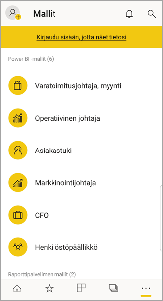

# Android-laitteiden Power BI -mobiilisovelluksen käytön aloittaminen
Android-sovellus Microsoft Power BI:lle tarjoaa BI-mobiilikäyttökokemuksen Power BI:lle, Power BI-raporttipalvelimelle ja Reporting Services -palveluille. Voit tarkastella ja käsitellä yrityksen koontinäyttöjä paikallisesti ja pilvipalvelussa missä tahansa, live-tilassa kosketusnäytöllisessä mobiilikäytössä. Tarkastele tietoja koontinäytöissä ja jaa sähköpostitse tai tekstiviestillä työtovereiden kanssa. 

Luo Power BI -raportteja Power BI Desktopissa ja julkaise ne:

* [Julkaise Power BI -palvelussa](../../power-bi-overview.md) ja luo koontinäyttöjä.
* [Julkaise paikallisesti Power BI -raporttipalvelimeen](../../report-server/quickstart-create-powerbi-report.md).

Voit Androidin Power BI -sovelluksessa käsitellä koontinäyttöjä ja raportteja joko paikallisesti tai pilvipalvelussa.

Katso [Power BI -mobiilisovellusten uudet ominaisuudet](../../mobile-whats-new-in-the-mobile-apps.md).

## Edellytykset

### Hanki sovellus

[Lataa Power BI Android-käyttöjärjestelmälle -sovellus](http://go.microsoft.com/fwlink/?LinkID=544867) Google Play Kaupasta.
  
Power BI voidaan suorittaa useilla eri Android-laitteilla, joissa on käytössä Android 5.0 -käyttöjärjestelmä tai uudempi versio. Jos haluat tarkistaa laitteesi, siirry kohtaan **Asetukset** > **Tietoa laitteesta** > **Android -versio**. 

**Käytön aloittaminen sovelluksen avaamisen jälkeen**    
Kun avaat sovelluksen, voit myös ilman rekisteröitymistä tai kirjautumista selata kirjautumissivuja ja saada lyhyen yleiskatsauksen asioista, joita voit tehdä Power BI -sovelluksessa Android-laitteessasi. Jos napautat **Ohita**, voit tarkastella ja tutkia malleja ja saada käytännönläheistä kokemusta sovelluksesta. Voit [siirtyä takaisin malleihin](mobile-android-app-get-started.md#try-the-power-bi-and-reporting-services-samples) milloin tahansa koontinäyttöjen aloitussivulta.

Katso [Power BI -mobiilisovellusten uudet ominaisuudet](../../mobile-whats-new-in-the-mobile-apps.md).

## Rekisteröidy verkossa Power BI -palveluun
Jos et ole vielä kirjautunut, siirry [Power BI -palveluun (http://powerbi.com/)](http://powerbi.com/) oman tilin luomiseen, jotta voit luoda ja tallentaa koontinäyttöjä ja raportteja sekä koota kaikki tietosi yhteen. Kirjaudu sitten Power BI:hin Android-laitteestasi, niin voit seurata omia koontinäyttöjäsi missä tahansa.

1. Napauta Power BI- palvelussa [Rekisteröidy](http://go.microsoft.com/fwlink/?LinkID=513879) Power BI -tilin luomiseksi.
2. Aloita [omien koontinäyttöjen ja raporttien luominen](../../service-get-started.md).

## Power BI -sovelluksen käytön aloittaminen laitteellasi
1. Avaa Power BI Android-käyttöjärjestelmälle -sovellus Android-laitteesi aloitusnäytössä.
   
   
2. Jos haluat tarkastella Power BI -koontinäyttöjä ja -raportteja, napauta **Power BI**.  
   
   Jos näyttöön tulee sanoma, että Power BI ei voi kirjata sinua sisään, katso kohta [”Todentaminen ei onnistunut, koska tämä laite ei luota yrityksesi SSL-varmenteeseen”](mobile-android-app-error-corporate-ssl-account-is-untrusted.md). Saat lisätietoja siitä, miten voit ratkaista ongelman.

   Jos haluat tarkastella Power BI -raporttipalvelimen ja Reporting Services -raportteja ja suorituskykyilmaisimia, napauta **Raporttipalvelinta**.
   
   

## Kokeile Power BI- ja Reporting Services -malleja
Voit kokeilla Power BI- ja Reporting Services -malleja jopa ilman rekisteröitymistä. Kun olet ladannut sovelluksen, voit tarkastella malleja tai aloittaa sovelluksen käytön. Voit siirtyä takaisin malleihin milloin tahansa koontinäyttöjen aloitussivulta.

### Power BI -mallit
Voit tarkastella ja käsitellä Power BI -koontinäytön malleja, mutta on muutamia asioita, joita et voi niille tehdä. Et voi avata koontinäyttöjen taustalla olevia raportteja, jakaa malleja muiden kanssa tai tehdä niistä suosikkejasi.

1. Napauta yleistä siirtymispainiketta  vasemmassa yläkulmassa.
2. Napauta **Asetukset** > **Etsi mallit**, valitse rooli ja tutustu tämän roolin mallikoontinäyttöön.  
   
   

### Reporting Services -mobiiliraportin mallit
1. Napauta yleistä siirtymispainiketta  vasemmassa yläkulmassa.
2. Napauta **Reporting Services -malleja**, avaa sitten jälleenmyyntiraportit tai Myyntiraportit -kansiota ja tutustu suorituskykyilmaisimiin ja mobiiliraportteihisi.
   
   

## Koontinäytön tai raportin hakeminen
* Napauta oikeassa yläkulmassa olevaa suurennuslasia , kirjoita sitten termi, jos haluat etsiä.
  
    
  
    Oletusarvoisesti se etsii kaikkia koontinäyttöjä ja raportteja, mutta voit hakea vain toisen parametreista.

## Sisällön etsiminen Power BI -mobiilisovelluksissa
Koontinäytöt ja raportit tallennetaan eri paikkoihin Power BI -mobiilisovelluksissa riippuen siitä, mistä ne ovat peräisin. Lue [sisällön etsimisestä mobiilisovelluksissa](../../mobile-apps-quickstart-view-dashboard-report.md). Lisäksi voit aina hakea kaikkea, mitä sinulla on Power BI -mobiilisovelluksissa. 

## Suosikkikoontinäyttöjen, suorituskykyilmaisimien ja raporttien tarkastelu
Näet mobiilisovellusten Suosikit-sivulta kaikki Power BI -suosikkikoontinäyttösi yhdessä Power BI -raporttipalvelimen ja Reporting Services -suorituskykyilmaisinten ja raporttien kanssa. Kun teet koontinäytöstä *suosikin* Power BI -mobiilisovelluksessa, voit käyttää sitä kaikista laitteistasi käsin, kuten selaimesi Power BI -palvelusta. 

* Napauta **Suosikit**.
  
   
  
   Power BI -suosikkisi ja suosikkisi Power BI -raporttipalvelimelta ja Reporting Services -verkkoportaalista ovat kaikki tällä sivulla.
  
   

Lue lisää [suosikeista Power BI -mobiilisovelluksissa](mobile-apps-favorites.md).

## Power BI -mobiilisovelluksien Enterprise-tuki
Microsoft Intunen avulla organisaatiot voivat hallita laitteita ja sovelluksia, kuten Power BI -mobiilisovellukset Androidille ja iOS:lle.

Microsoft Intunen avulla organisaatiot voivat ohjata tietoyksiköitä kuten pikakäytön kiinnittämisen edellyttämistä, sovelluksen tietojenkäytön valvontaa ja sovellustietojen salaamista myös silloin, kun sovellus ei ole käytössä.

> [!NOTE]
> Jos käytät Power BI -mobiilisovellusta Android-laitteessa ja organisaatiosi on määrittänyt Microsoft Intunen mobiilisovellusten hallinnan, tietojen päivittäminen taustalla on poistettu käytöstä. Kun avaat sovelluksen seuraavan kerran, Power BI päivittää tiedot verkossa olevasta Power BI -palvelusta.
> 
> 

Lue lisää [Power BI -mobiilisovellusten määrittämisestä Androidille Microsoft Intunella](../../service-admin-mobile-intune.md). 

## Seuraavat vaiheet
Seuraavassa on mainittu eräitä muita asioita, joita voit tehdä Android-laitteen Power BI -sovelluksessa. Saatavilla on Power BI -koontinäyttöjä ja -raportteja sekä raportteja ja suorituskyvyn mittareita Microsoft Power BI -raporttipalvelimessa ja Reporting Services -verkkoportaalissa.

### Power BI -koontinäytöt ja -raportit
* Tarkastele [omia sovelluksia](../../service-create-distribute-apps.md).
* Tarkastele omia [koontinäyttöjä](../../mobile-apps-view-dashboard.md).
* Tutustu [ruutuihin koontinäytöllä](../../mobile-tiles-in-the-mobile-apps.md).
* Avaa [Power BI -raportit](../../mobile-reports-in-the-mobile-apps.md).
* Tarkastele [omia sovelluksia](../../service-create-distribute-apps.md).
* [Lisää merkintöjä ja jaa ruutuja](mobile-annotate-and-share-a-tile-from-the-mobile-apps.md).
* Jaa [koontinäyttöjä](../../mobile-share-dashboard-from-the-mobile-apps.md).
* [Skannaa Power BI:n QR-koodi](../../mobile-apps-qr-code.md) avataksesi asianmukaisen koontinäytön ruudun tai raportin. 
* Näytä [päivitysilmoitukset, jotka koskevat Power BI-tiliäsi](../../mobile-apps-notification-center.md), kuten koontinäyttöjä, jotka työtoverisi jakavat kanssasi.

### Raportit ja suorituskykyilmaisimet Power BI -raporttipalvelimella ja Reportin Services -verkkoportaaleissa
* [Tarkastele raportteja ja suorituskykyilmaisimia verkkoportaalin](mobile-app-ssrs-kpis-mobile-on-premises-reports.md) Power BI-mobiilisovelluksessa Android-laitteille.
* Luo [suorituskykyilmaisimet verkkoportaalissa](https://docs.microsoft.com/sql/reporting-services/working-with-kpis-in-reporting-services).
* Luo [Power BI Desktop -raportit ja julkaise ne Power BI-raporttipalvelimen](../../report-server/quickstart-create-powerbi-report.md) verkkoportaalissa

### Katso myös
* [Lataa Android-sovellus](http://go.microsoft.com/fwlink/?LinkID=544867) Androidin sovelluskaupasta.
* [Mikä on Power BI?](../../power-bi-overview.md)
* Onko sinulla kysyttävää? [Voit esittää kysymyksiä Power BI -yhteisössä](http://community.powerbi.com/)

