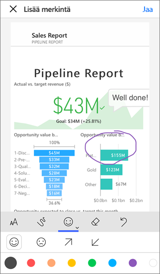
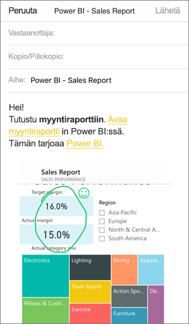

# Merkintöjen lisääminen ja ruudun, raportin tai visualisoinnin jakaminen Power BI -mobiilisovelluksissa
Koskee seuraavia:

|  |  |  |  |
|:--- |:--- |:--- |:--- |
| iPhonet |iPadit |Android-puhelimet |Android-tabletit |

Voit jakaa tilannevedoksen ruudusta, raportista tai visualisoinnista ja lisätä merkintöjä niihin Power BI -mobiilisovelluksessa iOS-ja Android-laitteissa. Vastaanottajat näkevät sen juuri sellaisena kuin se oli, kun lähetit sähköpostin sekä linkin. Voit lähettää ruutujen tilannevedoksia kenelle tahansa – ei pelkästään työkavereille samalla sähköpostitoimialueella. Voit lisätä merkintöjä – viivoja, tekstiä tai leimoja – ennen niiden jakamista.

*Raportti, jossa on merkintöjä*

Sähköposti, jossa tilannevedos ruudusta, raportista tai visualisoinnista, sisältää myös linkin todelliseen kohteeseen Power BI -palvelussa ([https://powerbi.com](https://powerbi.com)). Vastaanottajat voivat napsauttaa linkkiä ja siirtyä suoraan kyseiseen ruutuun, raporttiin tai visualisointiin, jos sinulla ja heillä on Power BI Pro -käyttöoikeudet tai jos sisältö on [Premium-kapasiteetissa](../../service-premium-what-is.md) ja olet jo jakanut kohteen heidän kanssaan. 

Voit myös [jakaa ruudun Windows 10 -laitteiden Power BI -mobiilisovelluksesta](mobile-windows-10-phone-app-get-started.md), mutta et lisätä siihen merkintöjä.

## Ruudun avaaminen merkintöjen lisäämiseksi
1. Napauta ruutua sen avaamiseksi tarkastelutilassa.
2. Napauta Lisää merkintä -kuvaketta  ruudun oikeassa yläkulmassa.
3. Nyt voit [lisätä merkintöjä ja jakaa ruudun](mobile-annotate-and-share-a-tile-from-the-mobile-apps.md#annotate-and-share-the-tile-report-or-visual).

## Raportin avaaminen merkintöjen lisäämiseksi
1. Avaa raportti. 
2. Napauta Lisää merkintä -kuvaketta  raportin oikeassa yläkulmassa.
3. Nyt voit [lisätä merkintöjä ja jakaa raportin](mobile-annotate-and-share-a-tile-from-the-mobile-apps.md#annotate-and-share-the-tile-report-or-visual).

## Visualisoinnin avaaminen merkintöjen lisäämiseksi
1. Napauta raportissa visualisointia, ja napauta sitten laajennuskuvaketta sen avaamiseksi tarkastelutilassa. 
   
    
2. Napauta Lisää merkintä -kuvaketta  visualisoinnin oikeassa yläkulmassa.
3. Nyt voit [lisätä merkintöjä ja jakaa visualisoinnin](mobile-annotate-and-share-a-tile-from-the-mobile-apps.md#annotate-and-share-the-tile-report-or-visual).

## Merkintöjen lisääminen ruutuun, raporttiin tai visualisointiin ja niiden jakaminen
1. Näin lisäät merkintöjä:  
   
   
   
   *Huomautus-palkki iPhoneissa ja iPadeissa*
   
   
   
   *Huomautus-palkki Android-laitteissa*
   
   * Jos haluat piirtää erivärisiä ja eripaksuisia viivoja, napauta aaltoviivakuvaketta, valitse leveys ja väri, ja piirrä.  
   * Jos haluat kirjoittaa kommentteja, napauta **AA**, valitse tekstin koko ja väriä, ja kirjoita.  
   * Jos haluat liittää ruutuun leimoja (kuten hymiöitä), napauta hymiötä, valitse väri ja napauta sitten kohtaa, johon haluat sen lisätä.   
2. Huomautusten tekemisen jälkeen napauta **Jaa** oikeassa yläkulmassa.
3. Avaa sähköpostisovellus, kirjoita vastaanottajien nimet ja muokkaa viestiä tarvittaessa.  
   
   
   
   Sähköpostissa on kuva ja linkki tiettyyn ruutuun, raporttiin tai visualisointiin. 
4. Napauta **Lähetä**.

## Seuraavat vaiheet
* [Koontinäytön jakaminen Power BI -mobiilisovelluksista](mobile-share-dashboard-from-the-mobile-apps.md)
* Onko sinulla kysyttävää? [Voit esittää kysymyksiä Power BI -yhteisössä](https://community.powerbi.com/)

