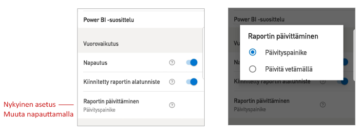

# Raportin käsittelyasetusten määrittäminen

## Yleiskatsaus

Power BI -mobiilisovelluksessa on useita määritettävissä olevia käsittelyasetuksia, joiden avulla voit hallita sitä, miten tietojasi käsitellään, ja määrittää, miten jotkin Power BI -mobiilisovelluksen osat toimivat. Alla olevassa taulukossa näkyvät parhaillaan käytettävissä olevat käsittelyasetukset ja laitteet, joissa ne ovat.

|| Android-puhelin | iPhone | Android-tabletti  | iPad |
|-|:-:|:-:|:-:|:-:|
| [Käsitteleminen yhdellä napautuksella tai kaksoisnapautuksella raportin visualisoinneissa](#single-tap) |✔|✔|||
| [Arvopisteiden monivalinta vs. yksittäinen valinta raportin visualisoinneissa](#multi-select) |✔|✔|✔|✔|
| [Kiinnitetty tai dynaaminen raportin alatunniste](#docked-report-footer) |✔|✔|||
| [Raportin päivittäminen painikkeella tai vetämällä](#report-refresh) |✔||||
|

Saat vuorovaikutusasetukset näkyviin avaamalla [sivupaneelin](./mobile-apps-home-page.md#header) napauttamalla profiilikuvaasi, valitsemalla **Asetukset** ja etsimällä **Vuorovaikutus**-osan.

Käsittelyasetukset on kuvattu alla olevissa osissa.

## Käsittelyasetukset

### Napautus
Kun lataat Power BI -mobiilisovelluksen, se on määritetty käsittelyyn yhdellä napautuksella. Tämä tarkoittaa sitä, että kun napautat visualisointia osittajatoiminnon, ristiinkorostamisen, linkin tai painikkeen napsauttamisen tai muun toiminnon suorittamista varten, napautus sekä valitsee visualisoinnin että suorittaa haluamasi toiminnon.

Halutessasi voit poistaa käytöstä käsittelyn yhdellä napautuksella. Sen jälkeen käsittelyssä käytetään kaksoisnapautusta. Kun käsittely kaksoisnapautuksella on käytössä, valitset visualisoinnin ensin napauttamalla sitä ja suoritat sitten haluamasi toiminnon napauttamalla visualisointia uudelleen.

### Valitse useita

Monivalintavaihtoehdon avulla raporttisivulta voidaan valita useita arvopisteitä. Kun monivalinta on käytössä, jokainen napsautettava arvopiste lisätään valittujen arvopisteiden joukkoon, ja yhdistetyt tulokset korostetaan automaattisesti kaikissa sivun visualisoinneissa. Kun monivalinta on poissa käytöstä, nykyinen valinta korvataan uudella valinnalla, kun arvopiste valitaan napauttamalla.

Jos haluat poistaa arvopisteen valinnan, napauta sitä uudelleen.

>[!NOTE]
>Monivalintaa ei tueta mukautetuissa Power BI -visualisoinneissa.
>
>Monivalintatilaa tuetaan Power BI -raporttipalvelimen seuraavassa julkaisuversiossa.

### Kiinnitetty raportin alatunniste

Kiinnitetyn raportin alatunnisteen asetus määrittää, pysyykö raportin alatunniste kiinnitettynä (eli kiinteänä ja aina näkyvissä) raportin alaosassa, vai piilotetaanko se ja tuodaanko se uudelleen näkyviin sen mukaan, mitä toimintoja (kuten vieritystä) raportissa käytetään.

Android-puhelimissa raportin kiinnitetyn alatunnisteen asetus on oletusarvoisesti **käytössä**, mikä tarkoittaa, että raportin alatunniste on kiinnitetty ja aina näkyvissä raportin alaosassa. Voit vaihtaa asetukseksi **ei käytössä**, jos haluat raporttiin mieluummin dynaamisen alatunnisteen, joka tulee näkyviin ja katoaa sen mukaan, mitä toimintoja käytät raportissa.

### Raportin päivittäminen

Raportin päivitysasetus määrittää, miten raporttien päivitykset aloitetaan. Voit valita, onko kaikkien raporttien ylätunnisteessa päivityspainike, vai päivitetäänkö raportti vetämällä raporttisivulla hieman ylhäältä alas. Seuraava kuva havainnollistaa näitä kahta vaihtoehtoa. 

Android-puhelimissa päivityspainike lisätään oletusarvoisesti.

Jos haluat muuttaa raportin päivitysasetusta, siirry käsittelyasetuksissa raportin päivitysasetukseen. Käytössä oleva asetus on näkyvissä. Napauta arvoa, niin näkyviin tulee ponnahdusikkuna, jossa voit valita uuden arvon.

## Etämääritys

Järjestelmänvalvoja voi määrittää käsittelyasetukset myös etäyhteydellä mobiililaitteiden hallinnan työkalun ja sovellusmääritystiedoston avulla. Näin raporttien käsittelykokemus voidaan standardoida koko organisaatiota tai organisaation tiettyjä käyttäjäryhmiä varten. Lisätietoja on artikkelissa [Käsittelyn määrittäminen mobiililaitteiden hallinnan avulla](./mobile-app-configuration.md).

## Seuraavat vaiheet
* [Raporttien käsitteleminen](./mobile-reports-in-the-mobile-apps.md#interact-with-reports)
* [Käsittelyn määrittäminen mobiililaitteiden hallinnan avulla](./mobile-app-configuration.md)
