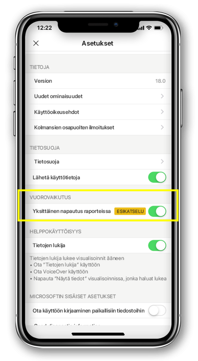

# Määritä raportin vuorovaikutuksen yhdellä napautuksella tai kaksinkertainen napauttamalla (esikatselu)
Koskee seuraavia:

|  |  | 
|:--- |:--- |
| iPhonet |Android-puhelimet |

Power BI -raportti on vuorovaikutteinen näkymä tiedoistasi, joka sisältää eri havaintoja ja merkityksellisiä tietoja esittäviä visualisointeja.

Voit määrittää, miten voit käsitellä tietojasi. Voit päättää, haluatko on yhdellä napautuksella vuorovaikutuksen tai napauta double vuorovaikutuksen.

* Kaksinkertainen napauttamalla toimia-visualisointia ensimmäistä napauttamalla valitsee sen ja vain toinen napauttamalla visualisoinnissa suorittaa toiminnon itse, kuten osittajan kohteen valitseminen, ristiinkorostaminen tai napsauta linkkiä, painike ja niin edelleen.

* Yhdellä napautuksella toimia yhdellä napautuksella sekä – valitsee visualisoinnin ja suorittaa toiminnon.

Alkaen Power BI-sovelluksen versio 18.0 iOS-ja 112540 Android kaikki uudet asennukset määritettävä yksittäisen napauttamalla oletustoimintaa.
Käyttäjät, jotka jo asennettu puhelimessa Power BI-ja päivittää näitä uusia versioita tarjotaan vaihtaa yhdellä napautuksella.

## Voit muuttaa vuorovaikutuksen käytöstä

Voit muuttaa vuorovaikutuksen toimintaa, siirry sovelluksen asetuksiin ja ota käyttöön tai yhdellä napautuksella vuorovaikutuksen käytöstä poistamista.

Tämä artikkeli koskee sekä vaakasuuntaiseksi ja puhelinraportit.

## Seuraavat vaiheet
* [Puhelimelle optimoitujen Power BI -raporttien tarkasteleminen ja käyttäminen](mobile-apps-view-phone-report.md)
* Onko sinulla kysyttävää? [Voit esittää kysymyksiä Power BI -yhteisössä](http://community.powerbi.com/)

