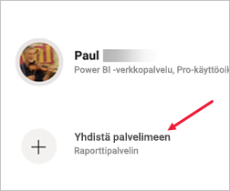
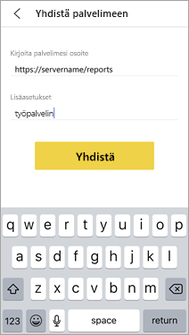
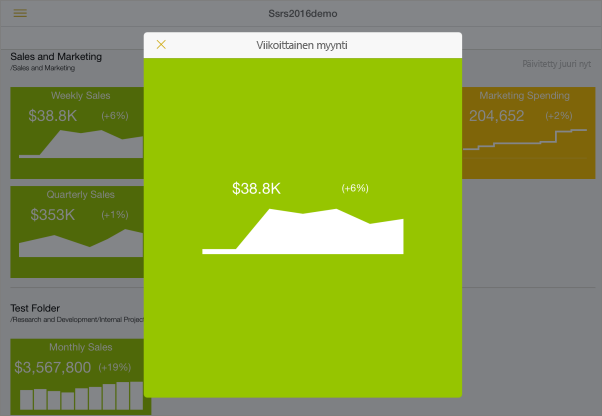
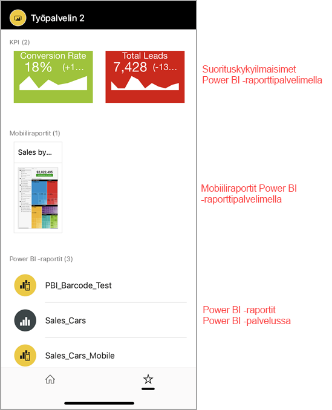

# Paikallisten raporttipalvelinten raporttien ja suorituskykyilmaisimien tarkastelu Power BI -mobiilisovelluksissa

Power BI -mobiilisovellukset tarjoavat reaaliaikaisen, kosketuskäyttöisten mobiiliyhteyden paikan päällä oleviin yritystietoihisi Power BI -raporttipalvelimessa ja SQL Server 2016 Reporting Services -palvelussa (SSRS).

Koskee seuraavia:

|  |  |  |  |
|:--- |:--- |:--- |:--- |
| iPhonet |iPadit |Android-puhelimet |Android-tabletit |

## Aloitetaan tärkeimmästä
**Mobile-sovellukset sijaitsevat siellä, missä voit tarkastella Power BI-sisältöä, eivät siellä, missä ne luotiin.**

* Sinä ja muut raporttien luojat organisaatiossasi [voitte luoda Power BI -raportteja Power BI Desktopissa ja julkaista ne Power BI -raporttipalvelimen](../../report-server/quickstart-create-powerbi-report.md) verkkoportaalissa. 
* Voit luoda [suorituskykyilmaisimia suoraan verkkoportaalissa](https://docs.microsoft.com/sql/reporting-services/working-with-kpis-in-reporting-services), järjestää ne kansioihin ja merkitä haluamasi suosikit, jotta löydät ne helposti. 
* Voit luoda [Reporting Services -mobiiliraportteja](https://docs.microsoft.com/sql/reporting-services/mobile-reports/create-mobile-reports-with-sql-server-mobile-report-publisher) SQL Server 2016 Enterprise Edition Mobiiliraportin julkaisijalla ja julkaista ne [Reporting Services -verkkoportaalissa](https://docs.microsoft.com/sql/reporting-services/web-portal-ssrs-native-mode).  

Sitten voit Power BI -mobiilisovelluksissa yhdistää jopa viisi raporttipalvelinta Power BI -raportteihin ja suorituskykyilmaisimiin, jotka on järjestetty kansioihin tai kerätty suosikeiksi. 

## Näytteisiin tutustuminen mobiilisovelluksissa ilman palvelinyhteyttä
Vaikka sinulla ei olisikaan pääsyä Reporting Services -verkkoportaaliin, voit tutustua Reporting Services -mobiiliraporttien ja suorituskykyilmaisinten ominaisuuksiin. 

1. Napauta profiilikuvaasi vasemmassa yläkulmassa ja valitse sitten **Asetukset** ulosliukuvassa Tilit-paneelissa.

2. Napauta avautuvalla Asetukset-sivulla **Reporting Services -malleja**, jonka jälkeen voit siirtyä käsittelemään suorituskykyilmaisinmalleja ja mobiiliraportteja.
   
   

## Yhteyden muodostaminen paikalliseen raporttipalvelimeen
Voit myös katsella paikallisia Power BI -raportteja, Reporting Services -mobiiliraportteja ja suorituskykyilmaisimia Power BI -mobiilisovelluksissa. 

1. Avaa Power BI -sovellus mobiililaitteessasi.
2. Jos et ole vielä kirjautunut sisään Power BI:hin, napauta **Raporttipalvelinta**.
   
   
   
   Jos olet jo kirjautunut sisään Power BI-sovellukseen, napauta profiilikuvaasi vasemmassa yläkulmassa ja valitse sitten **Asetukset** ulosliukuvassa Tilit-paneelissa.
3. Valitse avautuvalla Asetukset-sivulla **Yhdistä palvelimeen**.
   
    

    Mobiilisovellus tarvitsee yhteyden palvelimeen jollakin tavalla. Se voidaan tehdä muutamia tavoilla:
     * Samassa verkossa oleminen tai VPN:n käyttäminen on helpoin tapa.
     * Verkkosovelluksen välityspalvelinta voidaan käyttää yhteyden muodostamiseksi organisaation ulkopuolelle. Katso lisätietoja ohjeaiheesta [Reporting Servicesiin yhdistäminen OAuth-todennuksen avulla](mobile-oauth-ssrs.md).
     * Avaa yhteys (portti) palomuurissa.

4. Täytä palvelimen osoite ja anna palvelimelle kutsumanimi, jos haluat. Käytä tätä muotoilua palvelimen osoitteessa:
   
     `https://<servername>/reports`
   
     TAI
   
     `https://<servername>/reports`
   
   Lisää **http** tai **https** yhteysmerkkijonon eteen.
   
    
5. Kun olet kirjoittanut palvelimen osoitteen ja valinnaisen kutsumanimen, valitse **Yhdistä** ja anna sitten käyttäjänimi ja salasana pyydettäessä.
6. Nyt näet palvelimen Tilit-ruudussa – tässä esimerkissä sitä kutsutaan työpalvelimeksi.
   
   

## Yhteyden muodostaminen paikalliseen raporttipalvelimeen iOS- tai Android-laitteessa

Jos tarkastelet Power BI:tä iOS- tai Android-mobiilisovelluksessa, IT-järjestelmänvalvojasi on saattanut määrittää sovelluksen määrityskäytännön. Tässä tapauksessa yhteyden muodostaminen raporttipalvelimeen on helppoa eikä sinun tarvitse antaa niin paljon tietoja muodostaessasi yhteyden raporttipalvelimeen. 

1. Näyttöön tulee sanoma, jossa ilmoitetaan mobiilisovelluksen olevan määritetty raporttipalvelimen kanssa. Napauta **Kirjaudu sisään**.

    

2.  **Muodosta yhteys palvelimeen** -sivulla raporttipalvelimen tiedot on valmiiksi täytetty. Napauta **Yhdistä**.

    

3. Kirjoita salasana todennusta varten ja napauta sitten **Kirjaudu sisään**. 

    

Nyt voit tarkastella ja käsitellä raporttipalvelimeen tallennettuja suorituskykyilmaisimia ja Power BI -raportteja.

## Power BI -raporttien ja suorituskykyilmaisinten tarkastelu Power BI-sovelluksessa
Power BI -raportit, Reporting Services -mobiiliraportit ja suorituskykyilmaisimet näkyvät samoissa kansiossa, joissa ne ovat Reporting Services -verkkoportaalissa. 

* Napauta Power BI -raporttia . Se aukeaa vaakasuunnassa, ja voit käsitellä sitä Power BI -sovelluksessa.

    > [!NOTE]
  > Poraudu alaspäin ja ylöspäin -toimintoa ei tällä hetkellä ole otettu käyttöön Power BI -raporteissa Power BI -raporttipalvelimella.
  
    
* Power BI Desktopissa raporttien omistajat voivat [optimoida raportin](../../create-reports/desktop-create-phone-report.md) Power BI -mobiilisovelluksia silmällä pitäen. Matkapuhelimessa optimoiduilla raporteilla on erityinen kuvake,  ja asettelu.
  
    
* Napauta Suorituskykyilmaisinta sen näkemiseksi tarkastelutilassa.
  
    

## Suosikkisuorituskykyilmaisinten ja -raporttien tarkastelu
Voit merkitä suorituskykyilmaisimia ja raportteja suosikeiksi verkkoportaalissa ja tarkastella niitä yhdessä kätevässä kansiossa mobiililaitteessasi Power BI -suosikkikoontinäyttöjesi kera.

* Valitse **Suosikit** siirtymispalkissa.
  
   
  
   Suosikkisi suorituskykyilmaisimista ja verkkoportaalin raporteista ovat kaikki tällä sivulla, yhdessä Power BI -koontinäyttöjen kanssa Power BI -palvelussa:
  
   

## Yhteyden poistaminen raporttipalvelimeen
1. Avaa Tilit-ruutu ja valitse **Asetukset**.
2. Napauta sen palvelimen nimeä, johon et halua olla yhteydessä.
3. Napauta **Poista palvelin**.

## Seuraavat vaiheet
* [Mikä on Power BI?](../../fundamentals/power-bi-overview.md)  
* Onko sinulla kysymyksiä? [Voit esittää kysymyksiä Power BI -yhteisössä](https://community.powerbi.com/)
