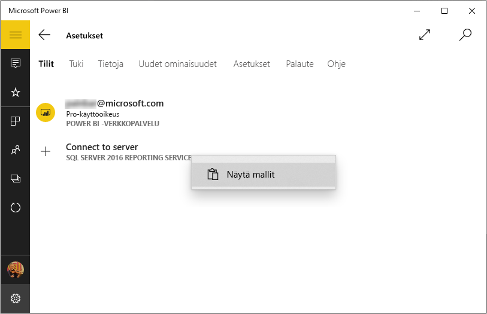
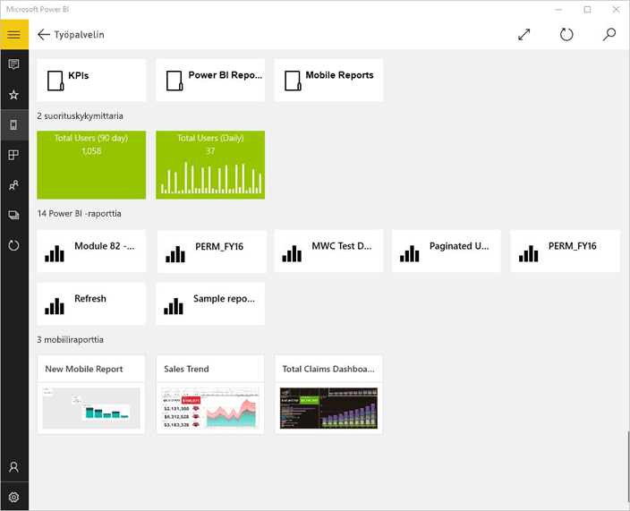

# Tarkastele Reporting Services (SSRS):n mobiiliraportteja ja suorituskykymittareita Windows 10 -laitteiden Power BI -sovelluksella
Power BI -mobiilisovellus Windows 10:lle tarjoaa tärkeiden, paikalliseen liiketoimintaan liittyvien tietojen reaaliaikaisen, kosketuskäyttöisten mobiilikäytön SQL Server 2016 Reporting Servicesissä. 

## Aloitetaan tärkeimmästä
Voit luoda [Reporting Services -mobiiliraportteja](https://msdn.microsoft.com/library/mt652547.aspx) SQL Server 2016 Enterprise Edition -mobiiliraportin julkaisuohjelmalla ja julkaista ne [Reporting Services -verkkoportaalissa](https://msdn.microsoft.com/library/mt637133.aspx). Luo suorituskykymittarit suoraan verkkoportaalissa. Voit järjestää ne kansioihin ja merkitä haluamasi suosikit, jotta löydät ne helposti. 

Sitten voit tarkastella Power BI -mobiilisovelluksessa Windows 10:lle omia mobiiliraportteja ja suorituskykymittareita, järjestää niitä kansioihin tai kerätä suosikeiksi. 

> [!NOTE]
> Laitteessa on oltava käytössä Windows 10. Sovellus toimii parhaiten laitteissa, joissa on vähintään 1 Gigatavua RAM-muistia ja 8 Gigatavua tallennustilaa.
> 
> 

## Tutustu näytteisiin ilman SQL Server 2016 Reporting Services -palvelinta
Vaikka sinulla ei olisikaan pääsyä Reporting Services -verkkoportaaliin, voit tutustua Reporting Services -mobiiliraporttien ominaisuuksiin.

1. Avaa Power BI -sovellus Windows 10 -laitteellasi.
2. Napauta yleistä siirtymispainiketta  vasemmassa yläkulmassa.
3. Napauta **Asetukset**-kuvaketta , napsauta hiiren kakkospainikkeella tai napauta pitkään **Muodosta yhteys palvelimeen**, napauta sitten **Näytä mallit**.
   
   
4. Avaa vähittäismyyntiraporttien tai myyntiraporttien kansio niiden suorituskykymittareiden ja mobiiliraporttien katselemiseksi.
   
   

Selaa näytteitä suorituskykymittarien ja mobiiliraporttien käyttämiseksi vuorovaikutteisesti.

## Muodosta yhteys Reporting Servicesin -raporttien palvelimelle
1. Napauta siirtymisruudun alaosassa **Asetukset** 
2. Napauta **Yhdistä palvelimeen**.
3. Kirjoita palvelimen osoite ja käyttäjänimesi ja salasanasi. Käytä tätä muotoilua palvelimen osoitteessa:
   
     `https://<servername>/reports` TAI   `https://<servername>/reports`
   
   > [!NOTE]
   > Lisää **http** tai **https** yhteysmerkkijonon alkuun.
   > 
   > 
   
    Napauta halutessasi **Lisäasetus**, jos haluat antaa palvelimelle nimen.
4. Muodosta yhteys napauttamalla valintamerkkiä. 
   
   Nyt näet palvelimen siirtymissiirtymisruudussa.
   
   
   
   >[!TIP]
   >Voit napauttaa  milloin tahansa ja siirtyä Reporting Services -mobiiliraporttien ja Power BI -palvelun koontinäyttöjen välillä. 
   > 

## Tarkastele Reporting Services -suorituskykymittareita ja mobiiliraportteja Power BI -sovelluksella
Reporting Services -mobiiliraportit ja suorituskykymittarit näkyvät samoissa kansiossa, joissa ne ovat Reporting Services -verkkoportaalissa.

* Napauta Suorituskykyilmaisinta sen näkemiseksi tarkastelutilassa.
  
    
* Napauta mobiiliraporttia Power BI -sovelluksen avaamista ja käyttöä varten.
  
    

## Suosikkisuorituskykymittareiden ja -raporttien tarkastelu
Voit merkitä suorituskykymittareiden ja mobiiliraportteja suosikeiksi  Reporting Services -verkkoportaalissa ja tarkastella niitä yhdessä kätevässä kansiossa Windows 10 -laitteessasi Power BI -suosikkikoontinäyttöjesi ja raporttien kera.

* Napauta **Suosikit**.
  
   
  
   Verkkoportaalin suosikit ovat kaikki tällä sivulla.
  
   

Lue lisää [suosikeista Power BI -mobiilisovelluksissa](mobile-apps-favorites.md).

## Yhteyden poistaminen raporttipalvelimeen
Voit olla yhdistettynä vain yhteen raporttipalvelimen kerrallaan Power BI -mobiilisovelluksestasi. Jos haluat muodostaa yhteyden eri palvelimeen, sinun on katkaistava yhteys nykyiseen.

1. Napauta siirtymisruudun alaosassa **Asetukset** .
2. Napauta ja pidä palvelimen nimeä, johon et halua olla yhteydessä.
3. Napauta **Poista palvelin**.
   
    

## Luo Reporting Services -mobiiliraportit ja suorituskykymittarit
Reporting Services -suorituskykymittareita ja mobiiliraportteja ei luoda Power BI -sovelluksella. Ne luodaan SQL Server Mobile Report Publisher- ja SQL Server 2016 Reporting Services -verkkoportaalien kautta.

* [Luo omat Reporting Services -raportit](https://msdn.microsoft.com/library/mt652547.aspx) ja julkaise ne Reporting Services -verkkoportaalissa.
* Luo [suorituskykymittarit Reporting Services -verkkoportaalissa](https://msdn.microsoft.com/library/mt683632.aspx)

## Seuraavat vaiheet
* [Windows 10:n Power BI -mobiilisovelluksen käytön aloittaminen](mobile-windows-10-phone-app-get-started.md)  
* [Mikä on Power BI?](../../fundamentals/power-bi-overview.md)  
* Onko sinulla kysyttävää? [Voit esittää kysymyksiä Power BI -yhteisössä](https://community.powerbi.com/)

