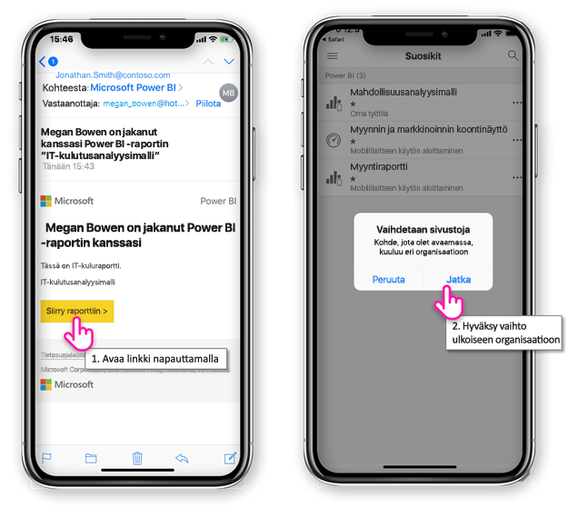
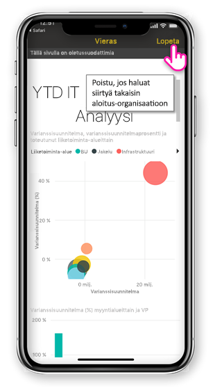
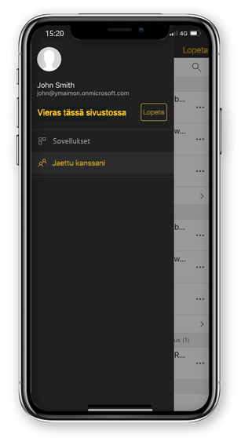

# Näytä Power BI-sisältö on jaettu ulkoisen organisaatiosta

Power BI on integroitu Azure Active Directory business-to-Businessin (Azure AD B2B), jotta Power BI-sisältöä organisaatiosi ulkopuolisten vierailevien käyttäjien kanssa. Ja ulkoisen vierailevien käyttäjien käyttää Power BI-mobiilisovelluksen kyseisen Power BI-sisältöä, joka on jaettu heidän kanssaan. 

Koskee seuraavia:

|  |  |  |  |
|:--- |:--- |:--- |:--- |
| iPhonet |iPadit |Android-puhelimet |Android-tabletit |

## Käytettäessä jaettua sisältöä

**Ensin sinun täytyy joku jakaa kohteen kanssasi ulkoisen organisaatiosta.** Kun joku [kohde jakaa sinulle](../../service-share-dashboards.md), sama organisaatio tai ulkoinen organisaatio, saat sähköpostiviestin, jossa on linkki, joka on jaettu kohde. Seuraavan linkin mobiililaitteeseesi avautuu Power BI-mobiilisovelluksessa. Jos sovellus tunnistaa kohde on jaettu ulkoisen organisaatiosta, sovellus muodostaa kyseisen organisaation käyttäjätietojen yhteydessä. Sovelluksen lataa sitten kaikki kohteet, jotka jaettiin kanssasi organisaatioiden.

> [!NOTE]
> Jos tämä on jaettu ulkoisen Vieraskäyttäjä kuin ensimmäinen kohde, on lunasta kutsun selaimessa. Sinun ei voi käyttää kutsua Power BI-sovelluksessa.

Kun olet muodostanut yhteyden ulkoisen organisaation musta otsikko näkyy sovelluksessa. Tämä otsikko ilmaisee, että et ole muodostanut koti organisaatiollesi. Muodostaa koti organisaatioon Lopeta Vieras tilasta.

Vaikka sinulla on oltava Power BI artefaktin linkin muodostaa ulkoisen organisaatiolle, kun sovellus siirtyy, voit käyttää kaikki kohteet, jotka on jaettu (ei ainoastaan sähköpostiviestistä avata kohdetta). Voit tarkastella kaikkia kohteita, voit käyttää ulkoista organisaation sovelluksen valikosta ja valitsemalla **jaettu kanssani**. Valitse **sovelluksia** löydät sovelluksia, joita voit käyttää myös.

## Rajoitukset

- Ehdollisen käyttöoikeuden ja muut Intune-käytäntöjä ei tueta Azure AD B2B: n ja Power BI-mobiilisovelluksessa. Tämä tarkoittaa, että sovelluksen pakottaa vain koti organisaation käytäntöjä, jos ne ovat olemassa.
- Palveluilmoituksia vastaanotetaan sivustosta sovelluksiini vain (jopa kun käyttäjä on liitetty ulkoisen organisaatiolle vieraana). Käyttäjän sovelluksiini sivuston sovelluksen muodostaa uudelleen avaamalla ilmoitus.
- Jos käyttäjä sulkee sovelluksen, kun avata uudelleen sovelluksen muodostaa automaattisesti yhteyden käyttäjän sovelluksiini.
- Ulkoinen organisaatiolle yhteydessä joitakin toimintoja on poistettu käytöstä: suosikin kohdetta, Tietoilmoitukset, kommentoinnin ja jakaminen.
- Offline-tietoja ei ole käytettävissä yhdistettynä ulkoisen organisaatiolle.
- Jos sinulla on yritysportaali-sovellus on asennettu laitteeseesi, sitten laite täytyy rekisteröidä.
