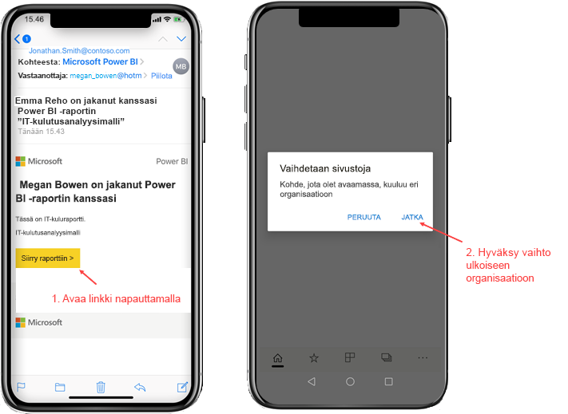
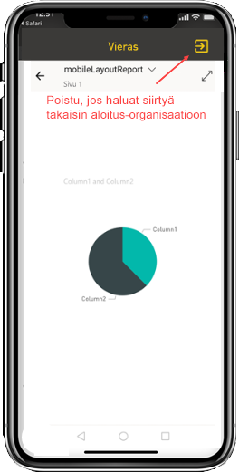
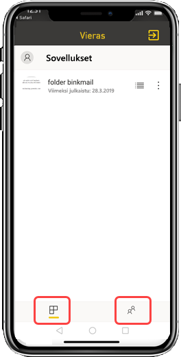

# Kanssasi ulkoisesta organisaatiosta jaetun Power BI -sisällön tarkasteleminen

Power BI on integroitu Azure Active Directory Business-to-Businessin (Azure AD B2B) kanssa, jotta Power BI -sisältöä voidaan jakaa turvallisesti organisaation ulkopuolisten vierailevien käyttäjien kanssa. Ulkoiset vieraskäyttäjät voivat käyttää Power BI -mobiilisovellusta ja käyttää jaettua Power BI -sisältöä sen avulla. 

Koskee seuraavia:

|  |  |  |  |
|:--- |:--- |:--- |:--- |
| iPhonet |iPadit |Android-puhelimet |Android-tabletit |

## Jaetun sisällön käyttäminen

**Tarvitset ensin ulkoisesta organisaatiosta henkilön, joka jakaa kohteen kanssasi.** Kun joku [jakaa kohteen kanssasi](../../service-share-dashboards.md), joko samasta organisaatiosta tai ulkoisesta organisaatiosta, saat sähköpostiviestin, jossa on linkki kyseiseen jaettuun kohteeseen. Kun avaat linkin mobiililaitteessasi, Power BI -mobiilisovellus avautuu. Jos sovellus tunnistaa, että kohde on jaettu ulkoisesta organisaatiosta, sovellus muodostaa yhteyden kyseiseen organisaatioon käyttäjätietojesi avulla. Sovellus lataa sitten kaikki kohteet, jotka on jaettu kanssasi kyseisestä organisaatiosta.

> [!NOTE]
> Jos tämä on ensimmäinen kohde, joka on jaettu kanssasi ulkoisena vieraskäyttäjänä, sinun on lunastettava kutsu selaimessa. Et voi lunastaa kutsua Power BI -sovelluksessa.

Kun olet yhteydessä ulkoiseen organisaatioon, sovelluksessa näkyy musta ylätunniste. Tämä ylätunniste ilmaisee, että et ole muodostanut yhteyttä kotiorganisaatioosi. Jos haluat muodostaa yhteyden takaisin kotiorganisaatioosi, poistu vierastilasta.

Vaikka sinulla on oltava Power BI:n artefaktin linkki ulkoiseen organisaatioon yhdistämistä varten, voit käyttää kaikkia kanssasi jaettuja kohteita (ei vain sähköpostista avaamaasi kohdetta) sovelluksen siirtymisen jälkeen. Jos haluat nähdä kaikki kohteet, joita voit käyttää ulkoisessa organisaatiossa, siirry sovellusvalikkoon ja valitse **Jaettu kanssani**. **Sovellukset**-kohdasta löydät sovelluksia, joita voit myös käyttää.

## Rajoitukset

- Käyttäjillä on oltava aktiivinen Power BI -tili ja aloitusvuokraaja.
- Käyttäjien on oltava kirjautuneina Power BI -aloitusvuokraajaan, ennen kuin he voivat käyttää sisältöä, joka on jaettu heidän kanssaan ulkoisesta vuokraajasta.
- Ehdollista käyttöä ja muita Intune-käytäntöjä ei tueta Azure AD B2B:ssä ja Power BI -mobiilisovelluksessa. Tämä tarkoittaa sitä, että sovellus valvoo vain kotiorganisaation käytäntöjä, jos sellaisia on.
- Palveluilmoitukset vastaanotetaan vain kotiorganisaation sivustolta (silloinkin, kun käyttäjä on yhdistetty vieraana ulkoiseen organisaatioon). Ilmoituksen avaaminen yhdistää sovelluksen uudelleen käyttäjän kotiorganisaation sivustoon.
- Jos käyttäjä sulkee sovelluksen, sovellus muodostaa automaattisesti yhteyden käyttäjän kotiorganisaatioon, kun sovellus avataan uudelleen.
- Kun yhteys ulkoiseen organisaatioon on muodostettu, seuraavat toiminnot on poistettu käytöstä: suosikkikohteet, tietoilmoitukset, kommentointi ja jakaminen.
- Offline-tiedot eivät ole käytettävissä, kun yhteys on muodostettu ulkoiseen organisaatioon.
- Jos sinulla on Yritysportaali-sovellus asennettuna laitteeseesi, laitteen on oltava rekisteröity.
