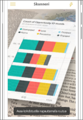
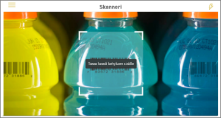

# Reaalimaailman tietojen saaminen Power BI -mobiilisovellusten avulla
Power BI-mobiilisovelluksissa voit yhdistää reaalimaailman suoraan aiheeseen liittyviin BI-tietoihin monilla eri tavoilla. 

## Ruutujen QR-koodit
Luo raportin tai ruudun QR-koodi raporttinäkymässä ja lisää QR-koodi haluamaasi paikkaan. Kun työtoverisi lukee koodin iPhonella, Android-puhelimella tai Power BI ja tehostettu todellisuus -sovelluksessa, hän näkee kyseiseen QR-koodiin yhdistämäsi ruudun. Kun käytössä on iPhone, ruutu näkyy lisätyssä todellisuudessa.

Lisätietoja:

* [Ruudun QR-koodin luominen Power BI:ssä](../../service-create-qr-code-for-tile.md)
* [Power BI:n QR-koodin lukeminen mobiililaitteella](mobile-apps-qr-code.md)
* [QR-koodin lukeminen Power BI ja tehostettu todellisuus -sovelluksessa](mobile-mixed-reality-app.md#scan-a-report-qr-code-in-holographic-view)

## Raporttien QR-koodit
Luo raportin QR-koodi.  Kun työtoverisi lukee koodin iPhonella (tuki Android-puhelimille tulossa pian), hän näkee kyseiseen QR-koodiin yhdistämäsi raportin. 

Lisätietoja [Raportin QR-koodin luomisesta Power BI:ssä](../../service-create-qr-code-for-report.md)

## Viivakoodit
Merkitse viivakooditiedot raporteissa, jotta työtoverisi voivat lukea tuotteessa olevan viivakoodin ja päästä suoraan raporttiin, joka on suodatettu kyseistä tuotetta varten.

Lisätietoja:

* [Viivakooditietojen merkitseminen raportissa](../../desktop-mobile-barcodes.md)
* [Viivakoodin lukeminen iPhonen Power BI -sovelluksella](mobile-apps-scan-barcode-iphone.md)

## Suodatus sijainnin mukaan
Luokittele raportin maantieteelliset tiedot Power BI Desktopissa. Kun työtoverisi tarkastelevat kyseistä raporttia Power BI -mobiilisovelluksessa iOS-laitteella, Power BI tarjoaa automaattisesti sijaintia vastaavat maantieteelliset suodattimet.

Lue lisätietoja [suodatuksesta sijainnin mukaan](mobile-apps-geographic-filtering.md).

## Seuraavat vaiheet
* [Ruudun QR-koodin luominen Power BI:ssä](../../service-create-qr-code-for-tile.md)
* [Raportin QR-koodin luominen Power BI:ssä](../../service-create-qr-code-for-report.md)

