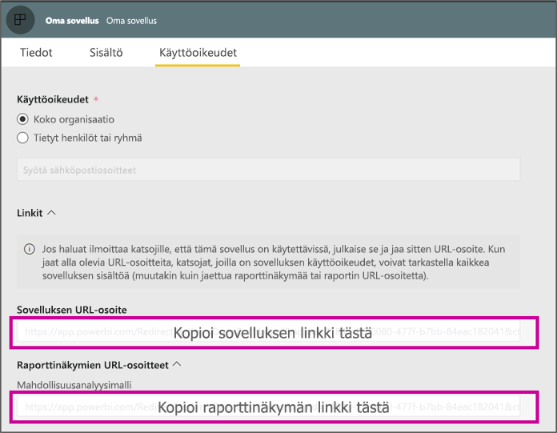

# <a name="create-a-link-to-a-specific-location-in-the-power-bi-mobile-apps"></a>Linkin luominen tiettyyn sijaintiin Power BI ‑mobiilisovelluksissa
Linkkien avulla voit käyttää suoraan tiettyjä kohteita Power BI:ssä: raporttia, koontinäyttöä ja ruutua.

Power BI-mobiilisovelluksen linkkien käyttämiseen on pääasiassa kaksi skenaariota: 

* Voit avata Power BI:n **sovelluksen ulkopuolelta**, ja sinut ohjataan tiettyyn sisältöön (raporttiin, koontinäyttöön tai sovellukseen). Tämä on se integraatioskenaario, jota tavallisesti sovelletaan, kun haluat avata Power BI -mobiilisovelluksen toisesta sovelluksesta. 
* **Siirtyminen** Power BI:n sisällä. Tätä käytetään yleensä silloin, kun haluat luoda mukautetun siirtymisen Power BI:n sisällä.


## <a name="use-links-from-outside-of-power-bi"></a>Power BI:n ulkopuolisten linkkien käyttäminen
Kun käytät Power BI:n ulkopuolista linkkiä, haluat varmistaa, että se voidaan avata sovelluksen ulkopuolelta, ja jos sovellusta ei ole laitteella asennettuna, tarjoudut asentamaan sen käyttäjälle. Olemme luoneet erityisen linkkimuodon juuri tämän tukemiseksi. Tämä linkkimuoto varmistaa, että laite käyttää sovellusta linkin avaamiseen, ja jos sovellusta ei ole asennettu laitteelle, se tarjoaa käyttäjälle mahdollisuuden hakea se myymälästä.

Linkin tulee alkaa seuraavasti  
```html
https://app.powerbi.com/Redirect?[**QUERYPARAMS**]
```

> [!IMPORTANT]
> Jos sisältöäsi isännöi erityinen tietokeskus, kuten valtiovalta, Kiina ym. Linkin pitäisi alkaa oikealla Power BI -osoitteella, kuten `app.powerbigov.us` tai `app.powerbi.cn`.   
>


**KYSELYPARAMETRIT** ovat:
* **toiminto** (pakollinen) = OpenApp/OpenDashboard/OpenTile/OpenReport
* **appId** = jos haluat avata raportin tai koontinäytön, joka on osa sovellusta 
* **groupObjectId** = jos haluat avata raportin tai koontinäytön, joka on osa työtilaa (muttei omaa työtilaa)
* **dashboardObjectId** = koontinäytön objektin tunnus (jos toiminto on OpenDashboard tai OpenTile)
* **reportObjectId** = raportin objektin tunnus (jos toiminto on OpenReport)
* **tileObjectId** = ruudun objektin tunnus (jos toiminto on OpenTile)
* **reportPage** = jos haluat avata tietyn raporttiosion (jos toiminto on OpenReport)
* **ctid** = kohteen organisaation tunnus (oleellinen yritystenvälisen yhteistyön skenaariossa. Tämä voidaan jättää pois, jos kohde kuuluu käyttäjän organisaatiolle).

**Esimerkkejä:**

* Sovelluslinkin avaaminen 
  ```html
  https://app.powerbi.com/Redirect?action=OpenApp&appId=appidguid&ctid=organizationid
  ```

* Sovelluksen osana jaetun koontinäytön avaaminen 
  ```html
  https://app.powerbi.com/Redirect?action=OpenDashboard&appId=**appidguid**&dashboardObjectId=**dashboardidguid**&ctid=**organizationid**
  ```

* Työtilan osana jaetun raportin avaaminen
  ```html
  https://app.powerbi.com/Redirect?Action=OpenReport&reportObjectId=**reportidguid**&groupObjectId=**groupidguid**&reportPage=**ReportSectionName**
  ```

### <a name="how-to-get-the-right-link-format"></a>Oikean linkkimuodon saaminen

#### <a name="links-of-apps-and-items-in-app"></a>Sovellusten ja kohteiden linkit sovelluksessa

**Sovelluksissa ja raporteissa sekä koontinäytöissä, jotka ovat osa sovellusta**, helpoin tapa saada linkki on siirtyä työtilaan ja valita ”Päivitä sovellus”. Tämä avaa ”Julkaise sovellus” -käyttökokemuksen, ja Käyttöoikeus-välilehdestä löydät **Linkit**-osion. Kun laajennat osion, näet luettelon sovelluksen kaikista sisältölinkeistä, joista sisältöä pääsee käyttämään suoraan.



#### <a name="links-of-items-not-in-app"></a>Linkit kohteisiin sovelluksen ulkopuolella 

Raporteissa ja koontinäytöissä, jotka eivät ole osa sovellusta, sinun on purettava tunnukset kohteen URL-osoitteesta.

Löydät esimerkiksi **koontinäytön** 36-merkkisen objektitunnuksen siirtymällä kyseiseen koontinäyttöön Power BI -palvelussa 

```html
https://app.powerbi.com/groups/me/dashboards/**dashboard guid comes here**?ctid=**organization id comes here**`
```

Löydät **raportin** 36-merkkisen objektitunnuksen siirtymällä Power BI -palvelussa haluamaasi raporttiin.
Tämä on esimerkki ”Oman työtilan” raportista

```html
https://app.powerbi.com/groups/me/reports/**report guid comes here**/ReportSection3?ctid=**organization id comes here**`
```
Yllä oleva URL sisältää myös erityisen raporttisivun **”ReportSection3”** .

Tämä on esimerkki työtilasta (ei Omasta työtilasta) saadusta raportista

```html
https://app.powerbi.com/groups/**groupid comes here**/reports/**reportid comes here**/ReportSection1?ctid=**organizationid comes here**
```

## <a name="use-links-inside-power-bi"></a>Linkkien käyttö Power BI:n sisällä

Power BI:n sisäiset linkit toimivat mobiilisovelluksissa täsmälleen samalla tavalla kuin Power BI -palvelussa.

Jos haluat lisätä raporttiin linkin, joka osoittaa toiseen Power BI -kohteeseen, sinun tarvitsee vain kopioida kyseisen kohteen URL-osoite selaimen osoiteriviltä. Lisätietoja [hyperlinkin lisäämisestä tekstiruutuun raportissa](https://docs.microsoft.com/power-bi/service-add-hyperlink-to-text-box).

## <a name="use-report-url-with-filter"></a>Raportin URL:n käyttö suodattimen kanssa
Sama kuin Power BI -palvelussa, mutta Power BI -mobiilisovellukset tukevat myös suodatinkyselyparametrin sisältävää raportin URL-osoitetta. Voit avata raportin Power BI -mobiilisovelluksessa ja suodattaa sen tiettyyn tilaan. Tämä URL-osoite esimerkiksi avaa myyntiraportin ja suodattaa sen alueen mukaan

```html
https://app.powerbi.com/groups/me/reports/**report guid comes here**/ReportSection3?ctid=**organization id comes here**&filter=Store/Territory eq 'NC'
```

Lue lisää siitä, [miten voit luoda kyselyparametrin raporttien suodattamiseksi](https://docs.microsoft.com/power-bi/service-url-filters).

## <a name="next-steps"></a>Seuraavat vaiheet
Palaute auttaa meitä päättämään, mitä toimintoja otamme käyttöön tulevaisuudessa, joten muista äänestää muita toimintoja, jotka haluaisit nähdä Power BI ‑mobiilisovelluksissa. 

* [Power BI -sovellukset mobiililaitteille](mobile-apps-for-mobile-devices.md)
* Seuraa käyttäjää @MSPowerBI Twitterissä
* Liity keskusteluun [Power BI -yhteisössä](https://community.powerbi.com/)
* [Mikä on Power BI?](../../fundamentals/power-bi-overview.md)

