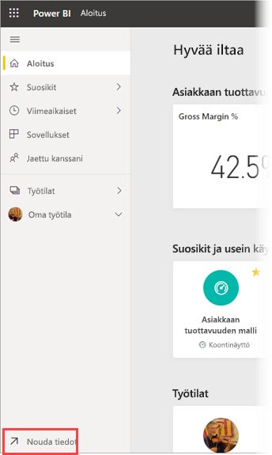
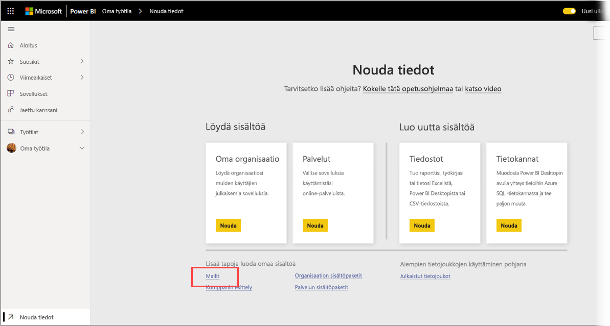
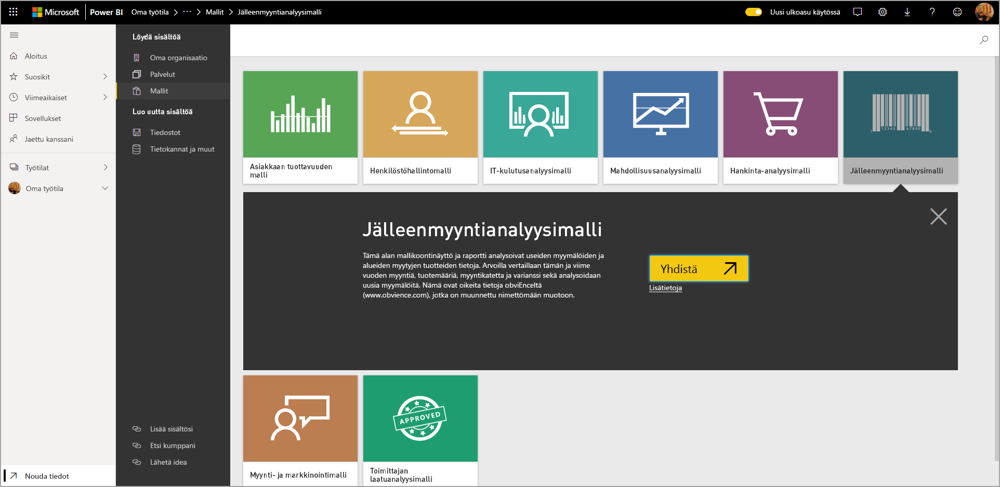
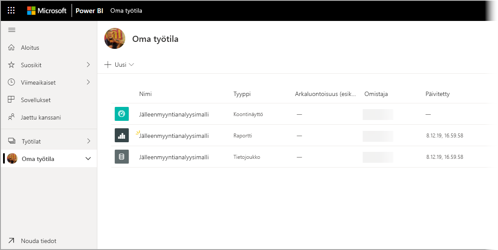

# Mallien lataaminen Power BI -palvelun Oma työtila -kohtaan

Joissakin tässä käytettävissä olevissa mobiilisovellusten dokumentaatioissa mallitietoja käytetään havainnollistamiseen. Jos haluat seurata ohjeita omalla laitteellasi, voit ladata mallitiedot Power BI -palvelun tilille, jonka jälkeen voit tarkastella niitä laitteesi Power BI -mobiilisovelluksella. Tässä artikkelissa kerrotaan, miten mallitiedot ladataan Power BI -palvelun tilille. 

## Edellytykset

Sinulla on oltava Power BI -palvelun tili, jotta voit ladata tiedot. Jos et ole vielä rekisteröitynyt Power BI:hin, [rekisteröidy ilmaiseen kokeiluversioon](https://app.powerbi.com/signupredirect?pbi_source=web) ennen aloittamista.

## Lataa malli

1. Avaa [Power BI -palvelu](https://app.powerbi.com) selaimessasi ja kirjaudu sisään.

2. Valitse siirtymisruudun vasemmasta alakulmasta **Nouda tiedot**. Jos siirtymisruutu on piilotettu etkä näe Nouda tiedot -linkkiä, näytä siirtymisruutu napsauttamalla Näytä/piilota siirtymisruutu -kuvaketta .  
   
    

3. Valitse Nouda tiedot -sivulla **Mallit**-linkki.
   
   

4. Valitse ladattava malli. Muista valita malli, jota tarvitaan käyttämässäsi opetusohjelmassa, pikaoppaassa tai artikkelissa. Kun olet valinnut sen, valitse **Yhdistä**.
  
   
   
5. Power BI tuo mallin sekä lisää uuden koontinäytön, raportin ja tietojoukon omaan työtilaasi.
   
   
  
Nyt voit siirtyä tarkastelemaan malleja mobiililaitteessa.

## Seuraavat vaiheet
* [Pikaopas](mobile-apps-quickstart-view-dashboard-report.md)
* Onko sinulla kysymyksiä? Tutustu [Power BI -yhteisön Mobiilisovellukset-osaan](https://go.microsoft.com/fwlink/?linkid=839277)
