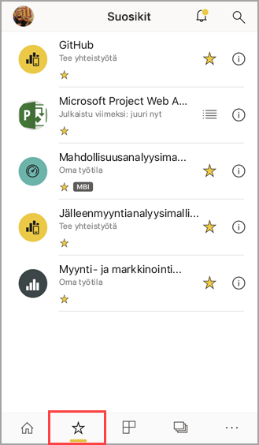
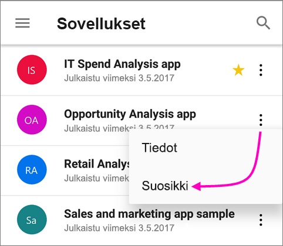
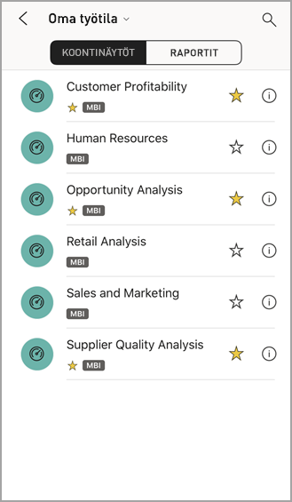
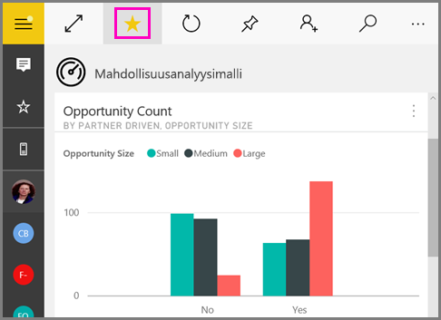
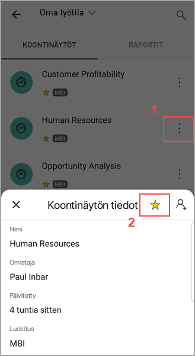
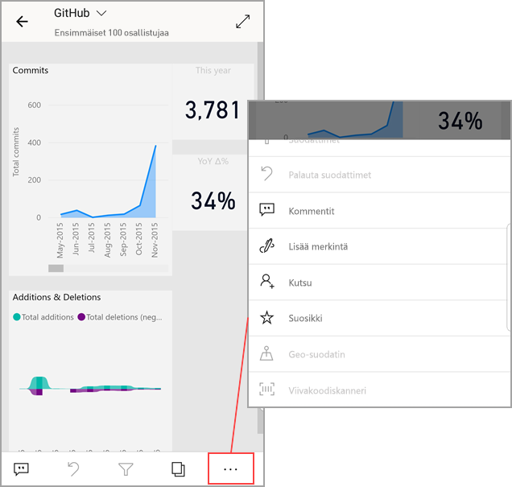

# Suosikkien luominen ja selaaminen Power BI -mobiilisovelluksissa
Koskee seuraavia:

|  |  |  |  |  |
|:--- |:--- |:--- |:--- |:--- |
| iPhonet |iPadit |Android-puhelimet |Android-tabletit |Windows 10 -laitteet |

>[!NOTE]
>Power BI -mobiilisovellustuki **Windows 10 Mobilea käyttäville puhelimille** päättyy 16. maaliskuuta 2021. [Lisätietoja](https://go.microsoft.com/fwlink/?linkid=2121400)

Miten luot ja selaat suosikkeja Power BI -koontinäytöillä, raporteilla ja sovelluksissa sekä paikallisista Power BI -raporttipalvelimen ja Raporttipalveluiden raporteista ja suorituskyvyn mittareista mobiilisovelluksissa.

Kun teet suosikin Power BI -mobiilisovelluksessa, näet sen [Power BI -palvelun](https://powerbi.com) ja kaikkien mobiililaitteidesi Suosikit-sivulla.

Jos haluat tarkastella Suosikit-sivuasi, napauta siirtymispalkin Suosikit-kuvaketta:

Voit myös [tehdä Power BI-koontinäytöistä ja sovelluksista suosikkeja Power BI-palvelussa](../end-user-favorite.md). Silloin näet ne mobiilisovelluksen Suosikit-sivulla.

Voit merkitä suorituskykymittareiden ja raportteja suosikeiksi Power BI -raporttipalvelimella tai Reporting Services -verkkoportaalissa ja tarkastella niitä yhdessä kätevässä kansiossa mobiililaitteessasi Power BI -suosikkikoontinäyttöjesi ja raporttien kera.

## Sovelluksen lisääminen suosikkeihin
1. Avaa sovellussivusi napauttamalla Sovellus-kuvaketta alareunan siirtymispalkissa.

2. Napauta iOS-laitteessa suosikiksi merkittävän sovelluksen nimen oikealla puolella olevaa tietopainiketta. Android-laitteissa näkyy Enemmän vaihtoehtoja (...) tietopainikkeen sijaan. 

3. Napauta tähteä avautuvan sovelluksen tieto-osiossa.
   
    
   
    Sovellus näkyy nyt Suosikit-sivullasi yhdessä muiden suosikkikoontinäyttöjen, -raporttien ja -sovellusten kanssa.
   
## Tee koontinäkymästä tai sovelluksesta suosikki iOS- tai Windows 10 -mobiilisovelluksissa
Voit tehdä Power BI -koontinäytöstä tai raportista suosikin koontinäyttö- tai raporttiluettelosta tai suoraan koontinäytöltä tai raportilta.

* Napsauta mobiilisovelluksen koontinäyttö- tai raporttilistalla nimen vieressä olevaa tyhjää tähteä . Tähti muuttuu keltaiseksi .
  
    
* Jos olet koontinäytössä, napauta tyhjää tähteä  valintanauhassa. Jos olet raportissa, tähti on kohdassa **Enemmän vaihtoehtoja** (...).  Tähti muuttuu mustaksi .
  
    

## Tee koontinäkymästä tai sovelluksesta suosikki Android-mobiilisovelluksissa
Voit tehdä koontinäytöstä tai raportista suosikin koontinäyttö- tai raporttiluettelosta tai suoraan koontinäytöltä tai raportilta.

* Napauta mobiilisovelluksen koontinäyttö- tai raporttilistalla nimen vieressä **Enemmän vaihtoehtoja** (...) ja napauta sitten Suosikki-painiketta avautuvassa tietovälilehdessä.
  
    

* Kun olet koontinäytössä, napauta tyhjää tähteä valintanauhassa . Tähti muuttuu keltaiseksi .
  
    

* Jos olet raportissa, avaa valintanauha pyyhkäisemällä alaspäin, valitse **Enemmän vaihtoehtoja** (...), vieritä alas löytääksesi tyhjän tähden  ja napauta sitä. Tähti muuttuu tummanharmaaksi .
  
    

## Tee suosikkeja Power BI -raporttipalvelimen ja Reportin Services -raporteista ja suorituskyvyn mittareista
Voit selata suosikkejasi Power BI -raporttipalvelimen ja Reporting Services -raporteista ja suorituskykymittareista Power BI -mobiilisovelluksissa, mutta et voi tehdä niistä suosikkeja mobiilisovelluksissa. Sinun [tulee merkitä ne suosikeiksi verkkoportaalissa](../../report-server/tutorial-explore-report-server-web-portal.md#tag-your-favorites). 

## Seuraavat vaiheet
* [Suosikkikoontinäytöt Power BI -palvelussa](../end-user-favorite.md) 
* Onko sinulla kysyttävää? [Voit esittää kysymyksiä Power BI -yhteisössä](https://community.powerbi.com/)

