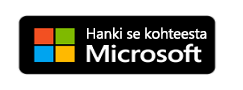

# Mitä Power BI -mobiilisovellukset ovat?
Power BI tarjoaa joukon mobiilisovelluksia iOS-, Android- ja Windows 10 -mobiililaitteisiin. Mobiilisovelluksissa muodostat yhteyden ja käytät pilvipalveluissa olevia tietoja ja paikallisia tietoja. 

Voit luoda raportteja Power BI Desktopissa. Voit luoda raporttinäkymiä sekä tarkastella raporttinäkymiä ja raportteja Power BI -palvelussa ([https://powerbi.com](https://powerbi.com)). Voit tarkastella Power BI -raportteja [Power BI -raporttipalvelimella](../../report-server/get-started.md). Kaikki nämä raportit ja raporttinäkymät ovat käytettävissä Power BI -mobiilisovelluksissa, olivatpa ne sitten paikallisia tai pilvessä. Voit tarkastella ja käsitellä niitä mobiililaitteessasi, olipa käytössäsi sitten iOS-laite (iPad, iPhone, iPod Touch tai Apple Watch), Android-puhelin tai -tabletti tai Windows 10 -laite.

### Sovelluksen hankkiminen sovelluskaupasta 

  

## Mobiilisovellukset eri laitteille

| **Laite** | **Kohokohdat** |
| --- | --- |
|  |**iPhone** kulkee mukana kaikkialla, ja sama koskee myös [iPhonen Power BI -mobiilisovelluksia](mobile-iphone-app-get-started.md). Power BI [-raporttien tarkastelemiseksi erityisessä mobiiliasettelunäkymässä](mobile-apps-view-phone-report.md) voit [lisätä Power BI -palvelun Apple Watch-kelloon](mobile-apple-watch.md) ja [kysyä kysymyksiä Q&A virtuaaliselta analyytikolta](mobile-apps-ios-qna.md).  [iOS:n Power BI -mobiilisovelluksen](mobile-iphone-app-get-started.md) käytön aloittaminen. |
|  |**iPadissa** Power BI -mobiilisovellus näyttää raporttinäkymän ja raportit tavalla, jolla ne muotoiltiin Power BI -palvelua varten. Lisäksi voit tarkastella omia [Power BI-raporttipalvelimen ja raportointipalvelimen suorituskykymittareita ja raportteja](mobile-app-ssrs-kpis-mobile-on-premises-reports.md) suoraan iPadista. Voit [asettaa tietoilmoituksia Power BI -mobiilisovellukseen ](mobile-set-data-alerts-in-the-mobile-apps.md) saadaksesi ilmoituksen, kun koontinäytön tiedot muuttuvat asettamiesi rajojen ulkopuolelle.  [iOS:n Power BI -mobiilisovelluksen](mobile-iphone-app-get-started.md) käytön aloittaminen. |
|  |**Android-puhelimen** Power BI -mobiilisovellus tuo Power BI:n palvelut suoraan taskuusi ja tarjoaa ajan tasalla olevan, kosketuskäyttöisen mobiiliyhteyden yritystietoihisi. Voit [suodattaa raportin maantieteellisen sijainnin mukaan](mobile-apps-geographic-filtering.md). Voit [skannata QR-koodin Android-puhelimellasi](mobile-apps-qr-code.md) ja siirtyä suoraan Power BI -raporttinäkymään tai raporttiin.  [Android-laitteen Power BI -mobiilisovelluksen ](mobile-android-app-get-started.md)käytön aloittaminen. |
|  |Tämä mobiilisovellus toimii useilla erilaisilla **Android-tableteilla** ja tarjoaa sinulle tarjoaa ajan tasalla olevan, kosketuskäyttöisen mobiiliyhteyden yritystietoihisi. Android-tabletissa Power BI -mobiilisovellus näyttää raporttinäkymät ja raportit tavalla, jolla ne muotoiltiin Power BI -palvelua varten. Voit myös [merkitä suosikkiraporttinäkymäsi ja raporttisi](mobile-apps-favorites.md), joten pääset käyttämään nopeasti niitä sekä suosituinta Power BI-raporttipalvelinta ja raportointipalveluiden suorituskykyilmaisimia ja raportteja.  [Android-laitteen Power BI -mobiilisovelluksen ](mobile-android-app-get-started.md)käytön aloittaminen. |
|  |Power BI -mobiilisovellus Windows 10:lle toimii kaikissa Windows 10-laitteissa, mukaan lukien Windows 10 -puhelimet. Power BI -mobiilisovellus Windows 10:lle tarjoaa joitakin erityisiä toimintoja muiden mobiilisovellusten toimintojen lisäksi. Voit esimerkiksi [kiinnittää Power BI -raporttinäkymän Windows 10:n aloitusnäyttöön](mobile-pin-dashboard-start-screen-windows-10-phone-app.md) Power BI -mobiilisovelluksesta. Lisäksi voit [suorittaa Power BI:n esitystilassa Surface Hubissa](mobile-windows-10-app-presentation-mode.md) ja Power BI-mobiilisovelluksessa Windows 10:lle.  [Windows 10 -laitteille tarkoitetun Power BI -mobiilisovelluksen](mobile-windows-10-phone-app-get-started.md) käytön aloittaminen. |||

>[!NOTE]
>Power BI -mobiilisovellustuki **Windows 10 Mobilea käyttäville puhelimille** lopetetaan 16. maaliskuuta 2021. [Lisätietoja](https://go.microsoft.com/fwlink/?linkid=2121400)

## Power BI -mobiilisovelluksien Enterprise-tuki
Microsoft Intunen avulla organisaatiot voivat hallita laitteita ja sovelluksia, kuten Power BI -mobiilisovellukset Androidille ja iOS:lle.

Microsoft Intunen avulla organisaatiot voivat ohjata tietoyksiköitä kuten pikakäytön kiinnittämisen edellyttämistä, sovelluksen tietojenkäytön valvontaa ja sovellustietojen salaamista myös silloin, kun sovellus ei ole käytössä.

Lue lisää [Power BI -mobiilisovellusten määrittämisestä Androidille ja iOS:lle Microsoft Intunella](../../admin/service-admin-mobile-intune.md). 

## Seuraavat vaiheet
[Tarkastele raporttinäkymää mobiilisovelluksissa](mobile-apps-quickstart-view-dashboard-report.md)
