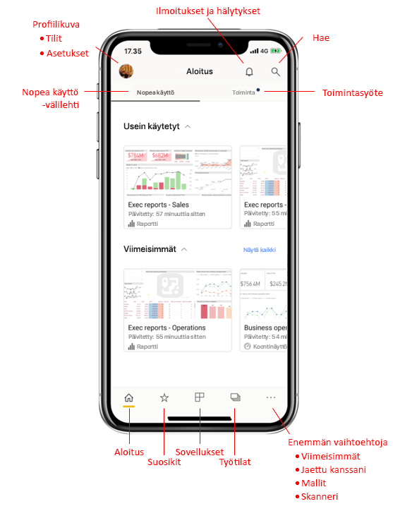
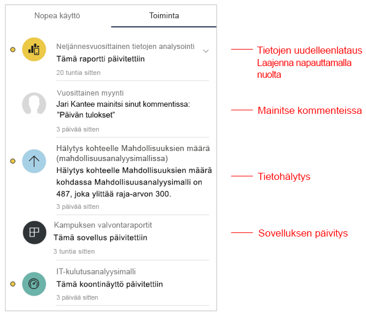
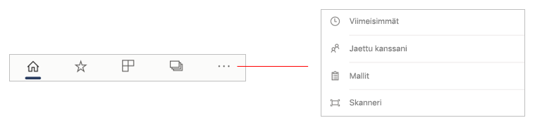
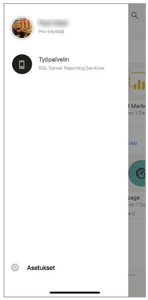
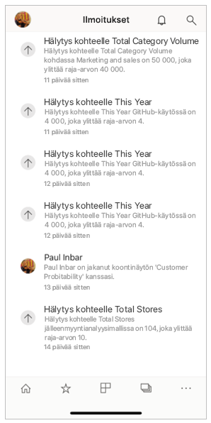
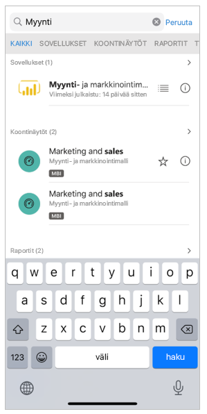

# Mobiilisovelluksen aloitussivun nopea esittely
Tässä esittelytoiminnossa tutustut Power BI -mobiilisovelluksen aloitussivuun ja siirtymisen apuvälineisiin, joiden avulla saat tarvitsemasi tiedot nopeasti.

Koskee seuraavia:

|  |  |  |
|:--- |:--- |:--- |
| iPhone | iPad | Android | 

Kun avaat Power BI -mobiilisovelluksen, siirryt aloitussivulle, josta pääset nopeasti useimmin tai viime aikoina käymiisi raportteihin, koontinäyttöihin ja sovelluksiin. Lisäksi toimintasyöte pitää sinut ajan tasalla siitä, mitä Power BI -sisällössäsi tapahtuu. Saat myös käteviä siirtymisen apuvälineitä, joiden avulla pääset nopeasti tarvitsemaasi sisältöön.

 
## Nopea käyttö -välilehti

Nopea käyttö -välilehdellä on usein ja viime aikoina käyttämäsi raportit, koontinäytöt ja sovellukset ryhmiteltyinä kahteen tiivistettävään osioon. Jos haluat tarkastella pidempää viimeksi tarkasteltujen kohteiden luetteloa, valitse **Näytä kaikki** Viimeisimmät-kohdan oikealla puolella. 

## Toimintasyöte

Toimintasyötteen avulla voit seurata, mitä Power BI ‑sisällöissä tapahtuu. Siinä näkyvät kaikki uusimmat ilmoituksesi, hälytyksesi, kommenttisi ja @mentions-kohteesi.

Syötteen päivitykset sisältävät seuraavat:
* **Päivitetyt tiedot**: kun pohjana olevat tiedot päivittyvät jossakin raportissa tai koontinäytössä, joka on suosikeissa tai viimeisimmissä.
* **Uudet kommentit**: kun käyttäjä luo kommentin raportissa tai koontinäytössä, joka on suosikeissa tai viimeisimmissä, tai kun joku mainitsee sinut kommentissa.
* **Tietoilmoitukset**: kun tiedot saavuttavat kynnysarvon, jonka olet aiemmin määrittänyt [tietoilmoituksessa](../../mobile-set-data-alerts-in-the-mobile-apps.md).
* **Sovelluspäivitykset**: kun sovelluksen luoja julkaisee päivityksen käyttämääsi sovellukseen.

 Napauta toimintokohdetta ja siirry asianmukaiseen kohtaan lisätutkimuksia varten.

Toimintokohteet kootaan yhteen, joten kaikki samasta sovelluksesta tai työtilasta tulevat tietopäivitykset ryhmitellään yhteen. Käytä  nuolta, jos haluat laajentaa koostekohteet ja tarkastella niitä. Uusin kohde on aina ylimpänä luettelossa.

## Siirtymispalkki

Sivun alareunassa on siirtymispalkki.

Siirtymispalkin kautta pääsee nopeasti seuraaviin kohteisiin:

*  **Aloitus** – takaisin aloitussivulle.
*  **Suosikit** – raportit, koontinäytöt ja sovellukset, jotka olet merkinnyt [suosikeiksi](../../mobile-apps-favorites.md).
*  **Sovellukset** – tiliisi asentamasi sovellukset.
*  **Työtilat** – työkansiot, jotka pitävät yhdessä sisällöntuottajien laatimat raportit ja koontinäytöt.
*  **Viimeisimmät** – kohteet, joita olet viimeksi tarkastellut.
*  **Jaettu kanssani** – kohteet, jotka muut ovat jakaneet kanssasi.
*  **Näytteet** – Power BI -näytteet, joita käyttämällä saat lisätietoja Power BI -ominaisuuksista.
*  **Skanneri** – laitteen kamera, jota voit käyttää skannerina [viivakoodien](../../mobile-apps-scan-barcode-iphone.md) ja [QR-koodien](../../mobile-apps-qr-code.md) skannaamiseksi.

## Ylätunniste

Sivun yläreunassa olevassa otsikossa näkyy Power BI:n sivun, raportin tai koontinäytön nimi.

Otsikossa on seuraavat siirtymiskohteet:
* **Profiilikuva tai avatar** – avaa sivupaneelin, jossa voit [vaihtaa Power BI -palvelun ja raporttipalvelimen tiliesi välillä](../../mobile-app-ssrs-kpis-mobile-on-premises-reports.md) sekä käyttää Power BI -mobiilisovelluksen asetuksia.

    

* **Ilmoitukset** – avaa [ilmoitusten sivun](../../mobile-apps-notification-center.md), jossa voit tarkastella ja käyttää ilmoituksiasi. Piste ilmoituskellossa ilmoittaa, että sinulla on uusia ilmoituksia.

    

* **Hae** – hae tilauksessasi olevaa Power BI -sisältöä.

    

## Seuraavat vaiheet
Tässä esittelyssä tutustuit Power BI -mobiilisovelluksen aloitussivuun. Lue lisää Power BI -mobiilisovelluksen käyttämisestä. 
* [Koontinäyttöjen ja raporttien tutkiminen](../../mobile-apps-quickstart-view-dashboard-report.md)
* [Raporttien tutkiminen Power BI -mobiilisovelluksissa](../../mobile-reports-in-the-mobile-apps.md)
