# Q&A:n virtuaalinen analyytikko iOS-sovelluksissa - Power BI

Helpoin tapa saada lisätietoja omista tiedoista on esittää kysymyksiä omin sanoin. Tässä artikkelissa esitetään kysymyksiä ja tarkastellaan mallitietojen merkityksellisiä tietoja käyttämällä Q&A:n virtuaalista analyytikkoa iPadin, iPhonen ja iPod Touchin Microsoft Power BI -mobiilisovelluksessa. 

Koskee seuraavia:

|  |  |
|:--- |:--- |
| iPhonet |iPadit |

Q&A:n virtuaalinen analyytikko on keskustelumainen BI-käyttökokemus, joka käyttää taustalla olevia Q&A-tietoja Power BI -palvelussa [(https://powerbi.com)](https://powerbi.com). Se ehdottaa merkityksellisiä tietoja, ja voit esittää sille kysymyksiä joko kirjoittamalla tai puhumalla ääneen.

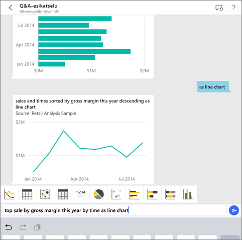

Jos et ole rekisteröitynyt Power BI:hin, [rekisteröidy ilmaiseen kokeiluversioon](https://app.powerbi.com/signupredirect?pbi_source=web) ennen aloittamista.

## Edellytykset

### Power BI:n iOS-sovelluksen asentaminen
[Lataa iOS-sovellus](http://go.microsoft.com/fwlink/?LinkId=522062 "Lataa iPhone-sovellus") iPadille, iPhonelle tai iPod Touchille Applen App Storesta.

Seuraavat versiot tukevat Power BI:n iOS-sovellusta:
- iPad, jossa on iOS 10 tai uudempi.
- iPhone 5 tai uudempi, jossa on iOS 10 tai uudempi. 
- iPod Touch, jossa on iOS 10 tai uudempi.

### Lataa mallit
Ensimmäinen vaihe on jälleenmyyjän analyysin ja mahdollisuuden analyysin näytteiden lataaminen Power BI -palvelussa.

**Jälleenmyyntianalyysimallin hankkiminen**

1. Avaa Power BI -palvelu (app.powerbi.com) ja kirjaudu sisään.

2. Valitse vasemmassa siirtymisruudussa **Työtilat**, **Oma työtila**.

3. Valitse vasemmassa alakulmassa **Nouda tiedot**.
   
    

3. Valitse Nouda tiedot -sivulla **Mallit**-kuvake.
   
   

4. Valitse **Jälleenmyyntianalyysimalli**.
 
    
 
8. Valitse **Muodosta yhteys**.  
  
   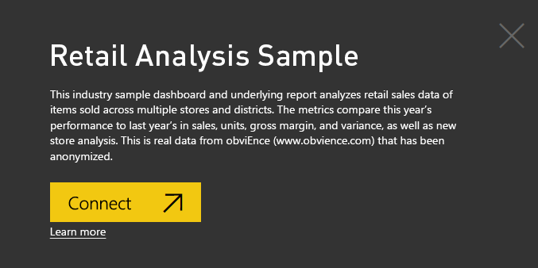
   
5. Power BI tuo sisältöpaketin ja lisää uuden koontinäytön, raportin ja tietojoukon senhetkiseen työtilaasi.
   
   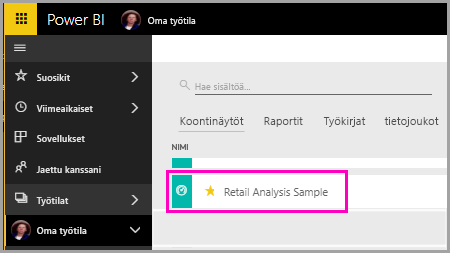

**Mahdollisuusanalyysimallin hankkiminen**

- Käy läpi samat vaiheet kuin jälleenmyyntianalyysimallin kohdalla, mutta valitse vaiheessa 4 **Mahdollisuusanalyysimalli**.

    
  
Nyt voit siirtyä tarkastelemaan malleja iOS-laitteessa.

## Kokeile esittää kysymyksiä iPhonella tai iPadilla
1. Napauta iPhone- tai iPad-laitteessa yleistä siirtymispainiketta  > **Työtilat** > **Oma työtila** ja avaa Jälleenmyyntianalyysimalli-koontinäyttö.

2. Napauta Q&A:n virtuaalinen analyytikko -kuvaketta  sivun alareunan toimintovalikosta (iPadissa sivun yläosassa).
     Q&A:n virtuaalinen analyytikko antaa joitain ehdotuksia, joilla pääset alkuun.
3. Kirjoita **näytä**, napauta **myynti** ehdotusluettelosta > **Lähetä** .

    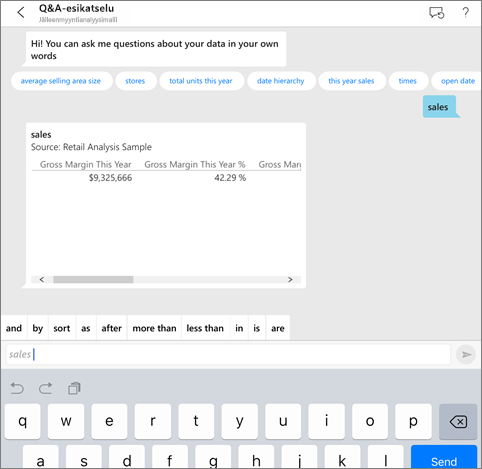
4. Napauta avainsanoissa **mukaan** ja napauta ehdotusluettelossa **kohde** > **Lähetä** .

    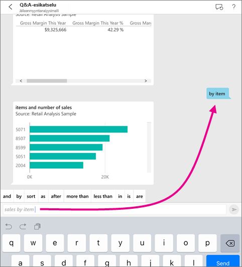
5. Napauta avainsanoissa **muodossa**, napauta palkkikaaviokuvaketta  ja napauta **Lähetä** .
6. Kaksoisnapauta tuloksena syntyvä kaaviota pitkään ja napauta **Laajenna**.

    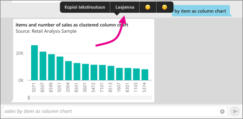

    Kaavio avautuu kohdistustilassa sovelluksessa.

    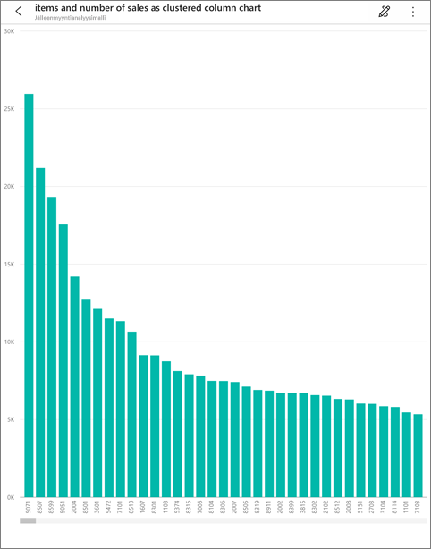
7. Siirry takaisin Q&A:n virtuaalisen analyytikon keskusteluikkunaan napauttamalla vasemmassa yläkulmassa olevaa nuolta.
8. Poista teksti ja aloita alusta napauttamalla X tekstiruudun oikeassa reunassa.
9. Kokeile uutta kysymystä: Napauta avainsanoissa **paras**, napauta **myynti keskimääräisen hinnan/yksikkö vuoden alusta mukaan** > **Lähetä** .

    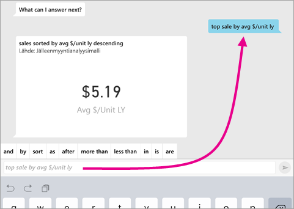
10. Valitse avainsanoista **mukaan**, napauta yläreunan ehdotusluettelossa **aika** > **Lähetä** .

     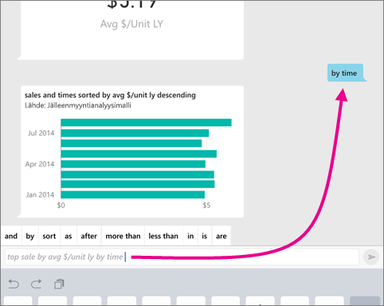
11. Kirjoita **muodossa**, valitse ehdotusluettelossa viivakaaviokuvake  > **Lähetä** .

    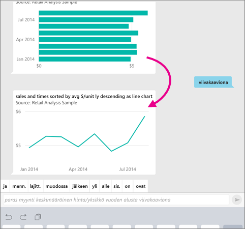

## Kokeile sanoa kysymyksesi
Nyt voit esittää kysymyksiä tiedoistasi Power BI -mobiilisovelluksessa puhumalla kirjoittamisen sijaan.

1. Napauta Q&A:n virtuaalinen analyytikko -kuvaketta  sivun alaosan (iPadissa sivun yläosassa) toimintovalikossa.
2. Napauta mikrofonikuvaketta .

    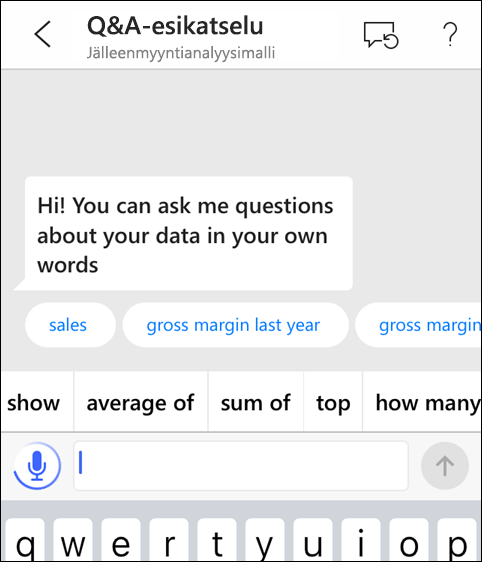

1. Kun mikrofonikuvake on aktiivinen, ala puhua. Voit esimerkiksi sanoa ”keskimääräinen yksikköhinta ajan mukaan” ja napauttaa **Lähetä** .

    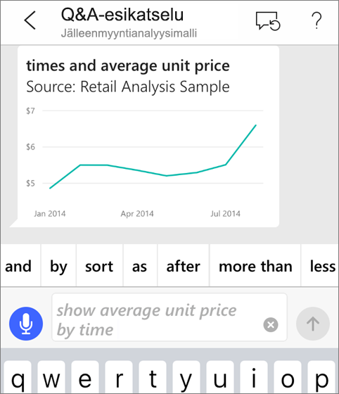

### Onko sinulla kysyttävää tietosuojasta puhe tekstiksi -toimintoa käytettäessä?
Katso Apple iOS -kehittäjäoppaiden kohdan [iOSin uutuudet](https://go.microsoft.com/fwlink/?linkid=845624) puheentunnistusta käsittelevä osio.

## Ohje ja palaute
* Tarvitsetko apua? Sano ”Hei” tai ”Ohje”, niin saat apua uuden kysymyksen aloittamisesta.
* Haluatko antaa palautetta tuloksista? Napauta pitkään kaaviota tai muuta tulosta ja napauta sitten hymiötä tai surullista hymiötä.

    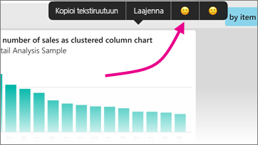

    Palautteesi on nimetöntä ja auttaa meitä parantamaan vastauksia kysymyksiin.

## Paranna Q&A:n virtuaalisen analyytikon tuloksia
Voit parantaa sinun ja asiakkaiden Q&A:n virtuaalisen analyytikon tietojoukossa käytön aikana saamia tuloksia joko esittämällä tarkennettuja kysymyksiä tai parantamalla tietojoukkoa.

### Kysymysten esittäminen
* Noudata näitä [kysymysten Q&A:ssa esittämisen vihjeitä](../end-user-q-and-a-tips.md) Power BI -palvelussa tai Q&A:n virtuaalisessa analyytikossa iOS-mobiilisovelluksessa.

### Tietojoukon parantaminen
* Paranna Power BI Desktopin tai Power BI -palvelun tietojoukkoa, [jotta tietosi toimivat hyvin Q&A:n ja Q&A:n virtuaalisen analyytikon kanssa](../../service-prepare-data-for-q-and-a.md).

## Seuraavat vaiheet
* [Q&A Power BI -palvelussa](../end-user-q-and-a.md)
* Onko sinulla kysymyksiä? Tutustu [Power BI -yhteisön Mobiilisovellukset-osaan](https://go.microsoft.com/fwlink/?linkid=839277)
