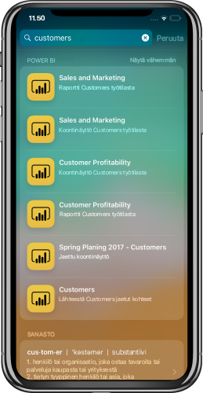

# iOS-laitteiden haun (Spotlight) integrointi Power BI:n iOS-mobiilisovellukseen (esikatselu)
Hae ja käytä tarvitsemaasi sisältöä iOS-laitteen haun avulla.

Kun haet tiettyä sisältöä iOS-laitteen hakutoiminnolla (Spotlight), Power BI -kohteet näytetään tulosluettelossa. Napauttamalla Power BI -kohdetta tulosluettelossa siirryt suoraan kyseiseen kohteeseen Power BI -sovelluksessa.

## Kohteiden hakeminen laitteen hakutoiminnolla

Kohteiden hakeminen laitteen hakutoiminnolla:

1. Sipaise alaspäin **Aloitus**näytön keskeltä avataksesi laitteen hakutoiminnon.

2. Napauta **Haku**-kenttää ja kirjoita, mitä haluat hakea.
 
   Seuraavantyyppiset Power BI -kohteet näytetään hakutuloksissa:

    * Koontinäytöt
    * Raportit
    * Sovellukset
    * Työtilat
    * Kohteet, jotka on jaettu hakemasi kontaktin kanssa

    

 3. Kun löydät haluamasi kohteen, napauta sitä. Valittu kohde avautuu suoraan Power BI -sovelluksessa. 

Laitteen Siri-hakutoiminto sisältää myös ehdotuksia, jotka perustuvat Power BI -sovelluksessa usein suorittamiisi toimintoihin. Sirin ehdotukset näytetään haku- ja lukitusnäytöllä.

>[!NOTE]
>
>Voit poistaa laitteen haun ja Sirin ehdotukset käytöstä avaamalla **Laitteen asetukset** > **Power BI -asetukset** > **Siri ja haku** ja poistamalla **Siri ja ehdotukset** -asetuksen käytöstä.
>

## Seuraavat vaiheet
Saat lisätietoja Power BI -mobiilisovelluksesta seuraavasti: 

* Lataa [Power BI:n iPhone-mobiilisovellus](https://go.microsoft.com/fwlink/?LinkId=522062)
* Seuraa [@MSPowerBI Twitterissä](https://twitter.com/MSPowerBI)
* Liity keskusteluun [Power BI -yhteisössä](https://community.powerbi.com/)

