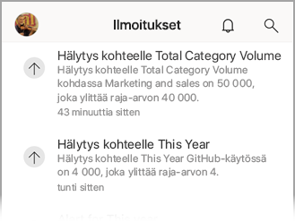
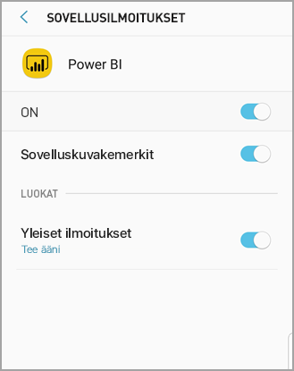

# Power BI -mobiilisovellusten ilmoitusten vastaanottaminen
Koskee seuraavia:

|  |  |  |  |  |
|:--- |:--- |:--- |:--- |:--- |
| iPhonet |iPadit |Android-puhelimet |Android-tabletit |Windows 10 -laitteet |

Ilmoitukset tuovat Power BI -käyttökokemukseen liittyvät tiedot suoraan sinulle Power BI -palveluun tai mobiililaitteeseesi. Kun avaat Ilmoitukset, näet järjestyksessä viestisyötteen muun muassa [asettamistasi ilmoituksista](mobile-set-data-alerts-in-the-mobile-apps.md), uusista kanssasi jaetuista koontinäytöistä, muutoksista ryhmätilassa ja tietoja Power BI -tapahtumista ja -tapaamisista.

> [!NOTE]
> Kun kirjaudut sisään iOS-laitteessa ensimmäisen kerran [Power BI -sovellusten päivitettyyn versioon](https://powerbi.microsoft.com/mobile/), näkyviin tulee sanoma, jossa kysytään, haluatko Power BI:n lähettävän ilmoituksia. Voit myös määrittää laitteesi **asetuksissa**, miten Power BI lähettää sinulle ilmoituksia. 
> 
> 

## Ilmoitusten tarkasteleminen mobiililaitteessa
1. Kun saat ilmoituksia mobiililaitteessasi, Power BI antaa oletusarvoisesti äänimerkin ja näyttää ilmoituspalkin.
   
   
   

   Voit myös [muuttaa sitä, miten Power BI ilmoittaa](mobile-apps-notification-center.md#change-or-turn-off-notifications-on-your-mobile-device).
2. Jos olet saanut ilmoituksia, kun kirjaudut sisään Power BI:hin mobiililaitteessasi, näet keltaisen pisteen ilmoituskellokuvakkeessa  (iOS ja Android) tai yleisessä siirtymispainikkeessa  (Windows 10 -laitteet). 

3. Jos haluat tarkastella ilmoituksia ilmoituskeskuksessa, napauta ilmoituskelloa  (iOS ja Android) tai ilmoituskeskuksen kuvaketta  (Windows 10 -laitteet).
   
    Ilmoitukset näkyvät uusin ylimpänä ja lukemattomat viestit korostettuina. Ilmoituksia säilytetään 90 päivää, ellei 100 kappaleen enimmäisrajaa saavuteta tai jos et poista niitä jo aiemmin.
   
   
4. Jos haluat hylätä ilmoituksen iOS- ja Android-laitteissa, napauta, pidä painettuna ja sipaise. Napsauta Windows 10 -laitteissa hiiren kakkospainikkeella ja valitse **Hylkää**.

## Ilmoitusten muuttaminen tai poistaminen käytöstä mobiililaitteessa
Voit myös muuttaa sitä, miten Power BI ilmoittaa.

1. Valitse iOS-laitteessa **Asetukset** > **Ilmoitukset**. 
   
    Valitse Android-puhelimessa **Asetukset** > **Ilmoitukset**.
   
    Valitse Windows-laitteessa **Asetukset**, **Järjestelmä** > **Ilmoitukset ja toiminnot**.
2. Valitse sovellusten luettelossa **Power BI**. 
3. Voit poistaa ilmoitukset käytöstä kokonaan tai valita haluamasi ilmoitukset.
   
    **iPhone**
   
    
   
    **Android-puhelin**
   
    

    **Windows 10 -laite**

    

## Seuraavat vaiheet
* [Power BI -palvelun tietoilmoitukset](../../service-set-data-alerts.md)
* [Tietoilmoitusten määrittäminen iPhone-sovelluksessa (Power BI iOS:lle)](mobile-set-data-alerts-in-the-mobile-apps.md)
* [Tietoilmoitusten määrittäminen Power BI -mobiilisovellukseen Windows 10:ssä](mobile-set-data-alerts-in-the-mobile-apps.md)
* [Lataa Power BI -sovellusten uusin versio](https://powerbi.microsoft.com/mobile/) mobiililaitteille

