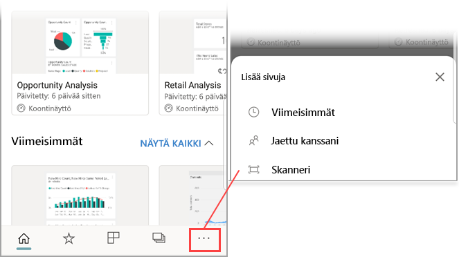

# Power BI:n QR-koodin lukeminen mobiililaitteella
Koskee seuraavia:

|  |  |  |
|:--- |:--- |:--- |:--- |
| iPhonet |Android-puhelimet |Android-tabletit |

Power BI:n QR-koodien avulla voit yhdistää minkä tahansa kohteen todellisesta maailmasta suoraan siihen liittyviin BI-tietoihin – siirtymis- tai hakutoimintoja ei tarvita.

Sanotaan, että työtoverisi olisi [luonut Power BI -palvelussa QR-koodin](../../service-create-qr-code-for-tile.md) raporttia tai koontinäytön ruutua varten, jakanut koontinäytön tai raportin sinulle ja lisännyt QR-koodin sopivaan paikkaan – esimerkiksi sähköpostiviestiin tai tiettyyn esineeseen. 

Voit lukea QR-koodin ja päästä saman tien haluttuun ruutuun tai raporttiin suoraan puhelimestasi käyttämällä joko Power BI ‑sovelluksen viivakoodinlukijaa tai muuta puhelimeen asennettua viivakoodinlukijaa. 

Jos työtoverisi ei ole jakanut koontinäyttöä tai raporttia sinulle, voit pyytää käyttölupaa suoraan mobiilisovelluksesta. 

> [!NOTE]
> Voit myös [lukea raportin QR-koodin Power BI ja tehostettu todellisuus -sovelluksessa](mobile-mixed-reality-app.md#scan-a-report-qr-code-in-holographic-view).

## Power BI:n QR-koodin lukeminen iPhonella Power BI ‑viivakoodinlukijan avulla

1. Napauta siirtymispalkissa **Lisää vaihtoehtoja** (...) ja napauta sitten **Skanneri**.

    

2. Jos kamerasi ei ole käytössä, sinun on sallittava Power BI -sovellukselle kameran käyttö. Kyseessä on yhden kerran suoritettava hyväksyntä. 
 
3. Osoita viivakoodinlukija kohti Power BI:n QR-koodia. 
   
    
4. Kameran näkymään ilmestyy ruutu tai raportti.
   
    

5. Voit joko avata ruudun tai raportin tarkastelutilassa napauttamalla sitä tai palata takaisin viivakoodinlukijaan.

### QR-koodin lukeminen iPhonella ulkoisen viivakoodinlukijan avulla
1. Avaa mikä tahansa puhelimeen asennettu viivakoodinlukija ja osoita se kohti haluttua Power BI:n QR-koodia, niin pääset välittömästi siirtymään ruutuun tai raporttiin. 
2. Jos puhelimeesi ei ole asennettu Power BI ‑sovellusta, sinut ohjataan [Apple App Storeen, josta voit ladata sen](https://go.microsoft.com/fwlink/?LinkId=522062) iPhoneen.

## Power BI:n QR-koodin lukeminen Android-laitteella Power BI:n viivakoodinlukijan avulla

1. Napauta siirtymispalkissa **Lisää vaihtoehtoja** (...) ja napauta sitten **Skanneri**.

    

2. Jos kamerasi ei ole käytössä, sinun on sallittava Power BI -sovellukselle kameran käyttö. Kyseessä on yhden kerran suoritettava hyväksyntä. 

3. Osoita viivakoodinlukija kohti Power BI:n QR-koodia. 
   
    
4. Ruutua tai raportti avautuu automaattisesti Power BI:ssä.
   
    

### QR-koodin lukeminen Android-laitteella ulkoisen viivakoodinlukijan avulla
1. Avaa mikä tahansa Android-laitteeseesi asennettu viivakoodinlukija ja osoita se kohti haluttua Power BI:n QR-koodia, niin pääset välittömästi siirtymään ruutuun tai raporttiin. 
2. Jos laitteeseen ei ole asennettu Power BI ‑sovellusta, sinut ohjataan [Google Play ‑kauppaan, josta voit ladata sen](https://go.microsoft.com/fwlink/?LinkID=544867). 

## Seuraavat vaiheet
* [Power BI:n yhdistäminen reaalimaailman tietoihin](mobile-apps-data-in-real-world-context.md) mobiilisovellusten avulla
* [Ruudun QR-koodin luominen Power BI -palvelussa](../../service-create-qr-code-for-tile.md)
* [Raportin QR-koodin luominen Power BI -palvelussa](../../service-create-qr-code-for-report.md)
* Voit myös [lukea QR-koodin Power BI ja tehostettu todellisuus -sovelluksessa](mobile-mixed-reality-app.md).
* Onko sinulla kysyttävää? [Voit esittää kysymyksiä Power BI -yhteisössä](https://community.powerbi.com/)

