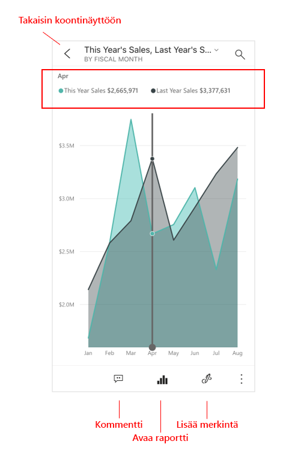

# Pikaopas: Raporttinäkymien ja raporttien tarkastelu Power BI -mobiilisovelluksissa
Tässä pikaoppaassa on esitellään Power BI -mobiilisovellus nopeasti ja tutustutaan mallikoontinäyttöön ja raporttiin. Tässä käytetään esimerkkinä iOS:n Power BI -sovellusta, mutta voit helposti seurata esittelyä muissakin laitteissa.

Koskee seuraavia:

|  |  |  |  |
|:--- |:--- |:--- |:--- |
| iPhone | iPad | Android- | Windows 10 |

>[!NOTE]
>Power BI -mobiilisovellustuki **Windows 10 Mobilea käyttäville puhelimille** päättyy 16. maaliskuuta 2021. [Lisätietoja](https://go.microsoft.com/fwlink/?linkid=2121400)

Raporttinäkymä on portaali yrityksesi elinkaareen ja prosesseihin. Se on yleisnäkymä, jossa voit seurata yrityksen nykyistä tilaa yhdessä paikassa. Raportti on vuorovaikutteinen näkymä tiedoistasi, joka sisältää eri havaintoja ja merkityksellisiä tietoja esittäviä visualisointeja. 

## Edellytykset

* **Rekisteröidy Power BI:hin**: Jos et ole rekisteröitynyt Power BI:hin, [rekisteröidy ilmaiseen kokeiluversioon](https://app.powerbi.com/signupredirect?pbi_source=web) ennen aloittamista.
* **Asenna Power BI -sovellus iOS-laitteeseesi**: Lataa Power BI -mobiilisovellus** [App Storesta](https://apps.apple.com/app/microsoft-power-bi/id929738808) (iOS) tai [Google Playstä](https://play.google.com/store/apps/details?id=com.microsoft.powerbim&amp;amp;clcid=0x409) (Android).
* **Lataa Jälleenmyyntianalyysimalli**: Tämän pikaoppaan ensimmäisessä vaiheessa ladataan Jälleenmyyntianalyysimalli Power BI -palvelussa. [Aloita tutustumalla mallin](./mobile-apps-download-samples.md) lataamiseen Power BI -tiliisi. Valitse Jälleenmyyntianalyysimalli.

Kun olet täyttänyt tarvittavat edellytykset ja ladannut Jälleenmyyntianalyysimallin Power BI tiliisi, voit aloittaa tämän nopean esittelyn.

## Selaa raporttinäkymää mobiililaitteesta
1. Avaa Power BI -sovellus laitteessasi ja kirjaudu sisään samoilla Power BI -tilisi tunnistetiedoilla, joita käytit selaimen Power BI-palvelussa.
 
1. Napsauta seuraavaksi **Työtilat**-kuvaketta , valitse **Omat työtilat** ja avaa sitten Jälleenmyyntianalyysimalli napsauttamalla sitä.

    
   
    Power BI -koontinäytöt näyttävät hieman erilaisilta mobiililaitteessasi kuin Power BI -palvelussa. Kaikki ruudut näkyvät saman levyisinä, ja ne on järjestetty peräkkäin ylhäältä alaspäin.

5. Napauta tähtikuvaketta  otsikkorivillä, jos haluat tehdä tästä suosikkiraporttinäkymän. Kun teet näkymästä suosikin mobiilisovelluksessa, siitä tulee suosikki myös Power BI -palvelussa ja päinvastoin.

6. Selaa alaspäin ja napauta viivakaaviota ”Tämän vuoden myynti, Viime vuoden myynti”.

    

    Tämä avaa tarkastelutilan.

7. Napauta tarkastelutilassa kaavion kohtaa **Apr**. Huhtikuun arvot näkyvät kaavion yläreunassa.

    

8. Napauta Raporttikuvaketta  näytön alareunassa (Android-laitteissa tämä voi olla näytön yläreunassa). Tähän ruutuun liittyvä raportti avautuu vaakatilassa.

    

9. Napauta keltaista ”040 - Juniors” -kuplaa kuplakaaviossa. Huomaa, miten se korostaa liittyvät arvot muissa visualisoinneissa. 

    

10. Tuo työkalurivi näkyviin näytön alareunaan sipaisemalla ylöspäin, ja napauta **Lisää vaihtoehtoja (...)** .

    

11. Vieritä luetteloa alapäin ja valitse **Lisää huomautus**.

    

12. Napauta Huomautus-työkalurivillä hymiökasvokuvaketta ja napauta sitten raporttisivua, johon haluat lisätä hymiökasvoja.
 
    

13. Napauta seuraavaksi **Jaa** oikeassa yläkulmassa.

14. Valitse tapa, jolla haluat jakaa raportin.  

    

    Voit jakaa tämän tilannevedoksen kenen kanssa tahansa organisaatiosi sisällä tai ulkopuolella. Jos vastaanottaja on organisaatiossasi ja hänellä on oma Power BI -tili, hän voi myös avata Jälleenmyyntianalyysimallin raportin.

## Puhdista resurssit

Kun olet suorittanut tämän pikaoppaan, voit halutessasi poistaa Jälleenmyyntianalyysimallin raporttinäkymän, raportin ja tietojoukon.

1. Avaa Power BI -palvelu ([Power BI -palvelu](https://app.powerbi.com)) ja kirjaudu sisään.

2. Valitse siirtymisruudussa **Oma työtila**.

3. Valitse Koontinäytöt-välilehti ja napsauta sitten roskakoria.

    

    Napsauta seuraavaksi Raportit-välilehteä ja toimi samoin.

4. Valitse seuraavaksi Tietojoukot-välilehdessä **Lisää vaihtoehtoja** (...) ja valitse **Poista**. 

    

## Seuraavat vaiheet

Tässä pikaoppaassa kerrottiin raporttinäkymien ja raporttien tarkastelusta mobiililaitteellasi. Lue lisää Power BI -palvelun käyttämisestä. 

> [!div class="nextstepaction"]
> [Pikaopas: Power BI -palvelussa liikkuminen](../end-user-experience.md)

