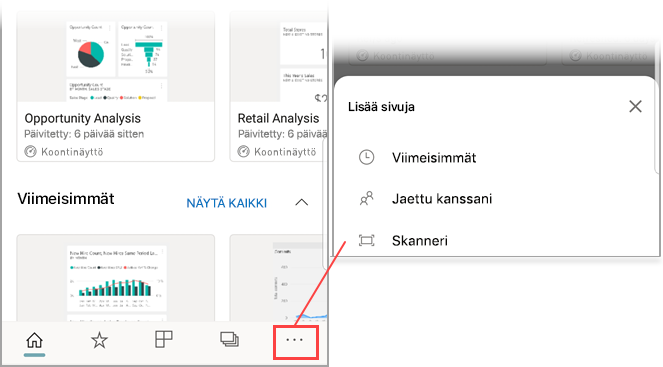

# Viivakoodin skannaaminen iPhonella Power BI -mobiilisovelluksesta
Voit skannata viivakoodeja todellisessa maailmassa ja siirtyä suoraan suodatettuihin BI-tietoihin Power BI -mobiilisovelluksessa.

Työtoverisi on saattanut esimerkiksi [merkitä viivakoodikentän raporttiin Power BI Desktopissa](../../desktop-mobile-barcodes.md) ja jakaa raportin kanssasi. 

Kun skannaat tuotteen viivakoodin iPhonen Power BI -sovelluksen skannerilla, näet raportin (tai raporttien luettelon) kyseisellä viivakoodilla. Voit avata raportin iPhonella kyseiseen viivakoodiin suodatettuna.

## Viivakoodin skannaaminen Power BI -skannerilla
1. Avaa Power BI-mobiilisovelluksen pääsiirtymisvalikko  vasemmasta yläkulmasta. 
2. Vieritä alaspäin **Skanneri**-kohtaan ja valitse se. 
   
    
3. Jos kamerasi ei ole käytössä, sinun on sallittava Power BI -sovellukselle kameran käyttö. Tämä on yhden kerran suoritettava hyväksyntä. 
4. Osoita skannerilla tuotteen viivakoodia. 
   
    Näet luettelon kyseiseen viivakoodiin liittyvistä raporteista.
5. Napauta raportin nimeä avataksesi sen iPhonessasi, ja raportti suodattuu automaattisesti kyseisen viivakoodin mukaan.

## Suodattaminen muiden viivakoodien perusteella raportissa
Tarkastellessasi viivakoodilla suodatettua raporttia iPhonessa haluat ehkä suodattaa saman raportin eri viivakoodilla.

* Jos viivakoodin kuvakkeessa on suodatin , suodatin on aktiivinen ja raportti on jo suodatettu viivakoodilla. 
* Jos kuvakkeessa ei ole suodatinta , suodatin ei ole aktiivinen ja raporttia ei ole suodatettu viivakoodilla. 

Kummassakin tapauksessa napauta kuvaketta avataksesi pienen valikon, jossa on irrallinen skanneri.

* Kohdista skanneri uuteen kohteeseen vaihtaaksesi raportin suodattimen eri viivakoodin arvoon. 
* Valitse **Tyhjennä viivakoodisuodatin** palataksesi suodattamattomaan raporttiin.
* Valitse **Suodata viimeaikaisten viivakoodien mukaan** vaihtaaksesi raportin suodattimen viivakoodiin, jonka olet skannannut nykyisessä istunnossa.

## Ongelmia viivakoodin skannaamisessa
Seuraavassa on joitakin sanomia, joita näyttöön saattaa tulla, kun skannaat tuotteen viivakoodia.

### ”Raporttia ei voitu suodattaa...”
Raportti, jonka haluat suodattaa, perustuu tietomalliin, joka ei sisällä tätä viivakoodiarvoa. Esimerkiksi tuote ”kivennäisvesi” ei sisälly raporttiin.  

### Raportin kaikki tai jotkin visualisoinnit eivät sisällä mitään arvoa
Skannattu viivakoodiarvo on olemassa mallissa, mutta raportin kaikki tai jotkin visualisoinnit eivät sisällä tätä arvoa ja siksi suodatus palauttaa tyhjän tilan. Yritä tarkastella raportin muita sivuja arvon osalta tai muokata raporttejasi Power BI Desktopissa 

### ”Vaikuttaa siltä, ettei sinulla ole raportteja, jotka voidaan suodattaa viivakoodien avulla.”
Tämä tarkoittaa, että sinulla ei ole viivakoodia käyttäviä raportteja. Viivakoodiskanneri voi suodattaa vain raportteja, joissa on **Viivakoodi**-sarake.  

Varmista, että sinä tai raportin omistaja on merkinnyt **Viivakoodi**-nimisen sarakkeen Power BI Desktopissa. Lue lisätietoja [viivakoodikentän merkitsemisestä Power BI Desktopissa](../../desktop-mobile-barcodes.md)

### ”Raporttia ei voitu suodattaa – Vaikuttaa siltä, että tätä viivakoodia ei ole raportin tiedoissa.”
Raportti, jonka haluat suodattaa, perustuu tietomalliin, joka ei sisällä tätä viivakoodiarvoa. Esimerkiksi tuote ”kivennäisvesi” ei sisälly raporttiin. Voit skannata eri tuotteen, valita eri raportin (jos useampi kuin yksi raportti on käytettävissä) tai tarkastella raporttia suodattamattomana. 

## Seuraavat vaiheet
* [Viivakoodikentän merkitseminen Power BI Desktopissa](../../desktop-mobile-barcodes.md)
* [Koontinäyttöruudut Power BI:ssä](../../service-dashboard-tiles.md)
* [Koontinäytöt Power BI:ssä](../../service-dashboards.md)

