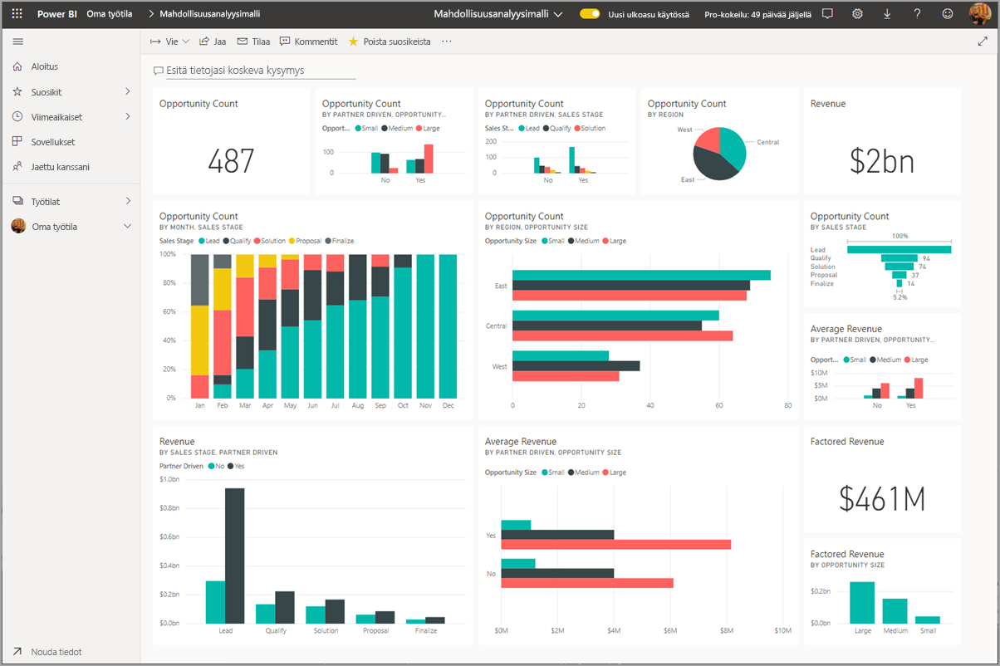
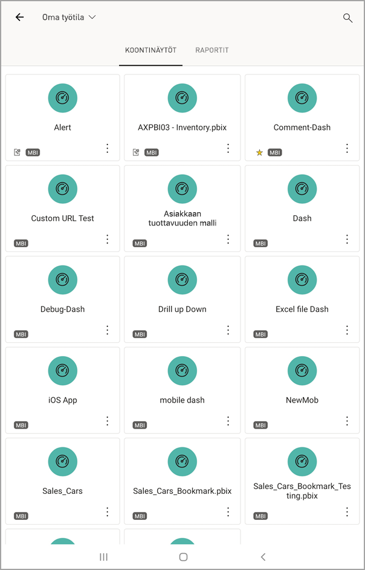

# Raporttinäkymien ja raporttien tarkastelu Power BI -mobiilisovelluksissa
Koskee seuraavia:

|  |  |  |  | 
|:--- |:--- |:--- |:--- |:--- |
| [iPhonet](mobile-apps-view-dashboard.md#view-dashboards-on-your-iphone) |[iPadit](mobile-apps-view-dashboard.md#view-dashboards-on-your-ipad) |[Android-puhelimet](mobile-apps-view-dashboard.md#view-dashboards-on-your-android-phone) |[Android-tabletit](mobile-apps-view-dashboard.md#view-dashboards-on-your-android-tablet) |

Raporttinäkymät ovat portaali yrityksesi elinkaareen ja prosesseihin. Raporttinäkymä on yleisnäkymä, jossa voit seurata yrityksen nykyistä tilaa yhdessä paikassa.

## Raporttinäkymien luominen Power BI -palvelussa (https://powerbi.com)
**Raporttinäkymiä ei luoda mobiilisovelluksissa.** 

Jotta voit tarkastella raporttinäkymiä ja raportteja mobiililaitteessasi, sinun on luotava ne tai muodostettava niihin yhteys verkkoselaimessa. 

1. Siirry Power BI -palveluun ([https://www.powerbi.com](https://www.powerbi.com)) ja [rekisteröi tili](../../service-self-service-signup-for-power-bi.md).
2. [Luo omia Power BI -raporttinäkymiä ja raportteja](../../service-get-started.md) tai muodosta yhteys olemassa oleviin [Power BI -sovelluksiin](../../service-connect-to-services.md) eri palveluita, kuten [Microsoft Dynamics CRM:ää](../../service-connect-to-microsoft-dynamics-crm.md) varten.

Tässä on Power BI -raporttinäkymä Power BI -palvelussa:

## Raporttinäkymien tarkastelu iPhonessa
1. Avaa iPhonen Power BI -sovellus ja kirjaudu sisään.
   
   Haluatko [ladata iPhone-sovelluksen](http://go.microsoft.com/fwlink/?LinkId=522062) Applen App Storesta?
2. Avaa raporttinäkymä napauttamalla sitä.  
   
    
   
   * Keltaiset tähdet  näyttävät, mitkä raporttinäkymät ovat suosikkeja. 
   * Kunkin raporttinäkymän nimen (tässä tapauksessa "MBI") alapuolella oleva merkintä  kertoo, miten kunkin raporttinäkymän tiedot on luokiteltu. Lue lisää [tietojen luokittelusta Power BI:ssä](../../service-data-classification.md).
   
   Oletusarvoisesti Power BI -raporttinäkymät näyttävät hiukan erilaisilta iPhonessasi. Kaikki ruudut näkyvät samalla tavalla, ja ne on järjestetty peräkkäin ylhäältä alaspäin.
   
    
   
   > [!TIP]
   > Jos olet raporttinäkymän omistaja, Power BI -palvelussa voit [luoda raporttinäkymästä pystysuuntaisen näkymän puhelimille](../../service-create-dashboard-mobile-phone-view.md). 
   > 
   > 
   
    Voit myös tarkastella raporttinäkymää vaakasuunnassa kääntämällä puhelimesi sivuttain.
   
    
3. Katso kaikki raporttinäkymän ruudut sipaisemalla ylös- ja alaspäin. Voit:
   
   * [napauttaa ruutua](mobile-tiles-in-the-mobile-apps.md) ja avata sen tarkastelutilassa ja käsitellä sitä.
   * napauttaa  ja [tehdä siitä suosikin](mobile-apps-favorites.md).
   * napauttaa kohtaa **Kutsu**  ja [kutsua työtoverisi](mobile-share-dashboard-from-the-mobile-apps.md) tarkastelemaan raporttinäkymää.
   * [synkronoida raporttinäkymän Apple Watch -kelloosi](mobile-apple-watch.md).
4. Voit siirtyä takaisin raporttinäkymien luetteloon napauttamalla raporttinäkymän nimen vieressä olevaa nuolta ja sitten kohtaa **Oma työtila**.
   
   

### Raporttinäkymien tarkastelu iPhonessa vaakasuunnassa
Voit tarkastella raporttinäkymiä vaakasuunnassa kääntämällä puhelimesi sivuttain. Raporttinäkymän asettelu muuttuu ruuduista koko raporttinäkymän näkymään, jolloin näet kaikki raporttinäkymän ruudut sellaisina kuin ne ovat Power BI -palvelussa.

Voit lähentää ja loitontaa raporttinäkymän eri alueita nipistämällä ja siirtyä näkymässä panoroimalla. Voit edelleen avata ruudun tarkastelutilassa ja käsitellä tietojasi [napauttamalla ruutua](mobile-tiles-in-the-mobile-apps.md).

## Raporttinäkymien tarkastelu iPadissa
1. Avaa Power BI -sovellus.
   
   Haluatko [ladata iPad-sovelluksen](http://go.microsoft.com/fwlink/?LinkId=522062) Applen App Storesta?
2. Napauta sovelluksen yläosassa **Raporttinäkymät**-kohtaa.  
   
   
   
   * Keltaiset tähdet  näyttävät, mitkä raporttinäkymät ovat suosikkeja. 
   * Kunkin raporttinäkymän nimen (tässä tapauksessa "MBI") alapuolella oleva merkintä  kertoo, miten kunkin raporttinäkymän tiedot on luokiteltu. Lue lisää [tietojen luokittelusta Power BI:ssä](../../service-data-classification.md).
3. Voit jakaa raporttinäkymän työtilastasi. Napauta raporttinäkymäruudun oikeassa alakulmassa kolmea pistettä ( **...** ) ja napauta **Kutsu muita** -kohtaa.
   
   
4. Voit myös avata raporttinäkymän napauttamalla ja tarkastella kyseisen raporttinäkymän ruutuja. Raporttinäkymässä voit käsitellä sen sisältöä:
   
   * [Käsittele ruutua napauttamalla sitä](mobile-tiles-in-the-mobile-apps.md).
   * [Avaa raportteja](mobile-reports-in-the-mobile-apps.md) ruutujen takaa.
   * [Kutsu muita tarkastelemaan raporttinäkymää](mobile-share-dashboard-from-the-mobile-apps.md).
   * [Tee merkintöjä ja jaa ruudun tilannevedos](mobile-annotate-and-share-a-tile-from-the-mobile-apps.md).
5. Jos haluat siirtyä omaan työtilaan, napauta raporttinäkymän nimeä vasemmassa yläkulmassa ja napauta sitten **Oma työtila** -kohtaa.
   
   

## Raporttinäkymien tarkastelu Android-puhelimessa
1. Avaa Android-puhelimen Power BI -sovellus ja kirjaudu sisään.
   
   Haluatko ensin [ladata Android-sovelluksen](http://go.microsoft.com/fwlink/?LinkID=544867)?
2. Avaa raporttinäkymä napauttamalla sitä.   
   
   

    Keltaiset tähdet  näyttävät, mitkä raporttinäkymät ovat suosikkeja. 

    Raporttinäkymän nimen (tässä tapauksessa ”MBI”) alapuolella oleva merkintä  kertoo, miten kunkin raporttinäkymän tiedot on luokiteltu. Lue lisää [tietojen luokittelusta Power BI:ssä](../../service-data-classification.md).

    Power BI -raporttinäkymät näyttävät hiukan erilaisilta Android-puhelimessasi. Kaikki ruudut näkyvät saman levyisinä, ja ne on järjestetty peräkkäin ylhäältä alaspäin.

    

    Jos olet raporttinäkymän omistaja, Power BI -palvelussa voit [luoda raporttinäkymästä pystysuuntaisen näkymän puhelimille](../../service-create-dashboard-mobile-phone-view.md). 

1. Raporttinäkymässä napauttamalla kolmea pystysuunnassa olevaa pistettä (...) nimen vieressä voit kutsua työtoverin, päivittää tai hakea tietoja raporttinäkymästä:
   
   
2. Katso kaikki [raporttinäkymän ruudut](mobile-tiles-in-the-mobile-apps.md) sipaisemalla ylös- ja alaspäin. 
3. Siirry raporttinäkymien aloitussivulle napauttamalla raporttinäkymän nimeä, jolloin navigointipolku avautuu. Valitse sitten **Oma työtila**.   

## Raporttinäkymien tarkastelu Android-tabletissa
1. Avaa Android-tabletin Power BI -sovellus ja kirjaudu sisään.
   
   Haluatko ensin [ladata Android-sovelluksen](http://go.microsoft.com/fwlink/?LinkID=544867)?
2. Avaa raporttinäkymä napauttamalla sitä.   
   
   
   
   * Keltaiset tähdet  näyttävät, mitkä raporttinäkymät ovat suosikkeja. 
   * Kunkin raporttinäkymän nimen (tässä tapauksessa "MBI") alapuolella oleva merkintä  kertoo, miten kunkin raporttinäkymän tiedot on luokiteltu. Lue lisää [tietojen luokittelusta Power BI:ssä](../../service-data-classification.md).
3. Raporttinäkymässä napauttamalla kolmea pystysuunnassa olevaa pistettä (...) nimen vieressä voit kutsua työtoverin, päivittää tai hakea tietoja raporttinäkymästä:
   
   
4. Katso kaikki [raporttinäkymän ruudut](mobile-tiles-in-the-mobile-apps.md) sipaisemalla ylös- ja alaspäin. 
   
   Voit lähentää ja loitontaa raporttinäkymän eri alueita nipistämällä ja siirtyä näkymässä panoroimalla. Voit edelleen avata ruudun tarkastelutilassa ja käsitellä tietojasi [napauttamalla ruutua](mobile-tiles-in-the-mobile-apps.md).
5. Siirry raporttinäkymien aloitussivulle napauttamalla raporttinäkymän nimeä, jolloin navigointipolku avautuu. Valitse sitten **Oma työtila**:
   
    

    Voit lähentää ja loitontaa raporttinäkymän eri alueita nipistämällä ja siirtyä näkymässä panoroimalla. Voit edelleen avata ruudun tarkastelutilassa ja käsitellä tietojasi [napauttamalla ruutua](mobile-tiles-in-the-mobile-apps.md).

## Puhelinnäkymän luominen raporttinäkymästä Power BI -palvelussa
Jos olet raporttinäkymän omistaja, *Power BI -palvelussa* voit luoda raporttinäkymästä pystysuuntaisen näkymän puhelimille. 

Lue lisää [raporttinäkymän puhelinnäkymän luomisesta](../../service-create-dashboard-mobile-phone-view.md).

## Seuraavat vaiheet
* [Android-sovelluksen lataaminen](http://go.microsoft.com/fwlink/?LinkID=544867) Google Play Kaupasta  
* [Power BI:n Android-sovelluksen käytön aloittaminen](mobile-android-app-get-started.md)  
* [Mikä on Power BI?](../../power-bi-overview.md)
* Onko sinulla kysyttävää? [Voit esittää kysymyksiä Power BI -yhteisössä](http://community.powerbi.com/)

