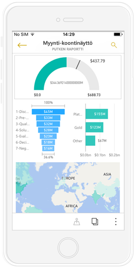
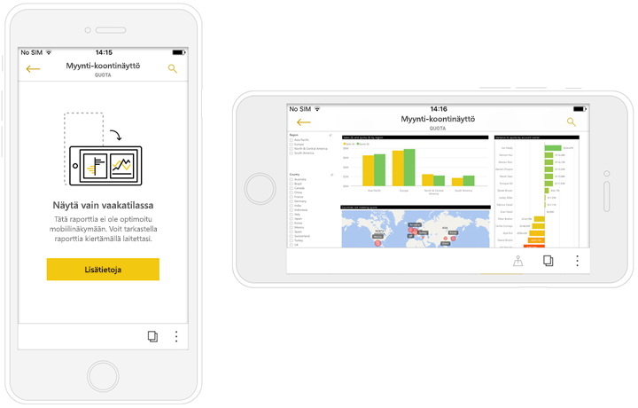
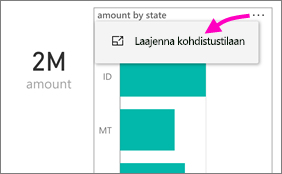
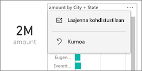
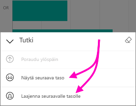
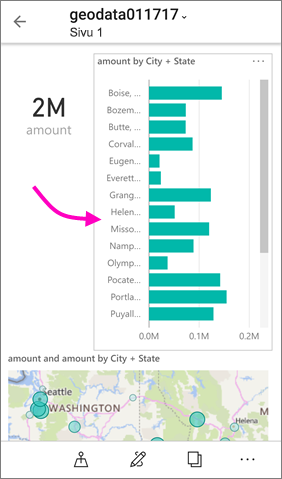

# Puhelimelle optimoitujen Power BI ‑raporttien tarkastelu

Koskee seuraavia:

|  |  |
|:--- |:--- |
| iPhonet |Android-puhelimet |

Kun luot Power BI Desktopissa tai Power BI -palvelussa Power BI ‑raportin, voit myös [luoda raportista version, joka on optimoitu ](../../desktop-create-phone-report.md) puhelimessa olevassa Power BI ‑sovelluksessa tarkastelua varten.

Kun avaat Power BI ‑raportin puhelimessa, Power BI tunnistaa, onko raportti optimoitu puhelimia varten ja avaa automaattisesti optimoidun raportin pystysuuntaisessa tilassa.

Jos puhelimille optimoitua raporttia ei ole, raportti avautuu silti mutta optimoimattomassa vaakanäkymässä. Vaikka raportista olisi puhelinoptimoitu versio, raportin voi avata optimoimattomassa alkuperäisessä raporttiasettelussa kääntämällä puhelimen vaakasuuntaan. Jos vain osa raportin sivuista on optimoitu, pystynäkymässä tulee esiin ilmoitus, jossa kerrotaan, että raportti on käytettävissä vaakanäkymässä.

Kaikki muut Power BI ‑raporttien ominaisuudet toimivat myös puhelinoptimoiduissa raporteissa. Lue lisää siitä käytettävissä olevista ominaisuuksista:

* [Raportit iPhone-puhelimissa](mobile-reports-in-the-mobile-apps.md). 
* [Raportit Android-puhelimissa](mobile-reports-in-the-mobile-apps.md).

## Raporttisivun suodattaminen puhelimella
Jos puhelinoptimoituun raporttiin on määritetty suodattimia, voit käyttää niitä tarkastellessasi raporttia puhelimella. Raportti avautuu puhelimessa suodatettuna verkossa olevassa raportissa suodatettuihin arvoihin ja saat ilmoituksen, että sivulla on aktiivisia suodattimia. Voit muuttaa suodattimia puhelimessasi.

1. Napauta suodatinkuvaketta  sivun alareunasta. 
2. Tuo esiin sinua kiinnostavat tulokset käyttämällä joko perus- tai lisäsuodattimia.
   
    

## Visualisointien ristiinkorostaminen
Visualisointien ristiinkorostaminen toimii puhelinraporteissa samalla tavalla kuin Power BI -palvelussa ja vaakasuuntaista näkymää käyttävissä puhelinraporteissa: kun valitset jostakin visualisoinnista tietoja, vastaavat tiedot korostuvat myös muissa saman sivun visualisoinneissa.

Lue lisää [suodattamisesta ja korostamisesta Power BI:ssä](../../power-bi-reports-filters-and-highlighting.md).

## Visualisointien valitseminen
Kun valitset puhelinraportissa visualisoinnin, puhelinraportti korostaa visualisoinnin ja kohdistaa siihen, mikä poistaa taustaa vasten tehtävät eleet käytöstä.

Kun visualisointi on valittuna, voit tehdä erilaisia toimintoja, kuten vierittää visualisointia. Kun haluat poistaa visualisoinnin valinnan, kosketa aluetta visualisoinnin ulkopuolella.

## Visualisointien avaaminen kohdistustilassa
Puhelinraporteissa on käytettävissä myös kohdistustila, jonka ansiosta voit nähdä yksittäisen visualisoinnin suurempana ja tarkastella lähemmin sekä visualisointia että raporttia.

* Napauta puhelinraportissa visualisoinnin oikeasta yläkulmasta kolmea pistettä (**...**) > **Laajenna kohdistustilaan**.
  
    

Kohdistustilassa tekemäsi toimet tulevat myös käyttöön myös raporttipohjassa ja päinvastoin, mikä tuottaa saumattoman katselukokemuksen. Jos esimerkiksi korostat visualisoinnista jonkin arvon ja palaat sitten koko raporttiin, koko raportti on suodatettu visualisoinnissa korostamasi arvon mukaan.

Näytön kokorajoitusten vuoksi jotkin toiminnot ovat käytettävissä vain kohdistustilassa:

* **Poraudu alaspäin** johdattaa tarkastelijan syvemmälle visualisoinnin esittämiin tietoihin. Lisätietoja [alas- ja ylöspäin porautumisesta](mobile-apps-view-phone-report.md#drill-down-in-a-visual) puhelinraporteissa annetaan jäljempänä.
* **Lajittele** visualisoinnin arvoja.
* **Kumoa** poistaa visualisoinnin tarkastelussa tehdyt toimet ja palauttaa raportin luonnin yhteydessä määritetyn tietojoukon.
  
    Jos haluat poistaa kaikki tarkastelutoimet, napauta kolmea pistettä (**...**) > **Kumoa**.
  
    
  
    Kumoaminen on käytettävissä sekä raportin tasolla, jolloin se poistaa kaikki tarkastelutoimet kaikista visualisoinneista, että visualisoinnin tasolla, jolloin se poistaa kaikki tarkastelutoimet valittuna olevasta yksittäisestä visualisoinnista.   

## Porautuminen alaspäin visualisoinnissa
Jos visualisointiin on määritetty hierarkiatasot, voit porautua syvemmälle visualisoinnin esittämien tietojen yksityiskohtiin ja palata sitten takaisin ylöspäin. [Lisää visualisointiin mahdollisuus porautua alaspäin](../end-user-drill.md) joko Power BI -palvelussa tai Power BI Desktopissa. Porautuminen alaspäin toimii vain puhelinoptimoiduissa Power BI ‑raporteissa, joita tarkastellaan puhelimella. 

1. Napauta puhelimella raportin oikeasta yläkulmasta kolmea pistettä (**...**) > **Laajenna kohdistustilaan**.
   
    
   
    Tässä esimerkissä palkit kuvaavat osavaltioiden arvoja.
2. Napauta tutkimiskuvaketta  vasemmasta alakulmasta.
   
    
3. Napauta joko vaihtoehtoa **Näytä seuraava taso** tai **Laajenna seuraavalle tasolle**.
   
    
   
    Nyt palkit esittävät kaupunkien arvot.
   
    
4. Jos napautat vasemmassa yläkulmassa olevaa nuolta, palaat puhelinraporttiin, jossa arvot näkyvät edelleen alemmalle tasolle laajennettuna.
   
    
5. Voit palata takaisin alkuperäiselle tasolle napauttamalla uudelleen kolmea pistettä (**...** ) > **Kumoa**.
   
    

## Seuraavat vaiheet
* [Power BI -puhelinsovelluksille optimoitujen raporttien luominen](../../desktop-create-phone-report.md)
* [Koontinäytön puhelinnäkymän luominen Power BI:ssä](../../service-create-dashboard-mobile-phone-view.md)
* [Mihin tahansa kokoon optimaalisten reagoivien visualisointien luominen](../../visuals/desktop-create-responsive-visuals.md)
* Onko sinulla muuta kysyttävää? [Voit esittää kysymyksiä Power BI -yhteisössä](http://community.powerbi.com/)

