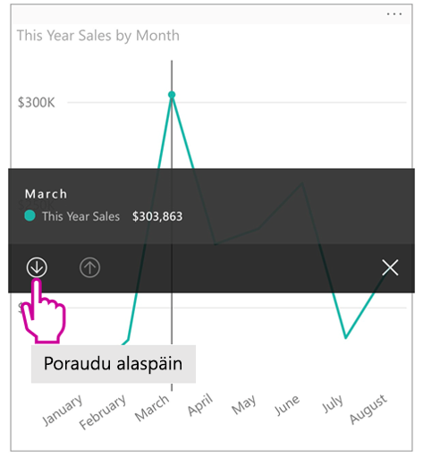
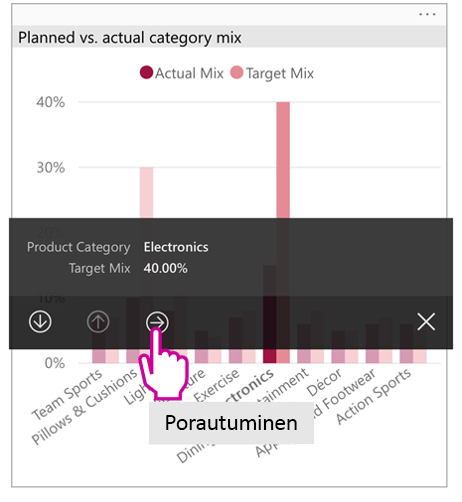
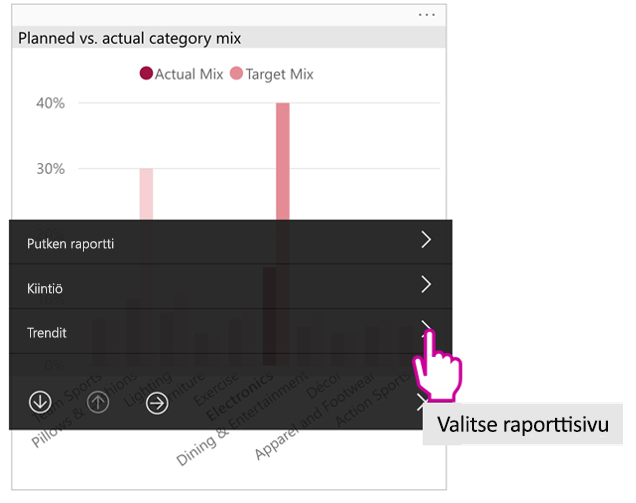

# Puhelimelle optimoitujen Power BI ‑raporttien tarkastelu

Koskee seuraavia:

|  |  |
|:--- |:--- |
| iPhonet |Android-puhelimet |

Kun tarkastelet Power BI -raporttia puhelimessasi, Power BI tarkistaa, onko raportti optimoitu puhelimille. Jos on, Power BI avaa optimoidun raportin automaattisesti pystynäkymässä.

Jos puhelimille optimoitua raporttia ei ole, raportti avautuu silti mutta optimoimattomassa vaakanäkymässä. Vaikka raportista olisi puhelinoptimoitu versio, raportin voi avata optimoimattomassa alkuperäisessä raporttiasettelussa kääntämällä puhelimen vaakasuuntaan. Jos vain osa raportin sivuista on optimoitu, pystynäkymässä tulee esiin ilmoitus, jossa kerrotaan, että raportti on käytettävissä vaakanäkymässä.

Kaikki muut Power BI ‑raporttien ominaisuudet toimivat myös puhelinoptimoiduissa raporteissa. Lue lisää siitä käytettävissä olevista ominaisuuksista:

* [Raportit iPhone-puhelimissa](mobile-reports-in-the-mobile-apps.md). 
* [Raportit Android-puhelimissa](mobile-reports-in-the-mobile-apps.md).

## Raporttisivun suodattaminen puhelimella
Jos puhelinoptimoituun raporttiin on määritetty suodattimia, voit käyttää niitä tarkastellessasi raporttia puhelimella. Raportti avautuu puhelimessa suodatettuna verkossa olevassa raportissa suodatettuihin arvoihin. Saat ilmoituksen siitä, että sivulla on aktiivisia suodattimia. Voit muuttaa suodattimia puhelimessasi.

1. Napauta suodatinkuvaketta  sivun alareunasta.

2. Tuo esiin sinua kiinnostavat tulokset käyttämällä joko perus- tai lisäsuodattimia.
   
    

## Visualisointien ristiinkorostaminen
Visualisointien ristiinkorostaminen pystynäkymässä toimii samoin kuin Power BI -palvelussa ja puhelimissa vaakasuunnassa: kun valitset tietoja yhdessä visualisoinnissa, tiedot korostuvat myös muissa tämän sivun visualisoinneissa.

Lue lisää [suodattamisesta ja korostamisesta Power BI:ssä](../../power-bi-reports-filters-and-highlighting.md).

## Visualisointien valitseminen
Kun valitset puhelinraportissa visualisoinnin, puhelinraportti korostaa visualisoinnin ja kohdistaa siihen, mikä poistaa taustaa vasten tehtävät eleet käytöstä.

Kun visualisointi on valittuna, voit tehdä erilaisia toimintoja, kuten vierittää visualisointia. Kun haluat poistaa visualisoinnin valinnan, kosketa aluetta visualisoinnin ulkopuolella.

## Visualisointien avaaminen tarkastelutilassa
Myös tarkastelutila on mahdollinen puhelinraporteissa: saat suuremman näkymän yksittäisestä visualisoinnista ja pääset tutustumaan siihen helpommin.

* Napauta puhelinraportissa visualisoinnin oikeasta yläkulmasta kolmea pistettä ( **...** ) &gt; **Laajenna tarkastelutilaan**.
  
    

Tarkastelutilassa tekemäsi toimet tulevat myös käyttöön myös raporttipohjassa ja päinvastoin. Jos esimerkiksi korostat visualisoinnista jonkin arvon ja palaat sitten koko raporttiin, raportti suodatetaan visualisoinnissa korostamasi arvon mukaan.

Näytön kokorajoitusten vuoksi jotkin toiminnot ovat käytettävissä vain tarkastelutilassa:

* **Poraudu alaspäin** johdattaa tarkastelijan syvemmälle visualisoinnin esittämiin tietoihin. Lisätietoja [alas- ja ylöspäin porautumisesta](mobile-apps-view-phone-report.md#drill-down-in-a-visual) puhelinraporteissa annetaan jäljempänä.
* **Lajittele** visualisoinnin arvoja.
* **Kumoa**: poistaa visualisoinnin tarkastelussa tehdyt toimet ja palauttaa raportin luonnin yhteydessä määritetyn tietojoukon.
  
    Jos haluat poistaa kaikki tarkastelutoimet, napauta kolmea pistettä ( **...** ) > **Kumoa**.
  
    
  
    Kumoaminen on käytettävissä sekä raportin tasolla, jolloin se poistaa tarkastelutoimet kaikista visualisoinneista, että visualisoinnin tasolla, jolloin se poistaa tarkastelutoimet valitusta visualisoinnista.   

## Porautuminen alaspäin visualisoinnissa
Jos visualisointiin on määritetty hierarkiatasot, voit porautua syvemmälle visualisoinnin esittämien tietojen yksityiskohtiin ja palata sitten takaisin ylöspäin. [Lisää visualisointiin mahdollisuus porautua alaspäin](../end-user-drill.md) joko Power BI -palvelussa tai Power BI Desktopissa.

Porautumistyyppejä on vähän:

### Porautuminen alaspäin arvoon
1. Pitkä napautus (napauta ja pidä painettuna) tiettyyn visualisoinnin arvopisteeseen.
2. Työkaluvihje tulee näkyviin, ja jos on määritetty hierarkia, porautumisen ylä- ja alanuoli näkyvät työkaluvihjeen alatunnisteessa.
3. Napauta alaspäin osoittavaa nuolta, kun haluat porautua alaspäin

    
    
4. Napauta ylöspäin osoittavaa nuolta, kun haluat porautua ylöspäin.

### Poraudu seuraavalle tasolle
1. Napauta puhelimella raportin oikeasta yläkulmasta kolmea pistettä ( **...** ) &gt; **Laajenna tarkastelutilaan**.
   
    
   
    Tässä esimerkissä palkit kuvaavat osavaltioiden arvoja.
2. Napauta tutkimiskuvaketta  vasemmassa alakulmassa.
   
    
3. Napauta joko vaihtoehtoa **Näytä seuraava taso** tai **Laajenna seuraavalle tasolle**.
   
    
   
    Nyt palkit esittävät kaupunkien arvot.
   
    
4. Jos napautat vasemmassa yläkulmassa olevaa nuolta, palaat puhelinraporttiin, jossa arvot näkyvät edelleen alemmalle tasolle laajennettuna.
   
    
5. Voit palata takaisin alkuperäiselle tasolle napauttamalla uudelleen kolmea pistettä ( **...** ) > **Kumoa**.
   
    

## Porautuminen läpi arvosta
Läpiporautumalla yhdistät yhden raporttisivun arvoja toisiin raporttisivuihin. Kun poraudut arvopisteestä läpi toiseen raporttisivuun, arvopisteen arvoja käytetään läpiporatun sivun suodattamiseen, tai se esiintyy valittujen tietojen yhteydessä.
Raportin tekijät voivat [määrittää porautumisen](https://docs.microsoft.com/power-bi/desktop-drillthrough) luodessaan raporttia.

1. Pitkä napautus (napauta ja pidä painettuna) tiettyyn visualisoinnin arvopisteeseen.
2. Työkaluvihje tulee näkyviin, ja jos on määritetty porautuminen, porautumisnuoli näkyy työkaluvihjeen alatunnisteessa.
3. Napauta nuolta kun haluat porautua läpi

    

4. Valitse, minkä raporttisivun läpi poraudutaan

    

5. Palaa alkusivulle sovelluksen otsikon Takaisin-painikkeesta.

## Seuraavat vaiheet
* [Power BI -puhelinsovelluksille optimoitujen raporttien luominen](../../desktop-create-phone-report.md)
* [Koontinäytön puhelinnäkymän luominen Power BI:ssä](../../service-create-dashboard-mobile-phone-view.md)
* [Mihin tahansa kokoon optimaalisten reagoivien visualisointien luominen](../../visuals/desktop-create-responsive-visuals.md)
* Onko sinulla kysyttävää? [Voit esittää kysymyksiä Power BI -yhteisössä](https://community.powerbi.com/)

